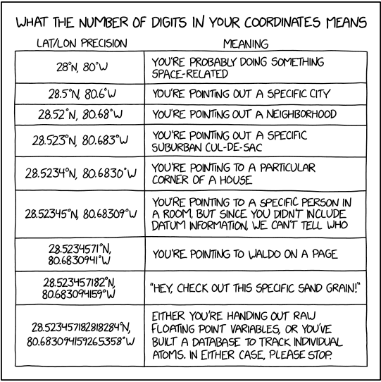

[#Introduction]
== Introduction

Throughout this document we make use of terminology for which the specific meaning has great importance for overall understanding, especially for terms that might differ from, or vary in common usage. We mark these key words in **bold**, with a link to the glossary, to call attention to the specific meaning and avoid potential confusion. All terms so marked are defined in the <<Glossary>>.

This publication provides guidelines to the best practice for **<<georeference,georeferencing>>**. Though it is targeted specifically at biological occurrence data, the concepts and methods presented here can be applied in other disciplines where spatial interpretation of **<<location>>** is of interest. This document builds on the original _*Guide to Best Practices for Georeferencing *_(Chapman & Wieczorek 2006), which was one of the outputs from the BioGeomancer project (Guralnick _et al._ 2006). Several earlier projects (MaNIS, MaPSTeDI, INRAM, GEOLocate, NatureServe, CRIA, ERIN, CONABIO, etc.) had previously developed guidelines and tools for **<<georeference,georeferencing>>**, and these provided a good starting point for such a document. A detailed history of the organizations involved in the development of BioGeomancer and of the original _*Guide*_ was given in that source. Throughout this document we reference tools and methodologies developed by those organizations and we acknowledge the valuable work by those organizations in their development. This document attempts to bring best practices up to date with terms, technologies, and **<<georeference,georeferencing>>** recommendations that have been developed and refined since the original document was published.

This document is designed so that institutions with **<<georeference,georeferencing>>** commitments can extract those portions that apply to their own requirements and priorities, and adapt them if necessary where those practices vary from, or elaborate on, the ones given here. Derived works should be made publicly accessible and the derived **<<georeferencing protocol>>** should be cited in the metadata of any **<<georeference,georeferenced>>** records that were produced by it. Citing a published protocol when your own methods differ would violate the best practice principle of replicability, described in <<Principles of Best Practice>>. An example of a citable protocol is the _*Georeferencing Quick Reference Guide*_ (Zermoglio _et al._, 2020). This document should not be cited as a **<<georeferencing protocol>>**.

This version is a complete revision with many new and updated references. The major changes and additions in this edition include:

* Redefined the term **<<extent>>** to conform with general English and common technical usage to mean a distance, area or volume within defined **<<boundary,boundaries>>** and added the term **<<radial>>** to cover the sense of the term "extent" in previous documents (Wieczorek 2001, Wieczorek _et al._ 2004, Chapman & Wieczorek 2006, Wieczorek _et al._ 2012a, Wieczorek & Bloom 2015).
* introduced the concept of the **<<corrected center>>** to replace **<<geographic center>>** wherever that was used in the past. This is an important change because the **<<geographic center>>** did not necessarily yield the correct minimum **<<uncertainty>>** due to the **<<extent>>** of a feature, the **<<corrected center>>** does.
* Expanded the sections on **<<elevation>>** and updated them to provide the most recent information on recording **<<elevation>>** and of determining **<<uncertainty>>** due to **<<accuracy>>** of **<<GPS>>**s and **<<DEM>>**s.
* Expanded information on **<<GPS>>** satellites to include information on the other **<<GNSS>>** satellite systems.
* Added information on the use of smartphones and cameras to record **<<GPS>>** locations and elevations.
* Elaborated on the **<<shape>> <<georeferencing method>>**, including steps to refine the **<<point-radius>> <<georeferencing method>>**.
* Expanded the explanations to include ecological, marine and other data collected in **<<transect,transects>>**, along irregular **<<path,paths>>**, in polygons, or on **<<grid,grids>>**.
* Added information on determining **<<georeference,georeferences>>** for subterranean locations such as caves, tunnels and mine sites.
* Added information on **<<bathymetry>>** and underwater **<<depth,depths>>**.
* Integrated this document with the companion documents _*Georeferencing Quick Reference Guide*_ (Zermoglio _et al._ 2020) and _*Georeferencing Calculator Manual*_ (Bloom _et al._ 2020).

[#Objectives]
=== Objectives

This document aims to provide current best practice for using the **<<point-radius>>**, **<<bounding box>>**, and **<<shape>> <<georeferencing method,georeferencing methods>>**, whether for new records in the field or for retrospective **<<georeference,georeferencing>>** of historic and un-georeferenced **<<location,locations>>**. We hope that the reader will come away from this document with, if nothing else, a good appreciation of the following essential principles:

* No matter how specific a **<<location>>** might seem, every **<<location>>** has an associated **<<uncertainty>>**, and this **<<uncertainty>>** determines the conditions under which the spatial interpretation of the **<<location>>** can be used. Based on this, **<<coordinates>>** without a carefully determined **<<uncertainty>>** should not be considered a **<<georeference>>**, they should be considered **<<coordinates>>** whose meaning is not clear.
* Interpretations of **<<location,locations>>** are fraught with a wide variety of sources of **<<uncertainty>>**, and these are not always trivial to aggregate into an overall **<<uncertainty>>**.
* The best **<<locality>>** description is one that is specific, concise, complete, and unambiguous; the more detailed the description, the better the chance of getting a **<<georeference>>** that is reproducible and that minimizes the **<<uncertainty>>**.
* **<<coordinate precision,Coordinate precision>>** is not the same as **<<coordinate uncertainty>>**, it is just one of many factors contributing to the overall **<<uncertainty>>**.
* Users of **<<georeference,georeferences>>** should take into account the **<<uncertainty>>** (or lack of its documentation) when choosing data for analyses, as without that information, analyses may be skewed and results **<<bias,biased>>** or altogether wrong.
* **<<coordinates,Coordinates>>** alone can not generally be checked for consistency; a **<<locality>>** description provides a confirmation that **<<coordinates>>** are correct.
* **<<coordinates,Coordinates>>** alone do not unambiguously define a **<<location>>**, because:
** **<<coordinates>>** require a **<<coordinate reference system>>** to anchor the **<<coordinates>>** in relation to the earth
** no **<<location>>** is a point; even the most specific **<<location,locations>>** have an **<<extent>>**
** any device that provides **<<coordinates>>** has an associated **<<uncertainty>>**

+
*Conclusion*: **<<coordinates>>** alone do not constitute a **<<georeference>>**.
* **<<geometry,Geometries>>** are great as **<<georeference,georeferences>>**, if you can deal with them; if not, the **<<point-radius>>** is surprisingly powerful, because using a **<<geographic information system,Geographic Information System>>** (GIS), it can be intersected with other spatial layers to get **<<geometry,geometries>>** (**<<shape,shapes>>**).

[#Target-Audience]
=== Target Audience

This work is designed for those who need, or want to know **why** the best practices are what they are, in detail. This document is also for individuals or organizations faced with planning a **<<georeference,georeferencing>>** project by providing a series of questions that suggests particular subsets of the best practices to follow.

For those who just need to know how to put these practices into action while **<<georeference,georeferencing>>**, the _*Georeferencing Quick Reference Guide*_ (Zermoglio _et al._ 2020) is the most suitable document to have at hand. The _*Georeferencing Quick Reference Guide*_ refers to details in this document as needed and accompanies the _*Georeferencing Calculator*_ (Wieczorek & Wieczorek 2020), which is a tool to calculate **<<coordinates>>** and **<<uncertainty>>** following the methods described in this document.

Above all, this document will help data end users to understand the implications of trying to use records that have not undergone **<<georeference,georeferencing>>** best practices and the value of those that have.

[#Scope]
=== Scope

This document is one of three that cover recommended requirements and methods to **<<georeference>>** **<<location,locations>>**. It is meant to cover the theoretical aspects (how to, and why) of spatially enabling information about the **<<location>>** of biodiversity-related phenomena, including special consideration for ecological and marine data. It also covers approaches to large-scale and collaborative **<<georeference,georeferencing>>** projects.

These documents DO NOT provide guidance on georectifying images or **<<geocode,geocoding>>** street addresses.

The accompanying _*Georeferencing Quick Reference Guide*_ (Zermoglio _et al._ 2020) provides a practical how-to guide for putting the theory of the **<<shape>>**,* <<bounding box>>*, and **<<point-radius>>** **<<georeferencing method,georeferencing methods>>** into practice. The _*Georeferencing Quick Reference Guide*_ relies on this document for background, definitions, more detailed explanations, and information on dealing with a wide variety of specific cases (see <<Using the Georeferencing Quick Reference Guide>>

The _*Georeferencing Calculator*_ (Wieczorek & Wieczorek 2020) is a browser-based javascript application that aids in **<<georeference,georeferencing>>** descriptive **<<locality,localities>>** and provides methods to help obtain **<<geographic coordinates>>** and **<<uncertainty,uncertainties>>** for **<<location,locations>>** (see <<Using the Georeferencing Calculator>>

[#Constraints]
=== Constraints

Constraints to using this document may arise because of:

* Specimens with labels that are hard to read or decipher.
* Records that don’t contain sufficient information.
* Records that contain conflicting information.
* Historic localities that are hard to find on current maps.
* **<<Locality>>** names that have changed through time.
* Marine <<location,locations>> from old ships' logs.
* Lack of information on **<<datum,datums>>** and/or **<<coordinate reference system,coordinate reference systems>>**.
* Data Management Systems that don’t allow for recording or storage of the required **<<georeference,georeferencing>>** information.
* Poor or no internet facilities.
* Lack of access to suitable resources (maps, reliable **<<gazetteer,gazetteers>>**, etc.).
* Lack of institutional/supervisor support.
* Lack of training.

[#Principles-of-Best-Practice]
=== Principles of Best Practice

The following are principles of best practice that should be applied to **<<georeference,georeferencing>>**:

* **<<accuracy,Accuracy>>** – a measure of how well the data represent the truth, for example, how well is the true **<<location>>** of the target of an observation, collecting, or sampling **<<event>>** represented in a **<<georeference>>**. This includes considerations taken both at the moment when the location was recorded and when it was **<<georeference,georeferenced>>**. Note that careless lack of **<<precision>>** will have an adverse effect on **<<accuracy>>** (see <<Accuracy Error Bias Precision False Precision and Uncertainty>>).
* *Effectiveness* – the likelihood that a work program achieves its desired objectives. For example, the percentage of records for which the **<<coordinates>>** and **<<uncertainty>>** can be **<<accuracy,accurately>>** identified and calculated (see <<Index of Spatial Uncertainty>>).
* *Efficiency* – the relative effort needed to produce an acceptable output, including the effort to assemble and use external input data (_e.g._, **<<gazetteer,gazetteers>>**, collectors’ itineraries, etc.).
* *Reliability* – the relative confidence in the repeatability or consistency with which information was produced and recorded. The reliability of sources and methods that can affect the **<<accuracy>>** of the results.
* *Accessibility* – the relative ease with which users can find and use information in all of the senses supported by FAIR principles (Wilkinson _et al._ 2016) of data being Findable, Accessible, Interoperable, and Reusable.

* *Transparency* – the relative clarity and completeness of the inputs and processes that produced a result. For example, the **<<data quality,quality>>** of the metadata and documentation of the methodology by which a **<<georeference>>** was obtained.
* *Timeliness* – relates to the frequency of data collection, its reporting and updates. For example, how often are **<<gazetteer,gazetteers>>** updated, how long after **<<georeference,georeferencing>>** are the records made available to others, and how regularly are updates/corrections made following feedback.
* *Relevance* – the relative pertinence and usability of the data to meet the needs of potential users in the sense of the principle of "fitness for use" (Chapman 2005a). Relevance is affected by the format of the output and whether the documentation and metadata are accessible to the user.
* *Replicability *– the relative potential for a result to be reproduced. For example, a **<<georeference>>** following best practices would have sufficient documentation to be repeated using the same inputs and methods.
* *Adaptability* – the potential for data to be reused under changing circumstances or for new purposes. For example, **<<georeference,georeferences>>** following best practices would have sufficient documentation to be used in analyses for which they were not originally intended.

In addition, an effective best practices document should:

* Align the vision, mission, and strategic plans in an institution to its policies and procedures and gain the support of sponsors and/or top management.
* Use a standard method of writing (writing format) to produce professional policies and procedures.
* Satisfy industry standards.
* Satisfy the scrutiny of management and external/internal auditors.
* Adhere to relevant standards and biodiversity informatics practices.

[#Accuracy-Error-Bias-Precision-False-Precision-and-Uncertainty]
=== Accuracy, Error, Bias, Precision, False Precision, and Uncertainty

There is often confusion around what is meant by **<<accuracy>>**, **<<error>>**, **<<bias>>**, **<<precision>>**, **<<false precision>>**, and **<<uncertainty>>**. In addition to the following paragraphs, refer to the definitions in the <<Glossary>> and Chapman (2005a). All of these concepts are relevant to measurements.

**<<accuracy,Accuracy>>**, **<<error>>**, and **<<bias>>** all relate directly to estimates of true values. The closer a statement (_e.g._, a measurement) is to the true value, the more **<<accuracy,accurate>>** it is. **<<error,Error>>** is a measure of **<<accuracy>>** - the difference between an estimated value and the true value. The more **<<accuracy,accurate>>** an estimate, the smaller the **<<error>>**. **<<bias,Bias>>** is a measurement of the average systematic **<<error>>** in a set of measurements. **<<bias,Bias>>** often indicates a calibration or other systematic problem, and can be used to remove systematic errors from measurements, thus making them more **<<accuracy,accurate>>**.

NOTE: "Because the true value is not known, but only estimated, the <<accuracy>> of the measured quantity is also unknown. Therefore, <<accuracy>> of coordinate information can only be estimated." (Geodetic Survey Division 1996, FGDC 1998).

image:img/Pictures/1000020100000273000002744EE828B46B73C65E.png[image,width=345,height=345]

**Figure 1. ****<<Accuracy>>** versus **<<precision,Precision>>**. Data may be **<<accuracy,accurate>>** and **<<precision,precise>>**, **<<accuracy,accurate>>** and **<<precision,imprecise>>**, **<<precision,precise>>** but **<<accuracy,inaccurate>>**, or both **<<precision,imprecise>>** and **<<accuracy,inaccurate>>**. Reproduced with permission from Arturo Ariño (2020).

Whereas **<<error>>** is an estimate of the difference between a measured value and the truth, **<<precision>>** is a measurement of the consistency of repeated measurements to each other. **<<precision,Precision>>** is not the same as **<<accuracy>>** (see <<Figure 1>>) because measurements can be consistently wrong (have the same **<<error>>**). **<<precision,Precise>>** measurements of the same target will give similar results, **<<accuracy,accurate>>** or not. We quantify **<<precision>>** as how specific a measurement should be to give consistent results. For example, a measuring device might give measurements to five decimal places (_e.g._, 3.14159), while repeated measurements of the same target with the same device are only consistent to four decimal places (_e.g._, 3.1416). We would say the **<<precision>>** is 0.0001 in the units of the measurement.

**<<false precision,False precision>>** refers to recorded values that have **<<precision>>** that is unwarranted by the original measurement. This is often an artifact of how data are stored, calculated, represented, or displayed. For example, a user interface might be designed to always display **<<coordinates>>** with five decimal places (_e.g._, 3.00000), demonstrating **<<false precision>>** for any **<<coordinates,coordinate>>** that was not **<<precision,precise>>** (_e.g._, 3°, a **<<latitude>>** given only to the nearest degree). Because **<<false precision>>** can be undetectable, the actual **<<precision>>** of a measurement is something that should be captured explicitly rather than inferred from the representation of a value. This is particularly true for **<<coordinates>>**, which can suffer from **<<false precision>>** as a result of a format transformation. For example, 3°20’ has a **<<precision>>** of one minute, equivalent to about 0.0166667 degrees, but when stored as **<<decimal degrees>>** where five decimal places are retained and displayed the value would be 3.33333, with a **<<false precision>>** of 0.00001 degrees. Also see <<Figure 2>>.

Like **<<error>>**, **<<uncertainty>>** is a measure of how different an unknown true value might be from a value given. In **<<georeference,georeferencing>>**, we use **<<uncertainty>>** to refer to the maximum distance from a center **<<coordinates,coordinate>>** of a **<<georeference>>** to the furthest point where the true **<<location>>** might be - a combination of all the possible sources of **<<error>>** given as a distance.

*Figure 2*. What the number of digits in **<<coordinates>>** would imply if **<<precision>>** was misconstrued to imply **<<geographic extent>>**. From xkcd (https://xkcd.com/2170/[_https://xkcd.com/2170/_]).

[#Software-and-Online-Tools]
=== Software and Online Tools

Software and tools come and go and are regularly updated, so rather than include a list in this document, we refer readers to the http://georeferencing.org/[_*georeferencing.org*_] website.

[#Conformance-to-Standards]
=== Conformance to Standards

Throughout this document, we have, where possible, recommended practices that conform to appropriate geographic information standards and standards for the transfer of biological and geographic information. These include standards developed by the Open Geospatial Consortium (OGC 2019), the Technical Committee for digital geographic information and geomatics (ISO/TC 2011), and Biodiversity Information Standards (TDWG). Also, this document supports the FAIR principles of data management in recommending that well georeferenced data are Findable, Accessible, Interoperable, and Reusable.

[#Persistent-Identifiers-PIDs]
=== Persistent Identifiers (PIDs)

The use of <<Persistent Identifier (PID),*Persistent Identifiers>>* (PIDs) including <<Globally Unique Identifier (GUID),*Globally Unique Identifiers>>* (GUIDs), Digital Object Identifiers (DOIs) etc. for uniquely identifying individual objects and other classes of data (such as collections, observations, images, and **<<location,locations>>**) are under discussion. It is important that any identifiers used are globally unique (apply to exactly one instance of an identifiable object), persistent, and resolvable (Page 2009, Richards 2010, Richards _et al._ 2011). As yet, very few institutions use **<<Persistent Identifier (PID),PIDs>>** for specimens, and even fewer for **<<location,locations>>**, however a recent paper by Nelson _et al._ (2018) makes a number of recommendations on minting, managing and sharing **<<Globally Unique Identifier (GUID),GUIDs>>** for herbarium specimens. We recommend that once a stable system for assigning and using **<<Persistent Identifier (PID),PIDs>>** is implemented, it be used wherever practical, including for **<<location,locations>>**.
