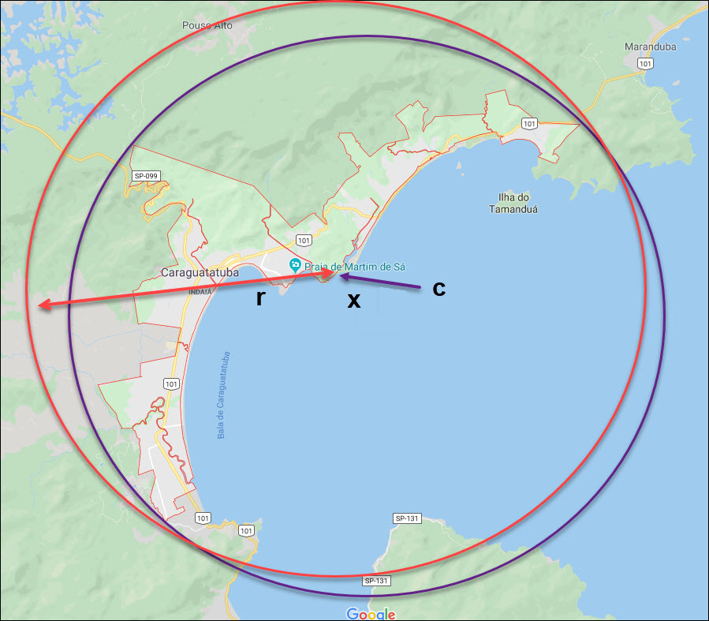
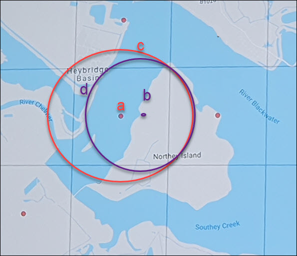
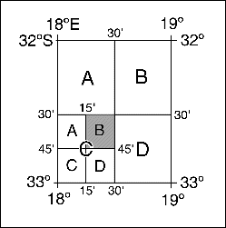
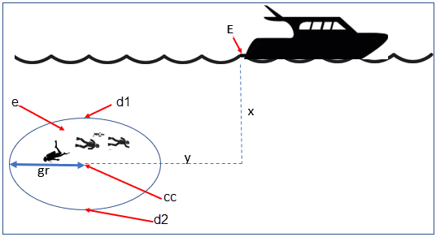
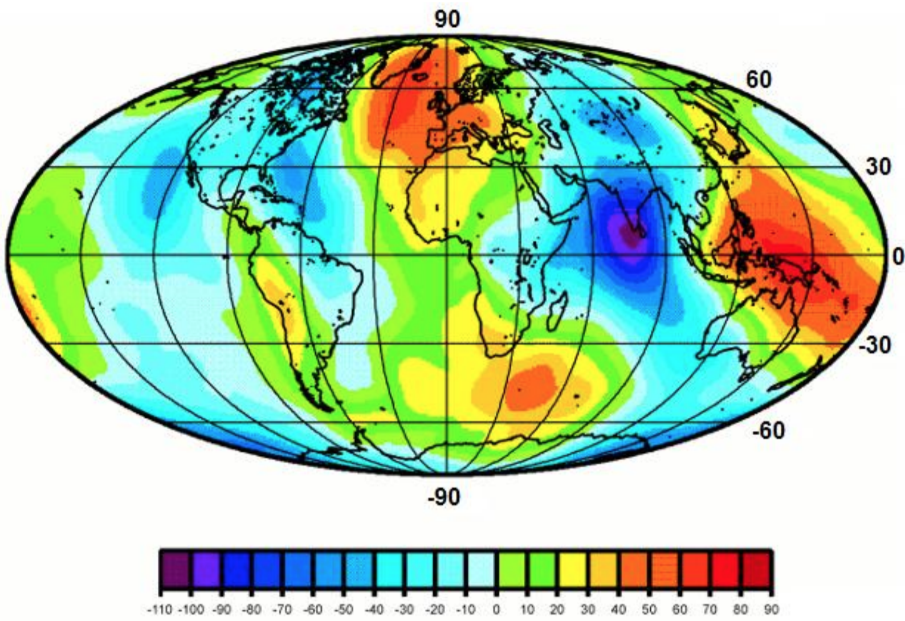

Elements for Describing a Location

In this section we discuss best practices for capturing and recording information so that it can be ¤<<georeference,georeferenced>>¤ and shared in the most productive and efficient way, following standard guidelines and methodologies. This will lead to improved consistency in recording, sharing, and use of data.

Collecting data in the field sets the stage for good ¤<<georeference,georeferencing>>¤ procedures (Museum of Vertebrate Zoology 2006). Many techniques now exist that can lead to well documented ¤<<georeference,georeferenced>>¤ ¤<<location,locations>>¤. It is important, however, that the ¤<<location,locations>>¤ be recorded correctly in order to reduce the likelihood of ¤<<error>>¤. We recommend that all new collecting ¤<<event,events>>¤ use a ¤<<GPS>>¤ for recording ¤<<coordinates>>¤ wherever possible, and that the ¤<<GPS>>¤ be set to a relevant ¤<<datum>>¤ or ¤<<coordinate reference system>>¤ (see <<__*2.5 Coordinate Reference System*__>>). There are many issues that need to be considered when collecting data in the field and in this section we provide recommendations for best practice.

🐠**MARINE**. The principles as laid out in this document apply equally to marine data as to terrestrial and other data. For example, recording ¤<<uncertainty>>¤ for marine data is just as important as recording it for terrestrial systems. This is particularly important for legacy data, data from historic voyages, scientific expeditions, etc. There is also ¤<<uncertainty>>¤ for all recordings of a ¤<<georeference>>¤ － however small that may be with modern equipment. Note that there are a number of issues that apply only to marine information. We refer those working in marine systems to other parts of this document for issues such as ¤<<depth>>¤, ¤<<distance above surface>>¤, dealing with non-natural occurrences, recording ¤<<extent>>¤ of diving activities, etc. Where there are differences that specifically apply to marine ¤<<location,locations>>¤, we will identify those with the 🐠icon.

🌳*ECOLOGICAL DATA*. ¤<<georeference,Georeferencing>>¤ ecological data, from surveys, trapping, species counts, etc. should be treated in a similar way to specimen and observation data. Often ecological data are recorded using a ¤<<grid>>¤, or ¤<<transect>>¤, and may have a starting ¤<<locality>>¤ and an ending ¤<<locality>>¤ as well as start time and end time. Where there are differences that specifically apply to ecological data, we will identify those with the 🌳icon.

🐉**CAVES**. Events in subterranean ¤<<location,locations>>¤, such as in caves, tunnels and mines, pose special problems in determining the ¤<<location>>¤. Where there are differences that specifically apply to these data, we will identify those with the 🐉icon.

=== The Importance of Good Locality Data

When recording data in the field, whether from a map or when using a ¤<<GPS>>¤, it is important to record descriptive ¤<<locality>>¤ information as an independent validation of a ¤<<georeference>>¤. The extent to which validation can occur depends on how well the ¤<<locality>>¤ description and its spatial counterpart describe the same place. The highest ¤<<data quality,quality>>¤ ¤<<locality>>¤ description is one contributing the least amount of ¤<<uncertainty>>¤ possible. This is equally important for retrospective ¤<<georeference,georeferencing>>¤, where ¤<<locality>>¤ descriptions are given and ¤<<georeference,georeferences>>¤ are not, and for ¤<<georeference,georeferencing>>¤ in the field.

=== Localities

Provide a descriptive ¤<<locality>>¤, even if you have ¤<<coordinates>>¤. The ¤<<locality>>¤ should be as specific, succinct, unambiguous, complete, and as ¤<<accuracy,accurate>>¤ as possible, leaving no room for multiple interpretations.

¤<<feature,Features>>¤ used as reference points should be stable,_ i.e_., places (permanent landmarks, ¤<<trig point,trig points>>¤, etc.) that will remain unchanged for a long time after the ¤<<event>>¤ is recorded. Do NOT use temporary ¤<<feature,features>>¤ or waypoints as the key reference ¤<<locality>>¤.

To facilitate the validation of a ¤<<locality>>¤, use reference ¤<<feature,features>>¤ that are easy to find on maps or in ¤<<gazetteer,gazetteers>>¤. At all costs, avoid using vague terms such as "near" and "center of" or providing only an ¤<<offset>>¤ without a distance, such as "West of Jiuquan", or worse "W Jiuquan".

In any ¤<<locality>>¤ that contains a ¤<<feature>>¤ that can be confused with another ¤<<feature>>¤ of a different type, specify the ¤<<feature>>¤ type in parentheses following the ¤<<feature>>¤ name, for example, "Clear Lake (populated place)".

If recording locations on a ¤<<path>>¤ (road, river, etc.), it is important to also record whether the distances were measured along the actual ¤<<path>>¤ (_e.g._, ‘by road’) or as a direct line from the origin (_e.g._, ‘by air’).

TIP: The most specific <<locality,localities>> are those described by a) a distance and heading along a <<path>> from a nearby and well-defined intersection, or b) two cardinal offset distances from a single persistent nearby <<feature>> of small <<extent>>.

By describing a ¤<<location>>¤ in terms of a distance along a ¤<<path>>¤, or by two orthogonal distances from a ¤<<feature>>¤, one removes ¤<<uncertainty>>¤ due to ¤<<precision,imprecise>>¤ ¤<<heading,headings>>¤, which, when the distances are great, can be the biggest contributing factor to overall ¤<<uncertainty>>¤. Choosing a reference ¤<<feature>>¤ with small ¤<<extent>>¤ reduces the ¤<<uncertainty>>¤ due to the size of the reference ¤<<feature>>¤, and by choosing a nearby reference ¤<<feature>>¤, one reduces the potential for ¤<<error>>¤ in measuring the ¤<<offset>>¤ distances, especially along ¤<<path,paths>>¤. The Museum of Vertebrate Zoology at the University of California, Berkeley has published a guide to recording good ¤<<locality,localities>>¤ in the field that follows these principles. Following is an example ¤<<locality>>¤ from that document (copied with permission).

*Example:*

*Locality: "Modoc National Wildlife Refuge, 2.8 mi S and 1.2 mi E junction of Hwy. 299 and Hwy. 395 in Alturas, Modoc Co., Calif.*"

*Lat/Long/Datum:* 41.45063, −120.50763 (WGS84)

*Elevation:* 1330 ft

*GPS Accuracy:* 24 ft

*Radial:* 150 ft

*References:* Garmin Etrex Summit GPS for coordinates and accuracy, barometric altimeter for elevation.

** (**From http://mvz.berkeley.edu/Locality_Field_Recording_Notebooks.html[_MVZ Guide for Recording Localities in Field Notes_])

When recording a ¤<<location>>¤ that does not have a ¤<<feature>>¤ that can be easily referenced, for example a 🐠dive location in the middle of the ocean (see ¤<<entry point>>¤) or using some other marker that may only be recorded as a ¤<<latitude>>¤ and ¤<<longitude>>¤, also record the provenance of the ¤<<location>>¤ (_e.g._, device or method used to determine the ¤<<coordinates>>¤ such as "transcription from ship’s log", etc.).

=== Extent of a Location

The ¤<<extent>>¤ of a ¤<<location>>¤ is the totality of the space it occupies. The ¤<<extent>>¤ is a simple way to alert the user that, for example, all of the specimens collected or observations made at the stated ¤<<coordinates>>¤ were actually within an area of up to 0.5 kilometers from that point. It can be quite helpful at times to include in your field notes a large-scale (highly detailed) map of the local vicinity for each ¤<<locality>>¤, marking the area in which ¤<<event,events>>¤ actually occurred.

The ¤<<extent>>¤ may be a linear distance, an area or a volume represented by one or more buffered points (_i.e._, a ¤<<point-radius>>¤), buffered lines (_e.g._, ¤<<transect,transects>>¤, ¤<<stratigraphic section,stratigraphic sections>>¤), polygons, or other ¤<<geometry,geometries>>¤ in two or three dimensions (sphere, cube, etc.).

A ¤<<location>>¤ can be anchored to a position (as ¤<<coordinates>>¤, potentially in combination with ¤<<elevation>>¤, ¤<<depth>>¤ and ¤<<distance above surface>>¤) within the ¤<<extent>>¤. This may be the corner or center of a ¤<<grid>>¤, the center of a polygon, the center of a circle, etc.

The ¤<<geographic extent>>¤ is the space occupied by the ¤<<location>>¤ when projected onto a 2D ¤<<coordinate reference system>>¤ in ¤<<geographic coordinates>>¤ (_e.g._, ¤<<latitude>>¤ and ¤<<longitude>>¤ in ¤<<decimal degrees>>¤ in ¤<<WGS84>> <<datum>>¤ on Google Maps™). The ¤<<geographic radial>>¤ is the line segment from the ¤<<corrected center>>¤ of the ¤<<location>>¤ to the furthest point on the ¤<<boundary>>¤ of the ¤<<geographic extent>>¤ of that ¤<<location>>¤. This simplified representation may be convenient for many uses, as long as the references to the ¤<<extent>>¤ are not lost. With the ¤<<coordinates>>¤ alone, the nature of the ¤<<extent>>¤ and the variety of conditions found therein will be lost, thus sacrificing the utility of the spatial information about the ¤<<location>>¤ and the contexts in which the data can be used.

When recording observations, whether by people or from fixed recording instruments such as camera traps (Cadman & González-Talaván 2014), sound recorders, etc., the ¤<<extent>>¤ should include the effective field of view (for camera traps) or area of detectable signals covered by the sound recorders, etc. In these cases the most faithful representation of the ¤<<location>>¤ (the one that would allow for the least ¤<<maximum uncertainty distance>>¤) should have the ¤<<coordinates>>¤ at the center of the ¤<<extent>>¤ of the field of detection, not at the position of the recording device or person. The true ¤<<location>>¤ may need to be calculated from the ¤<<coordinates>>¤ of the device using the ¤<<radial>>¤ and ¤<<point-radius>> <<georeferencing method>>¤. If the position of the device or person is the only practical way to give the ¤<<coordinates>>¤, then the ¤<<radial>>¤ for the ¤<<location>>¤ is the length of the furthest distance in the field of detection.

For 🐠diving activities, the ¤<<coordinates>>¤ are recorded as an ¤<<entry point>>¤ into the water and the ¤<<locality>>¤ is recorded with reference to that ¤<<entry point>>¤. For example, "sampling was conducted in a rough sphere of 30 meters diameter, whose center was located 300 meters due west of the ¤<<entry point>>¤ at a ¤<<depth>>¤ between 50 and 100 meters". In these cases the ¤<<radial>>¤ must be big enough to encompass the position within the ¤<<extent>>¤ farthest from the ¤<<entry point>>¤ (see <<Figure 7>>).

==== Transects

🌳🐠For a ¤<<location>>¤ that is a ¤<<transect>>¤, record both the start and end points of the line. This allows the orientation and ¤<<direction>>¤ of the ¤<<transect>>¤ to be preserved. If the ¤<<event,events>>¤ associated with the ¤<<transect>>¤ occur within a given maximum distance from the ¤<<transect>>¤, it is better to represent the ¤<<location>>¤ as a polygon (see <<__*2.3.3 Polygons*__>>). If the ¤<<event,events>>¤ associated with the ¤<<transect>>¤ can be reasonably separated into their individual ¤<<location,locations>>¤, it is better to do so, as these will be more specific than the ¤<<transect>>¤ as a whole. If that is done, however, ensure that you document that each individual ¤<<location>>¤ is part of a ¤<<transect>>¤.

If the ¤<<locality>>¤ is recorded as the center of the ¤<<transect>>¤ and half the length of the ¤<<transect>>¤ is then used to describe ¤<<uncertainty>>¤, information about the orientation of the ¤<<transect>>¤ is lost, and the description essentially becomes equivalent to a circle.

==== Paths

Not all linear-based ¤<<location,locations>>¤ are ¤<<transect,transects>>¤ or straight lines. We use the term ¤<<path>>¤ to highlight this broader concept. Illustrative examples are: _ad-hoc_ observations while walking along a trail, an inventory or count of species while travelling along a river, tracking an individual animal’s movements. 🐠Marine ¤<<transect,transects>>¤, tracks, tows, and trawls, are further examples. ¤<<path,Paths>>¤ should be described using ¤<<shape,shapes>>¤ (see discussion under <<__*3.3.4 Shape method*__>>) as connected line segments (a polygonal chain), with the ¤<<coordinates>>¤ of the starting point followed by the ¤<<coordinates>>¤ of each segment beginning and finishing with the end point. One simple way to store and share these is through https://en.wikipedia.org/wiki/Well-known_text_representation_of_geometry[_Well-Known Text_] (WKT, ISO 2016) (De Pooter, _et al._ 2017, OBIS _n.dat._, W.Appeltans, _pers. comm._ 15 Apr. 2019).

To determine the ¤<<uncertainty>>¤ of a described ¤<<path>>¤ using the ¤<<point-radius>> <<georeferencing method>>¤, one needs to determine the ¤<<corrected center>>¤ - _i.e.,_ the point on the ¤<<path>>¤ that describes the ¤<<smallest enclosing circle>>¤ that includes the totality of the ¤<<path>>¤ ("c" on <<Figure 3>>). This is very seldom the same place as the center of a line joining the two ends of the ¤<<path>>¤ ("y" on <<Figure 3>>), nor the center of the extremes of ¤<<latitude>>¤ and ¤<<longitude>>¤ (the ¤<<geographic center>>¤) of the ¤<<path>>¤ ("x" on <<Figure 3>>)*.*

image:img/Pictures/10000201000000FB000000EA3EFF1956D95523CB.png[image,width=251,height=233]

*Figure 3.* A ¤<<path>>¤ (river) showing the *center* of the ¤<<smallest enclosing circle>>¤, '*x*', the mid point between the ends of the river '*y*', the ¤<<corrected center>>¤ '*c*', and the ¤<<radial>>¤ '*r*'.

==== Polygons

When collecting or recording data from an area, for example, bird counts on a lake, a set of nesting or roosting sites on an offshore coral cay, or a buffered ¤<<transect>>¤ - the ¤<<location>>¤ is best recorded as a polygon. Polygons can be stored using the ¤<<Darwin Core>>¤ (Wieczorek _et al_. 2012b) field called _*dwc:footprintWKT*_, in which a ¤<<geometry>>¤ can be stored in the Well-Known Text format (ISO 2016). For the ¤<<point-radius>> <<georeferencing method>>¤, if the polygon has a concave shape (for example a crescent), the center may not actually fall within the polygon (<<Figure 4>>). In that case, the ¤<<corrected center>>¤ on the ¤<<boundary>>¤ of the polygon is used for the ¤<<coordinates>>¤ of the ¤<<location>>¤ and the ¤<<geographic radial>>¤ is measured from that point to the furthest extremity of the polygon. Note that the circle based on the ¤<<corrected center>>¤ (red circle in <<Figure 4>>) will always be greater than the circle based on the ¤<<geographic center>>¤ (black circle in <<Figure 4>>).

*Figure 4.* The town of Caraguitatuba in SP, Brazil (a complicated polygon), showing the center ('*x*') of the ¤<<smallest enclosing circle>>¤ encompassing the whole of the town, and the ¤<<corrected center>>¤ ('*c*') - the nearest place on the ¤<<boundary>>¤ to '*x*. '*r*' is the ¤<<geographic radial>>¤ of the larger, red circle.

Complex polygons, such as donuts, self-intersecting polygons and multipolygons create even more problems, in both documentation and storage.

==== Grids

¤<<grid,Grids>>¤ may be based on the lines of ¤<<latitude>>¤ and ¤<<longitude>>¤, or they may be cells in a cartesian ¤<<coordinate system>>¤ based on distances from a reference point. Usually ¤<<grid,grids>>¤ are aligned North-South, and if not, their ¤<<magnetic declination>>¤ is essential to record. If the ¤<<extent>>¤ of a ¤<<location>>¤ is a ¤<<grid>>¤ cell, then the ideal way to record it would be the ¤polygon¤ consisting of the corners of the ¤<<grid>>¤ (_i.e._, a ¤<<bounding box>>¤). The ¤<<point-radius>>¤ method can be used to capture the ¤<<coordinates>>¤ of the ¤<<grid>>¤ cell center and the distance from there to one of the furthest corners, but given that the ¤<<geometry,geometries>>¤ for ¤<<grid>>¤ cells are so simple, it is best to also capture them as polygons. Often ¤<<grid>>¤ cells (_e.g._, geographic <<grid,grids>>) are described using the ¤<<coordinates>>¤ of the southwest corner of the ¤<<grid>>¤. Using the southwest corner as the ¤<<coordinate>>¤ for a ¤<<point-radius>>¤ ¤<<georeference>>¤ is wasteful, since the ¤<<geographic radial>>¤ would be from there to the farthest corner, which would be twice as far as it would be if the center of the ¤<<grid>>¤ cell was used instead. In any case, the characteristics of the ¤<<grid>>¤ should be recorded with the ¤<<locality>>¤ information.

It is important when converting gridded data to ¤<<geographic coordinates>>¤ to also check the ¤<<locality>>¤ description. ¤<<locality,Locality>>¤ information may allow you to refine the ¤<<location>>¤ as in <<Figure 5>> where just having the ¤<<grid,grids>>¤ without the ¤<<locality>>¤ information (_i.e._ "on Northey Island") would lead to the circle (c) with its center (a) at the center of the ¤<<grid>>¤. Knowing that the record is on Northey Island, however, allows you to refine the ¤<<location>>¤ to the smaller circle (d) with its center at (b). Note that other criteria (such as a change of ¤<<datum>>¤, map scale, etc.) may add to the ¤<<uncertainty>>¤.

 

*Figure 5*. Two options for ¤<<georeference,georeferencing>>¤ gridded data, 1) circle '*c*' with center at '*a*' for just the ¤<<grid>>¤ cell, and 2) circle '*d*' with center at '*b*' using the part of the ¤<<grid>>¤ cell constrained to be on Northey Island.

===== Township, Range and Section and Equivalents

Township, Range and Section (TRS) or Public Land Survey System (PLSS) is a ¤<<grid>>¤-like way of dividing land into townships in the mid- and western USA. Sections are usually 1 mile on each side and townships usually consist of 36 sections arranged in a ¤<<grid>>¤ with a specific numbering system. Not all townships are square, however, as there may be irregularities based on administrative boundaries, for example. For this reason, though these systems resemble ¤<<grid,grids>>¤, they are best treated as individual polygons. Similar subdivisions are used in other countries

===== Quarter Degree Squares

Quarter Degree Squares (QDS) or QDGC (Quarter Degree Grid Cells) (Larsen _et al._ 2009) have been used in many historical African biodiversity atlas projects and continue to be used for current South African biodiversity projects such as the Atlas of South African birds (Larsen _et al._ 2009, Larsen 2012). It has also been recommended as the method to use for ¤<<generalization,generalizing>>¤ sensitive biodiversity data in South Africa (SANBI 2016, Chapman 2020).

Unlike most geographic ¤<<grid>>¤ systems, which have their origin in the bottom left corner of the ¤<<grid>>¤, QDS ¤<<grid,grids>>¤ reference their origin from the top left corner. ¤<<grid,Grids>>¤ are identified by a code that consists of 4 numbers and two letters (_e.g._, 2624BD). The code can be worked out as follows:

* Each degree square is designated by a four digit number made up of the values of ¤<<latitude>>¤ and ¤<<longitude>>¤ at its top left corner, for example, 3218 for the larger square in <<Figure 6>>.
* Each degree square is divided into sixteen quarter-degree squares, each 15’ x 15’. These are given two additional letters as indicated. Thus in <<Figure 6>>, the hatched area is represented by the code 3218CB.

Note that QDS is developed for use in Africa, and currently only works in the Southern Hemisphere. It has been suggested that it be extended for use in the Northern Hemisphere, but this is not yet under development.

*Figure 6.* Recording data using Quarter Degree Square (QDS) ¤<<grid,grids>>¤. The shaded ¤<<grid>>¤ is referenced as QDS 3218CB. Image with permission from RePhotoSA (http://rephotosa.adu.org.za/FAQs.php[_http://rephotosa.adu.org.za/FAQs.php_]).

==== Three Dimensional Shapes

Most terrestrial ¤<<location,locations>>¤ are recorded with reference to the terrestrial surface as ¤<<geographic coordinates>>¤, sometimes with ¤<<elevation>>¤. Some types of 🐠marine *events* such as dives and trawls, benefit from explicit description in three dimensions.

🐠Diving ¤<<event,events>>¤ are commonly recorded using the ¤<<geographic coordinates>>¤ of the point on the surface where the diver entered the water, called ¤<<entry point>>¤ or point of entry. The underwater ¤<<location>>¤ should be recorded as a horizontal distance and ¤<<direction>>¤ along with water ¤<<depth>>¤ from that surface ¤<<location>>¤ (see <<Figure 7>>). Below the surface the diver may then begin a collection/observation exercise in three dimensions from that point including a horizontal component and a minimum and maximum water ¤<<depth>>¤. These should all be recorded. The reference point should be the ¤<<corrected center>>¤ of the 3D-shape that includes the ¤<<extent>>¤ of the ¤<<location>>¤. The ¤<<geographic radial>>¤ would be the distance from the ¤<<corrected center>>¤ of the 3D shape (the three dimensions projected perpendicularly onto the surface) to the furthest extremity of the projection of the 3D-shape in the horizontal plane (_i.e._, on the ¤<<geographic boundary>>¤).

*Figure 7.* Recording the ¤<<location>>¤ of an underwater ¤<<event>>¤. '*E*' denotes ¤<<entry point>>¤, the surface ¤<<location>>¤ at which the ¤<<geographic coordinates>>¤ are recorded. '*x*' is the water ¤<<depth>>¤, '*y*' is the horizontal ¤<<offset>>¤ (distance and direction) from '*E*' to the center of the ¤<<location>>¤. <<extent,*Extent>> *'*e*' is the three-dimensional ¤<<location>>¤ covered by the ¤<<event>>¤. The ¤<<corrected center>>¤ '*cc*' is the point within the 3D shape that minimizes the length of the ¤<<geographic radial>>¤ '*gr*'. Minimum ¤<<depth>>¤ '*d1*' and maximum ¤<<depth>>¤ '*d2*' are the upper and lower limits of the ¤<<location>>¤.

🐠There are many different types of trawls and tows, including bottom and mid-water trawls. The 3D nature should be captured as above. The geographic reference points would be line segments tracing the route of the trawl, and would be more akin to ¤<<path,paths>>¤ and captured as a ¤<<shape>>¤ as described above under <<__*2.3.2 Paths*__>>.

=== Coordinates

Whenever practical, provide the ¤<<coordinates>>¤ of the ¤<<location>>¤ where an ¤<<event>>¤ actually occurred (see <<__*2.3 Extent of a Location*__>>) and accompany these with the ¤<<coordinate reference system>>¤ of the ¤<<coordinates,coordinate>>¤ source (map or ¤<<GPS>>¤). The two ¤<<coordinate system,coordinate systems>>¤ most commonly used by biologists are based on ¤<<geographic coordinates>>¤ (_i.e._, ¤<<latitude>>¤ and ¤<<longitude>>¤) or Universal Transverse Mercator (¤<<UTM>>¤) (_i.e._, ¤<<easting>>¤, ¤<<northing>>¤, and ¤<<UTM>>¤ zone).

A ¤<<datum>>¤ is an essential part of a ¤<<coordinate reference system>>¤ and provides the frame of reference. Without it the ¤<<coordinates>>¤ are ambiguous. When using both maps and ¤<<GPS>>¤ in the field, set the ¤<<coordinate reference system>>¤ or ¤<<datum>>¤ of the ¤<<GPS>>¤ or ¤<<GNSS>>¤ receiver to be the same as that of the map so that the ¤<<GPS>>¤ ¤<<coordinates>>¤ for a ¤<<location>>¤ will match those on the map. Be sure to record the ¤<<coordinate reference system>>¤ or ¤<<datum>>¤ used.

==== Geographic Coordinates

¤<<geographic coordinates,Geographic coordinates>>¤ are a convenient way to define a ¤<<location>>¤ in a way that is not only more specific than is otherwise possible with a ¤<<locality>>¤ description, but also readily allows calculations to be made in a ¤<<geographic information system,GIS>>¤. ¤<<geographic coordinates,Geographic coordinates>>¤ can be expressed in a number of different ¤<<coordinate format,coordinate formats>>¤ (¤<<decimal degrees>>¤, ¤<<DMS,degrees minutes seconds>>¤, degrees decimal minutes), with ¤<<decimal degrees>>¤ being the most commonly used. ¤<<geographic coordinates,Geographic coordinates>>¤ in ¤<<decimal degrees>>¤ are convenient for ¤<<georeference,georeferencing>>¤ because this succinct format has global applicability and relies on just three attributes, one for ¤<<latitude>>¤, one for ¤<<longitude>>¤, and one for the ¤<<geodetic datum>>¤ or ¤<<ellipsoid>>¤, which, together with the ¤<<coordinate format>>¤, make up the ¤<<coordinate reference system>>¤. By keeping the number of recorded attributes to a minimum, the chances for transcription ¤<<error,errors>>¤ are minimized (Wieczorek _et al._ 2004).

When capturing ¤<<geographic coordinates>>¤, always include as many decimals of ¤<<precision>>¤ as given by the ¤<<coordinates,coordinate>>¤ source. ¤<<coordinates,Coordinates>>¤ in ¤<<decimal degrees>>¤ given to five decimal places are more ¤<<precision,precise>>¤ than a measurement in ¤<<DMS,degrees, minutes, and seconds>>¤ to the nearest second, and more ¤<<precision,precise>>¤ than a measurement in degrees and decimal minutes given to three decimal places (see <<Table 3>>). Some new ¤<<GPS>>¤/¤<<GNSS>>¤ receivers now display data in decimal seconds to two decimal places, which corresponds to less than a meter everywhere on earth. This doesn't mean that the ¤<<GPS>>¤ reading is ¤<<accuracy,accurate>>¤ at that scale, only that the ¤<<coordinates>>¤ as given do not contribute additional ¤<<uncertainty>>¤.

TIP: <<decimal degrees,_*Decimal degrees>> are preferred when capturing <<coordinates>> from a <<GPS>>, however, where reference to maps is important, and where the <<GPS>> receiver allows, set the recorder to report in degrees, minutes, and decimal seconds.

==== Universal Transverse Mercator (UTM) Coordinates

¤<<UTM>>¤, Universal Transverse Mercator (UTM), is a system for assigning distance-based ¤<<coordinates>>¤ using a mercator ¤<<projection>>¤ from an idealized ¤<<ellipsoid>>¤ of the surface of the earth onto a plane. In most applications of the ¤<<UTM>>¤ system, the earth is divided into a series of six-degree wide ¤<<longitude,longitudinal>>¤ zones extending between 80°S and 84°N and numbered from 1-60 beginning with the zone at the ¤<<antimeridian,Antimeridian>>¤ (Snyder 1987). Because of the ¤<<latitude,latitudinal>>¤ limitation in extent, ¤<<UTM>> <<coordinates>>¤ are not usable in the extreme polar regions of the earth. A map of ¤<<UTM>>¤ zones can be found at http://www.dmap.co.uk/utmworld.htm[_UTM Grid Zones of the World_] (Morton 2006).

¤<<UTM>> <<coordinates>>¤ consist of a zone number, a hemisphere indicator (N or S), and ¤<<easting>>¤ and ¤<<northing>>¤ coordinate pairs separated by a space with 6 and 7 digits respectively, and all in the order given here. For example, for Big Ben in London (¤<<latitude>>¤ 51.500721, ¤<<longitude>>¤ -0.124430), the ¤<<UTM>>¤ reference would be: 30N 699582 5709431.

¤<<latitude,Latitude>>¤ bands are not officially part of ¤<<UTM>>¤, but are used in the Military Grid Reference System (MGRS). They are used in many applications, including in Google Earth™. Each zone is subdivided into 20 ¤<<latitude,latitudinal>>¤ bands, with letters used from South to North starting with "C" at 80°S to "X" (stretched by an extra 4 degrees) at 72°N (to 84°N) and omitting "O". All letters below "N" are in the southern hemisphere, "N" and above are in the northern hemisphere. When using ¤<<latitude,latitudinal>>¤ bands, "north" and "south" need to be spelled out to avoid confusion with the ¤<<latitude,latitudinal>>¤ bands of "N" and "S" respectively. Using the ¤<<latitude,latitudinal>>¤ band method, the ¤<<coordinates>>¤ for Big Ben would be: 30T 699582m east 5709431m north.

National and local ¤<<grid>>¤ systems derived from ¤<<UTM>>¤, but which may be based on different ¤<<ellipsoid,ellipsoids>>¤ and ¤<<datum,datums>>¤, are basically used in the same way as ¤<<UTM>>¤s. For example, the Map Grid of Australia (MGA2020) uses ¤<<UTM>>¤ with the GRS80 ¤<<ellipsoid>>¤ and Geocentric Datum of Australia (GDA2020) (Geoscience Australia 2019b). An example of a ¤<<location>>¤ in MGA2020 is "MGA Zone 56, x: 301545 y: 7011991"

When recording a ¤<<location>>¤, or databasing using ¤<<UTM>>¤ or equivalent ¤<<coordinates>>¤, a zone should ALWAYS be included; otherwise the data are of little or no value when used outside that zone, and certainly of little use when combined with data from other zones. Zones are often not reported where a region (_e.g._, Tasmania) falls completely within one ¤<<UTM>>¤ zone. This is OK while the database remains regional, but is not suitable for exchange outside of the zone. When exporting data from databases like these, the region’s zone should be added prior to export or transfer. Better still, modify the database so that the zone remains with the ¤<<coordinates>>¤.

Note that ¤<<Darwin Core>>¤ (Wieczorek _et al_. 2012b) supports ¤<<UTM>>¤ ¤<<coordinates>>¤ only in the _verbatimCoordinates_ field. There are several tools to convert ¤<<UTM>> <<coordinates>>¤ to ¤<<geographic coordinates>>¤, including http://home.hiwaay.net/~taylorc/toolbox/geography/geoutm.html[_Geographic/UTM Coordinate Converter_] (Taylor 2003) - see http://georeferencing.org/tools.html[_http://georeferencing.org/tools.htm_]http://georeferencing.org/tools.html[_l_]. For details on ¤<<georeference,georeferencing>>¤, see <<__*2.3.2 Coordinates - Universal Transverse Mercator (UTM)*__>> in Zermoglio _et al. _(2020).

TIP: If using <<UTM>> <<coordinates>>, always record the <<UTM>> zone and the <<datum>> or <<coordinate reference system>>.

=== Coordinate Reference System

Except under special circumstances (the poles, for example), ¤<<coordinates>>¤ without a ¤<<coordinate reference system>>¤ do not uniquely specify a ¤<<location>>¤. Confusion about the ¤<<coordinate reference system>>¤ can result in positional ¤<<error,errors>>¤ of hundreds of meters. Positional shifts between what is recorded on some maps and ¤<<WGS84>>¤, for example, may be between zero and 5359 m (Wieczorek 2019).

An unofficial (not governed by a standards body) set of ¤<<EPSG>>¤ (IOGP 2019) codes are often used (and misused) to designate ¤<<datum,datums>>¤. There are ¤<<EPSG>>¤ codes for a variety of entities (¤<<coordinate reference system,coordinate reference systems>>¤, areas of use, ¤<<prime meridian,prime meridians>>¤, ¤<<ellipsoid,ellipsoids>>¤, etc.) in addition to ¤<<datum,datums>>¤, and the codes for these are often confused. For example, the code for the ¤<<WGS84>>¤ ¤<<coordinate reference system>>¤ is epsg:4326, while the code for the ¤<<WGS84>>¤ ¤<<datum>>¤ is epsg:6326 and the code for the ¤<<WGS84>>¤ ¤<<ellipsoid>>¤ is epsg:6422. The ¤<<EPSG>>¤ code has the advantage (when properly chosen) that it is explicit which type of entity it refers to, unlike the common name alone (_e.g._, "¤<<WGS84>>¤" alone could refer to the ¤<<coordinate reference system>>¤, the ¤<<datum>>¤, or the ¤<<ellipsoid>>¤). Increasingly, ¤<<GPS>>¤ units are reporting ¤<<coordinate reference system,coordinate reference systems>>¤ as ¤<<EPSG>>¤ codes. Knowing the ¤<<EPSG>>¤ code for the ¤<<coordinate reference system>>¤, one can determine the ¤<<datum>>¤ and ¤<<ellipsoid>>¤ for that system. It is thus recommended to record the ¤<<EPSG>>¤ code of the ¤<<coordinate reference system>>¤ if possible, otherwise, record the ¤<<EPSG>>¤ code of the ¤<<datum>>¤ if possible, otherwise, record the ¤<<EPSG>>¤ code of the ¤<<ellipsoid>>¤. If none of these can be determined from the ¤<<coordinates,coordinate>>¤ source, record "not recorded". This is important, as it determines the ¤<<uncertainty>>¤ due to an unknown ¤<<datum>>¤ (see <<__*3.4.4 Uncertainty from Unknown Datum*__>>) and has potentially drastic implications for the ¤<<maximum uncertainty distance>>¤.

Sources of ¤<<EPSG>>¤ codes include epsg.io (Maptiler 2019), Apache (2019), EPSG Dataset version 9.1 (IOGP 2019), and Geomatic Solutions (2018). When using a ¤<<GPS>>¤, it is important to set and record the ¤<<EPSG>>¤ code of the ¤<<coordinate reference system>>¤ or ¤<<datum>>¤. See discussion below under <<__*3.4 Calculating Uncertainties*__>>__.__

TIP: If you are not basing your <<locality>> description on a map, set your <<GPS>> to report <<coordinates>> using the <<WGS84>> <<datum>> or a recent local <<datum>> that approximates <<WGS84>> (that may, for example, be legislated for your country) or the appropriate <<coordinate reference system,Coordinate Reference System>> (<<EPSG>> Code). Record the <<datum>> used in all your documentation.

=== Using a GPS

¤<GPS>>¤ (Global Positioning System) technology uses triangulation between a ¤<<GPS>>¤/¤<<GNSS>>¤ receiver and ¤<<GPS>>¤ or ¤<<GNSS>>¤ satellites (Kaplan & Hegarty 2006, Van Sickle 2015, Novatel 2015). As the ¤<<GNSS>>¤ satellites are at known positions in space, and the ¤<<GPS>>¤/¤<<GNSS>>¤ receiver can determine the distances to the detected satellites, the position on earth can be calculated. A minimum of four ¤<<GNSS>>¤ satellites is required to determine a position on the earth’s surface (McElroy _et al._ 2007, Van Sickle 2015). This is not generally a limitation today, as one can often receive signals from a large number of satellites (up to 20 or more in some areas). Note, however, that just because your ¤<<GNSS>>¤ receiver is showing lots of satellites, it doesn’t mean that all are being used as the receiver’s ability to make use of additional satellites may be limited by its computational power (Novatel 2015). In the past, many ¤<<GPS>>¤ units only referenced the ¤<<GPS>>¤ (USA) satellites of which there are currently 31 (April 2019), but now many ¤<<GPS>>¤/¤<<GNSS>>¤ receivers are designed to access systems from other countries as well - such as GLONASS (Russia), BeiDou-2 (China), Galileo (Europe), NAVIC (India), and QZSS (Japan), making a total of about 112 currently accessible satellites (2019) with a further 23 to be brought into operation over the next few years. This number is increasing rapidly every year (Braun 2019). Prior to the removal of Selective Availability in May 2000, the ¤<<accuracy>>¤ of handheld ¤<<GPS>>¤ receivers in the field was around 100 meters or worse (McElroy _et al_. 2007, Leick 1995). The removal of this signal degradation technique has greatly improved the ¤<<accuracy>>¤ that can now generally be expected from ¤<<GPS>>¤ receivers (GPS.gov 2018).

To obtain the best possible ¤<<accuracy>>¤, the ¤<<GPS>>¤/¤<<GNSS>>¤ receiver must be located in an area that is free from overhead obstructions and reflective surfaces and have a good field of view to a broad portion of the sky (for example, they do not work very well under a heavy forest canopy, although new satellite signal technology is improving the ¤<<accuracy>>¤ in these locations (Moore 2017)). The ¤<<GPS>>¤/¤<<GNSS>>¤ receiver must be able to record signals from at least four ¤<<GNSS>>¤ satellites in a suitable geometric arrangement. The best arrangement is to have "_one satellite directly overhead and the other three equally spaced_ _around the horizon_" (McElroy _et al. 2007_). The ¤<<GPS>>¤/¤<<GNSS>>¤ receiver must also be set to an appropriate ¤<<datum>>¤ or ¤<<coordinate reference system>>¤ (CRS) for the area, and the ¤<<datum>>¤ or ¤<<coordinate reference system,CRS>>¤ that was used must be recorded (Chapman _et al._ 2005a).

TIP: Set your <<GPS>> to report <<location,locations>> in <<decimal degrees>> rather than make a conversion from another <<coordinate system>> as it is usually more <<precision,precise>> (see <<Table 3>> in <<3.4.3. Uncertainty Related to Coordinate Precision>>), better and easier to store, and saves later transformations, which may introduce <<error>>.

TIP: An alternative where reference to maps is important, and where the <<GPS>> receiver allows it, is to set the recorder to report in degrees, minutes, and decimal seconds.

==== Choosing a GPS or GNSS Receiver

One of the most important issues for consideration when choosing a ¤<<GPS>>¤ or ¤<<GNSS>>¤ receiver is the antenna. An antenna behaves both as a spatial and frequency filter, therefore, selecting the right antenna is critical for optimizing performance (Novatel 2015). One of the drawbacks with smartphones, for example, is the limited size of the ¤<<GNSS>>¤ antenna.

For information on issues to consider when selecting an appropriate ¤<<GNSS>>¤ antenna and/or ¤<<GPS>>¤ receiver, we refer you to Chapter 2 in Novatel (2015) and Chapter 10 in NLWRA (2008).

==== GPS Accuracy

Most ¤<<GPS>>¤ devices are able to report a theoretical horizontal ¤<<accuracy>>¤ based on local conditions at the time of reading (atmospheric conditions, reflectance, forest cover, etc.). For highly specific ¤<<location,locations>>¤, it may be possible for the potential ¤<<error>>¤ in the ¤<<GPS>>¤ reading to be on the same order of magnitude as the ¤<<extent>>¤ of the ¤<<location>>¤. In these cases, the ¤<<GPS>>¤ ¤<<accuracy>>¤ can make a non-trivial contribution to the overall ¤<<uncertainty>>¤ of a ¤<<georeference>>¤.

The latest US Government commitment (US Dept of Defence and GPS Navstar 2008) is to broadcast the ¤<<GPS>>¤ signal in space "_with a global average user range error (URE) of ≤7.8 m (25.6 ft.), with 95% probability_". In reality, actual performance exceeds this, and in May 2016, the global average URE was ≤ 0.715__ __m (2.3__ __ft), 95% of the time (GPS.gov 2017). Though it does not mean that all receivers can obtain that ¤<<accuracy>>¤, the ¤<<accuracy>>¤ of ¤<<GPS>>¤ receivers has improved and today most manufacturers of handheld ¤<<GPS>>¤ units promise errors of less than 5__ __meters in open areas when using four or more satellites. The need for four or more satellites to achieve these ¤<<accuracy,accuracies>>¤ is because of the inaccuracies in the clocks of the ¤<<GPS>>¤ receivers as opposed to the much more ¤<<accuracy,accurate>>¤ satellite clocks (Novatel 2015). The ¤<<accuracy>>¤ can be improved by averaging the results of multiple observations at a single location (McElroy __et al. __2007), and some modern ¤<<GPS>>¤ receivers that include averaging algorithms can bring the ¤<<accuracy>>¤ to around three meters or less. According to GISGeography (2019a), “_A well-designed GPS receiver can achieve a horizontal accuracy of 3 meters or better and vertical accuracy of 5 meters or better 95% of the time. Augmented GPS systems can provide sub-meter accuracy_”.. Another method to improve ¤<<accuracy>¤ is to average over more than one ¤<<GPS>>¤ unit. Note that some ¤<<GPS>>¤/¤<<GNSS>>¤ receivers can record up to 20 decimal places of ¤<<precision>>¤, but that doesn’t mean that is the ¤<<accuracy>>¤ of the unit.

==== Differential GNSS

The use of Differential ¤<<GNSS>>¤ (DGNSS) (incorporating Differential ¤<<GPS>>¤_ _(DGPS)) can improve ¤<<accuracy>>¤ considerably. DGNSS references a ¤<<GNSS>>¤ Base Station (usually a survey control point) at a known position to calibrate the receiving ¤<<GNSS>>¤ signal. The Base Station and handheld ¤<<GNSS>>¤ receiver reference the satellites’ positions at the same time and thus reduces¤<<error>>¤ due to atmospheric conditions, as well as (to a lesser extent) satellite ephemeris (orbital location) and clock ¤<<error>>¤ (Novatel 2015). The handheld ¤<<GNSS>>¤ instrument applies the appropriate corrections to the determined position. Depending on the ¤<<data quality,quality>>¤ of the receivers used, one can expect an ¤<<accuracy>>¤ of <1 meter (USGS, 2017). This ¤<<accuracy>>¤ decreases as the distance of the receiver from the Base Station increases. It is important to note that differential technology is not available in all areas - for example, in remote ¤<<location,locations>>¤ and remote islands, and the resulting ¤<<accuracy>>¤ may be less than expected. Again, averaging can further improve on these values (McElroy __et al. __2007). It is important to note, however, that most DGNSS is post-processed. Records are stored in the ¤<<GPS>>¤/¤<<GNSS>>¤ unit and then post-processing software is run to improve the measurements once connected to a computer. Post processing is not as commonly used since the introduction of real-time DGNSS, such as the ¤<<SBAS,Satellite Based Augmentation System>>¤, see the next subsection below), and is now used mostly in surveying applications where high ¤<<accuracy>>¤ is required.

🐠Marine horizontal position ¤<<accuracy>>¤ requirements are 2-5 meters (at a 95 percent confidence level) for safety of navigation in inland waters, 8-20 meters (95%) in harbor entrances and approaches, and horizontal position ¤<<accuracy,accuracies>>¤ of 1-100 meters (95%) for resource exploration in coastal regions (Skone 2004, Skone & Yousuf 2007). While DGNSS horizontal ¤<<error>>¤ bounds are specified as 10 meters (95%) studies have shown that under normal operating conditions ¤<<accuracy,accuracies>>¤ fall well within this bound.

DGNSS ¤<<accuracy,accuracies>>¤ are susceptible to severe degradation due to enhanced ionospheric effects associated with geomagnetic storms. Degradation can be in the order of 2-30 times in some areas and depending on the severity of the storm.

==== Satellite Based Augmentation System

Satellite Based Augmentation System (¤<<SBAS>>¤) is a collection of geosynchronous satellites originally developed for precision guidance of aircraft (Federal Aviation Administration 2004) and more recently to provide services for improving the ¤<<accuracy>>¤, integrity and availability of basic ¤<<GNSS>>¤ signals (Novatel 2015). ¤<<SBAS>>¤ receivers are inexpensive examples of real-time differential correction. ¤<<SBAS>>¤ uses a network of ground-based reference stations to measure small variations in the ¤<<GNSS>>¤ satellite signals. Measurements from the reference stations are routed to master stations, which queue the received Deviation Correction (DC) and send the correction messages to geostationary satellites. Those satellites broadcast the correction messages back to Earth, where ¤<<SBAS>>¤-enabled ¤<<GPS>>¤/¤<<GNSS>>¤ receivers use the corrections while computing their positions to improve ¤<<accuracy>>¤. Separate corrections are calculated for ionospheric delay, satellite timing, and satellite orbits (ephemerides), which allows ¤<<error>>¤ corrections to be processed separately, if appropriate, by the user application.

===== Wide Area Augmentation System

The first ¤<<SBAS>>¤ system was ¤<<WAAS>>¤ (Wide Area Augmentation System), which was originally developed to provide improved ¤<<GPS>>¤ ¤<<accuracy>>¤ and a certified level of integrity to the US aviation industry, such as to enable aircraft to conduct ¤<<precision>>¤ approaches to airports and for coastal navigation. It was later expanded to cover Canada and Mexico, providing a consistent coverage over North America.

===== European Geostationary Navigation Overlay Service

The European Geostationary Navigation Overlay Service (EGNOS) was developed as an augmentation system that improves the ¤<<accuracy>>¤ of positions derived from ¤<<GPS>>¤ signals and alerts users about the reliability of the ¤<<GPS>>¤ signals. Originally developed using three geostationary satellites covering European Union member states, EGNOS satellites have now also been placed over the eastern Atlantic Ocean, the Indian Ocean, and the African mid-continent.

===== Other SBAS Services

More recently, other ¤<<SBAS>>¤s have been, or are in the process of being developed to cover other parts of the world, including MSAS (Japan and parts of Asia), GAGAN (India), SDCM (Russia), SNAS (China), AFI (Africa) and SACCSA (South and Central America) (ESA 2014). Australia and New Zealand are in the process of developing an ¤<<SBAS>>¤ system that will provide several decimeter accuracy across Australia and its marine areas, and one decimetre accuracy across New Zealand. The system will provide three services to users - an L1 system with sub one-meter horizontal ¤<<accuracy>>¤ for aviation purposes; a Dual-Frequency Multi-Constellation (DFMC) with sub one-meter ¤<<accuracy,accuracies>>¤; and a Precise Point Position (PPP) service (see <<__*2.6.6 Precise Point Positioning*__>> with ¤<<accuracy,accuracies>>¤ of 10-15 cm (Guan 2019). Testing is scheduled for completion in July 2020 (Geoscience Australia 2019a).

===== Accuracy of SBAS Services

A study in 2016 determined that, over most of the USA, the ¤<<accuracy>>¤ of ¤<<WAAS>>¤-enabled, single-frequency ¤<<GPS>>¤ units was on the order of 1.9 meters at least 95% of the time (FAA 2017). This may be lower in other parts of the world where ¤<<SBAS>>¤ stations are less common. Note that as most ¤<<SBAS>>¤ satellites are geostationary, blocked line of sight towards the equator (southwards in the northern hemisphere, or northwards in the Southern hemisphere) by buildings or heavy canopy cover will reduce the ¤<<accuracy>>¤ of ¤<<SBAS>>¤ correction, Also, during solar storms, the ¤<<accuracy>>¤ deteriorates by a factor of around 2.

Despite early indications that ¤<<WAAS>>¤ can significantly improve positional ¤<<accuracy>>¤ during the most severe period of geomagnetic storms, more recent studies in the USA and Canada have shown that the sparseness of ¤<<WAAS>>¤ stations and ionospheric grids do not lead to a significant improvement. (Skone _& Yousuf_ 2007). With reference stations needing to have separations within 100 km, improvements are only likely in coastal and near coastal areas of North America and Europe in the foreseeable future.

==== Ground-based Augmentation System

Ground Based Augmentation Systems (GBAS), also known as Local Area Augmentation Systems (LAAS), provide differential corrections and satellite integrity monitoring in conjunction with VHF radio, to link to ¤<<GNSS>>¤ receivers. A GBAS consists of several ¤<<GNSS>>¤ antennas placed at known locations with a central control system and a VHF radio transmitter. GBAS is limited in its coverage and is used mainly for specific applications that require high levels of ¤<<accuracy>>¤, availability and integrity, and is the system largely used for airport navigation systems.

==== Precise Point Positioning

Precise Point Positioning (PPP) depends on ¤<<GNSS>>¤ satellite clock and orbit corrections, generated from a network of global reference stations to remove ¤<<GNSS>>¤ system ¤<<error>>¤ and provide a high level (decimeter) of positional ¤<<accuracy>>¤. Once the corrections are calculated, they are delivered to the end user via satellite or over the Internet.

Although similar to ¤<<SBAS>>¤ systems (see above), they generally provide a greater ¤<<accuracy>>¤ and have the advantage of providing a single, global reference stream as opposed to the regional nature of an ¤<<SBAS>>¤ system. Whereas ¤<<SBAS>>¤ is free, the use of PPP usually incurs a charge to access the corrections, so it is unlikely that the increased ¤<<accuracy>>¤ of PPP when compared to that of ¤<<SBAS>>¤, will be a consideration for most biological applications.

==== Static GPS

Static ¤<<GPS>>¤__ __uses high ¤<<precision>>¤__ __instruments and specialist techniques and is generally employed only by surveyors. Surveys conducted in__ __Australia using these techniques reported ¤<<accuracy,accuracies>>¤ in the centimeter range. These techniques are__ __unlikely to be extensively used with biological record collection due to the cost and general lack of__ __requirement for such ¤<<precision>>¤.

==== Dual and Multi-Frequency GPS

High-end dual and multi-frequency ¤<<GPS>>¤/¤<<GNSS>>¤ devices can bring ¤<<accuracy>>¤ to the centimeter level, and even mm level over the long-term (GPS.gov, 2017). One of the ways this is done is by removing one of the largest contributors to overall satellite ¤<<error>>¤ － ¤<<error>>¤ due to the ionosphere (known as ionosphere ¤<<error>>¤) (Novatel 2015).

==== Smartphones

¤<<GPS>>¤-enabled smartphones are typically ¤<<accuracy,accurate>>¤ to within 4.9 m (16 ft.) under open sky, however, their ¤<<accuracy>>¤ worsens near buildings, bridges, and trees (GPS.gov 2017). A study by Tomaštik _et al._ (2017) found that the ¤<<accuracy>>¤ of smartphones in open areas was around 2-4 m. This decreased to 3-11 m in deciduous forest without leaves, and 3-20 m in deciduous forest with leaves. There are reports that the ¤<<accuracy>>¤ in some ¤<<GPS>>¤-enabled smartphones will soon be improved to <1 meter (Moore 2017) and that ¤<<accuracy>>¤ in areas with restricted satellite view within cities will be improved drastically with inbuilt 3D smartphone apps and probabilistic shadow matching (Iland _et al._ 2018). In general, the ¤<<GNSS>>¤ chipsets in smartphones are quite good, and any loss of ¤<<accuracy>>¤ is usually due to the ¤<<data quality,quality>>¤ of the antenna, whose chief failing is due to their poor multipath suppression (Pirazzi _et al._ 2017). In some smartphones where good satellite coverage is unavailable (_e.g._, in cities and forests), the phone may introduce ¤<<error,errors>>¤ from ¤<<bias>>¤ in its internal clock (Pirazzi __et al. __2017), leading to occasional large inaccuracies (A.Arino pers. comm.). Already the technology for better than 1 meter smartphone ¤<<accuracy>>¤ exists, but it is not available to the public due to the difficulty and cost of incorporating the technology into small smartphones (Braun 2019). The ¤<<accuracy,accuracies>>¤ reported in most publications refer to studies in the USA, Europe, coastal Australia, India or Japan where good differential stations are plentiful. More studies are needed to test smartphone ¤<<accuracy,accuracies>>¤ in remote ¤<<location,locations>>¤ and where differential stations are not available.

Smartphone ¤<<GPS>>¤ technology is changing rapidly and there is likely to be new and updated information even before this document is published.

2.6.10 GPS-enabled Cameras

We are not aware of the characteristics of the ¤<<accuracy>>¤ of ¤<<GPS>>¤-enabled cameras, but we expect the ¤<<accuracy>>¤ to be similar to that of smartphones. One study, using three different cameras, showed variation between the three and the true ¤<<location>>¤ to be less than 3 m from the reported ¤<<location>>¤ (Doty 2017). 🐠Note that ¤<<GPS>>¤-enabled cameras that are used for snorkelling and diving activities, will only give new ¤<<GPS>>¤ readings each time the camera is brought to the surface.

2.6.11 Diver-towed Underwater GPS Receivers

🐠Over the years, a number of methods for tracking a diver underwater with a ¤<<GPS>>¤ have been tried with limited success. These included using a floating ¤<<GPS>>¤ receiver over the diver’s bubbles, and a ¤<<GPS>>¤ receiver on a raft towed by the diver that recorded intermittent readings to provide a dive ¤<<transect>>¤ (Schories & Niedzwiedz 2011). The most successful to date has been the use of a ¤<<GPS>>¤ antenna on a floating buoy that is attached by a cable to a diver-held ¤<<GPS>>¤. These diver-towed underwater ¤<<GPS>>¤/¤<<GNSS>>¤ handheld receivers have been used for underwater monitoring studies for several years. Most dives using this method are at <20 meters as the signal deteriorates with cable length giving a maximum practical depth of 50 meters (Niedzwiedz & Schories 2013). One problem is cable drag, and it is almost impossible to determine the buoys ¤<<offset>>¤ exactly although Niedzwiedz & Schories (2013) provide formulae for attempting to do so. A study by the same authors (Schories & Niedzwiedz 2011) showed displacement of 2.3 m at a ¤<<depth>>¤ of 5 m, 3.2 m at 10-m ¤<<depth>>¤, 4.6 m at 20-m ¤<<depth>>¤, 5.5 m at 30-m ¤<<depth>>¤, and 6.8 m at 40-m ¤<<depth>>¤. These are in addition to ¤<<GPS>>¤ ¤<<accuracy>>¤ discussed under <<__*2.6.2 GPS Accuracy*__>>, above.

=== Elevation

Supplement the ¤<<locality>>¤ description with ¤<<elevation>>¤ information if this can be easily obtained. ¤<<elevation,Elevation>>¤ can be determined from a variety of sources while in the field, including altimeters, maps (both digital and paper), and ¤<<GPS>>¤/¤<<GNSS>>¤ receivers, each with associated ¤<<uncertainty,uncertainties>>¤. ¤<<elevation,Elevation>>¤ can be estimated _post-facto_ using ¤<<digital elevation model,Digital Elevation Models>>¤ at the ¤<<coordinates>>¤ of the ¤<<location>>¤. In any case, record the method used to determine the ¤<<elevation>>¤.

NOTE: "<<elevation,Elevation>> markings can narrow down the area in which you place a point. More often than not, however, they seem to create inconsistency. While <<elevation>> should not be ignored, it is important to realize that <<elevation>> was often measured <<accuracy,inaccurately>> and/or <<precision,imprecisely>>, especially early in the 20th century. One of the best uses of <<elevation>> in a <<locality>> description is to pinpoint a <<location>> along a road or river in a topographically complex area, especially when the rest of the <<locality>> description is vague." *_(Murphy _et al._ 2004).

When adding ¤<<elevation>>¤ _post facto_ be aware that the ¤<<elevation>>¤ can vary considerably over a small area (especially in steep terrain) and that the ¤<<uncertainty>>¤ of the ¤<<georeference>>¤ must be taken into account when determining the ¤<<elevation>>¤. Do not use the ¤<<coordinates>>¤ on their own.

==== Altimeters

A barometric altimeter uses changes in air pressure as a proxy for changes in ¤<<elevation>>¤, and can be a reliable source of ¤<<elevation>>¤ if properly calibrated. Calibration requires that the ¤<<elevation>>¤ of the altimeter be set to a known starting ¤<<elevation>>¤, which could be determined from a map, for example. Thereafter, as the altimeter goes higher or lower in ¤<<elevation>>¤, it estimates the new ¤<<elevation>>¤ directly from the air pressure it experiences. Since weather conditions can change the air pressure independently of changes in ¤<<elevation>>¤, it is important to re-calibrate the altimeter frequently, either by recording the ¤<<elevation>>¤ when you stop moving and resetting to that same ¤<<elevation>>¤ before starting out again, and/or by recalibrating to known ¤<<elevations>>¤ whenever you encounter them.

In theory it would be possible to use a barometric altimeter to determine ¤<<elevations>>¤ when in a 🐉subterranean ¤<<location>>¤ (cave, mine, etc.), but these situations are particularly prone to changes in air pressure independent from ¤<<elevation>>¤ changes (especially in caves with narrow openings), so recalibration would have to be particularly careful.

==== Maps

¤<<elevation,Elevation>>¤ can be determined using the contours and spot height information from a suitable scale map of the area. In general, the ¤<<uncertainty>>¤ in the ¤<<elevation>>¤ when read from a map is half the contour interval.

For information on determining accuracy from a map, see <<__*3.4.2.1 *__https://docs.google.com/document/d/1eooUGqT0wu7unzCvg5TOrfhHToYUrRCgmg36HmPgxII/edit#heading=h.vu2q3vfjht3[_*Uncertainty *_]__*in Paper Map Measurements*__>>.

==== GPS

¤<<elevation,Elevation>> <<accuracy>>¤ as reported from a ¤<<GPS>>¤ has improved markedly in recent years, but ¤<<elevation>> <<accuracy>>¤ is not usually reported by ¤<<GPS>>¤/¤<<GNSS>>¤ receivers. As a general rule, for most non-¤<<SBAS>>¤ or ¤<<WAAS>>¤ enabled ¤<<GPS>>¤/¤<<GNSS>>¤ receivers, ¤<<elevation>> <<error>>¤ is approximately 2-3 times the horizontal ¤<<error>>¤ (USGS 2017). It is hard to find definitive information for smartphones, but it would appear that this same multiplier is a good rule for those as well. With ¤<<WAAS>>¤-enabled ¤<<GPS>>¤, the FAA reports that 95% of the time vertical error is <4 meters (FAA 2019). However, the ¤<<elevation>>¤ reported on the ¤<<GPS>>¤ receiver or smartphone is not necessarily referring to ¤<<mean sea level>>¤ (MSL) as reported, but to the zero elevation of the ¤<<ellipsoid>>¤ of the ¤<<datum>>¤ - see discussion below.

Note that ¤<<GPS>> <<elevation>>¤ readings can represent one of at least two different values, depending on the method used by the ¤<<GPS>>¤. ¤<elevation,Elevation>>¤ reported can be the geometric height. This is the only value that ¤<<GPS>>¤ devices can actually measure, and is the height based on the ¤<<ellipsoid>>¤ of the ¤<<datum>>¤. The ¤<<elevation>>¤ reported can also be the ¤<<elevation>>¤ above ¤<<mean sea level>>¤ (MSL), or orthometric height. These values are not directly measured by the ¤<<GPS>>¤, but are calculated as the difference between the geometric height (measured) and the ¤<<geoid>>¤ height. The ¤<<geoid>>¤ height depends on the ¤<<geoid>>¤ and the ¤<<datum>>¤ you are trying to compare it against. Thus, to understand the potential difference between ¤<<elevation,elevations>>¤ based on ¤<<mean sea level>>¤ and those based on the geometric model, the geometric model (¤<<datum>>¤) must be known. To calculate the potential ¤error¤ using ¤<<WGS84>>¤ ¤<<datum>>¤ at a given geographic ¤<<location>>¤, use the https://www.unavco.org/software/geodetic-utilities/geoid-height-calculator/geoid-height-calculator.html[_Geoid Height Calculator_] (UNAVCO 2020). For further discussion about these methods, consult Eos Positioning Systems (2018). For a good explanation of the differences between the ¤<<geoid>>¤ and ¤<<mean sea level>>¤, we refer you to GISGeography (2019).

==== Vertical Datums

In 2022, the USA will release a new geometric reference frame and geopotential ¤<<vertical datum>>¤ that will replace existing USA geometric ¤<<vertical datums>>¤. Similarly, over the next five years, Australia will move to a new generation height reference frame - the Australian Gravimetric Quasigeoid 2017 (AGQG 2017) (McCubbine _et al._ 2019). The new reference frames will rely primarily on Global Navigation Satellite Systems (¤<<GNSS>>¤), as well as on an updated gravimetric ¤<<geoid>>¤ model (National Geodetic Survey 2018). The new method of calculating ¤<<vertical datum,vertical datums>>¤ will improve vertical ¤<<accuracy,accuracies>>¤ to around 1-2 cm, will provide more ¤<<accuracy,accurate>>¤ ¤<<GPS>>¤-determined ¤<<elevation,elevations>>¤ (Ellingson 2017), and will allow for dynamic updating. Other jurisdictions are likely to move to new methods of calculating ¤<<vertical datum,vertical datums>>¤ over time, meaning that within 5 years most users will be able to vertically position themselves using mobile Global Navigation Satellite Systems (¤<<GNSS>>¤) technology with sub-decimetre ¤<<accuracy>>¤ (Brown _et al._ 2019).

==== Digital Elevation Models

¤<<digital elevation model,Digital Elevation Models>>¤ (DEM) are based on ¤<<elevation,elevations>>¤ above ¤<<mean sea level>>¤ (or more recently, the ¤<<geoid>>¤). The models are calculated using sophisticated interpolations and do not necessarily correspond to the actual surface ¤<<elevation>>¤. ¤<<digital elevation model,DEM>>¤ vertical ¤<<accuracy>>¤ is influenced by several factors such as ¤<<grid>>¤ size, slope, land cover, and geolocation (horizontal) ¤<<error>>¤, as well as other ¤<<bias,biases>>¤ due to the original ¤<<digital elevation model,DEM>>¤ data collection (_e.g._, satellite imaging geometry) and/or production method (Mukherjee _et al._ 2013, Mouratidis and Ampatzidis 2019). Global ¤<<digital elevation model,DEMs>>¤ such as the Advanced Spaceborne Thermal Emission and Reflection Radiometer (ASTER) Global DEM V2 (Meyer 2011) and the Shuttle Radar Topography Mission (SRTM) are based on 1 arc-second grids (about 30 m x 30 m) (Farr _et al._ 2007) and have an ¤<<accuracy>>¤ of better than 17 m and 10 m respectively (except for in steep terrain such as mountains, and areas with very smooth sandy surfaces with low signal to noise ratio, such as the Sahara Desert (Farr _et al._ 2007)). Local and regional ¤<<digital elevation model,DEMs>>¤ may have a smaller ¤<<grid>>¤ size. For example, a 5 m ¤<<grid>>¤ in Australia, which has a vertical ¤<<accuracy>>¤ better than one meter, and even to 0.3 meter in some areas (Geoscience Australia 2018) or the European Digital Elevation Model, which has an ¤<<accuracy>>¤ of better than three meters (Mouratidis and Ampatzidis 2019). Note also that satellite image-based ¤<<digital elevation model,DEMs>>¤, being radar based, vary greatly over different land surfaces, forests, shrub or herbaceous vegetation, agricultural areas, bare areas, rocky surfaces, wetlands, and artificial surfaces such as cities. Also the radar can penetrate into areas of snow, ice, and sand (as in deserts) (Mouratidis and Ampatzidis 2019).

==== Smartphones

Some smartphones, whether they incorporate ¤<<GPS>>¤ capabilities or not, use apps that provide ¤<<elevation>>¤ values based on a ¤<<digital elevation model,DEM>>¤. With smartphone ¤<<GPS>>¤ apps, be aware that some devices and apps incorrectly record the method used. The ¤<<uncertainty>>¤ in ¤<<elevation>>¤ due to an unknown ¤<<elevation>>¤ source can be up to 100 m. For example, the difference with ¤<<datum>> <<WGS84>>¤ between the ¤<<ellipsoid>>¤ and ¤<<geoid>>¤ or ¤<<mean sea level>>¤ methods of reporting ¤<<elevation>>¤ is shown in <<Figure 8>>. Note also that these ¤<<uncertainty,uncertainties>>¤ are in addition to the ¤<<uncertainty,uncertainties>>¤ associated with the measurements themselves. The only true way of determining what your ¤<<GPS>>¤ receiver or smartphone is recording is to test it against a known ¤<<elevation>>¤. Some preliminary studies by the authors show ¤<<elevation>> <<accuracy>>¤ from ¤<<smartphones>>¤ varies greatly in different areas of the world. In areas in the USA, Europe, Australia, Japan, etc. (where most published results are from) ¤<<error,errors>>¤ are generally within 10 meters or so, but in more remote areas (such as on a remote island in Fiji), ¤<<error,errors>>¤ in the order of +/- 60 meters are not uncommon. Using two different mobile applications at sea level at one location resulted in reported ¤<<elevation,elevations>>¤ from -24 m to +58.9 m. These studies are preliminary and more research is needed in different areas of the world.

*Figure 8*. Map comparing the ¤<<geoid>>¤-based ¤<<mean sea level,Mean Sea Level>>¤ to the ¤<<WGS84>> <<ellipsoid>>¤. (Lemoine _et al._ 1998). The color scale shows distance of the ¤<<geoid>>¤ below (negative) or above (positive) the ¤<<WGS84>> <<ellipsoid>>¤ in meters. Image from Tan _et al_. (2016) by permission of the authors.

==== Google Earth™

Using a large sample size (n>20,000) of ¤<<GPS>>¤ benchmarks in a variety of terrains in the United States, Wang _et al._ (2017) found that ¤<<elevation,elevations>>¤ in the Google Earth™ terrain model had a boundary of ¤<<error>>¤ interval at 95% (BE95) of __+__44 m, with worst-case scenarios around 200 m. The same study found that Google Earth™ terrain model had a BE95 of __+__6 m along highways. Though we find no data for elsewhere in the world at this time, we recommend using the values extracted from the work of Wang _et al_. as estimates of ¤<<elevation,elevational>> <<uncertainty>>¤ when the source is the Google Earth™ terrain model. A second study using Google Earth™ to determine ¤<<elevation>>¤ in three regions of Egypt (El-Ashmawy 2016) on flat, medium, and steep terrains concluded that ¤<<elevation>>¤ data is more ¤<<accuracy,accurate>>¤ in flat areas or areas with small height difference, with an ¤<<accuracy>>¤ of approximately 1.85 m (RMSE) and an ¤<<error>>¤ range of less than 3.72 m (and in some findings less than 1 m). Increasing the difference in height leads to decrease in the obtained ¤<<accuracy>>¤ with the RMSE rising to 5.69 m in steep terrain.

=== Headings

Compass directions (also known as ¤<<heading,headings>>¤) can be rather ambiguous. North, for example, might be any direction between northwest and northeast if more specific information is not provided. There are several ways to avoid ambiguity when recording ¤<<heading,headings>>¤. One way is to qualify the direction with "due" (_e.g._, "due north") if the ¤<<heading>>¤ warrants it. A second way to avoid ambiguity is to use two orthogonal ¤<<heading,headings>>¤ in ¤<<locality>>¤ descriptions, making implicit that both components are "due". Finally, ambiguity can be reduced if ¤<<heading,headings>>¤ are given in degrees from north (0° is north, 90° is east, 180° is south, and 270° is west).

It is important to record ¤<<heading,headings>>¤ based on True North (true ¤<<heading>>¤) and not on Magnetic North (magnetic ¤<<heading>>¤). The differences between True North and Magnetic North vary throughout the world, and in some places can vary greatly across a very small distance (NOAA 2019, NOAA/NCEI & CIRES 2019). For example, in an area about 250 km NW of Minneapolis in the United States, the anomalous ¤<<magnetic declination>>¤ (the difference between the ¤<<magnetic declination,declination>>¤ caused by the Earth's outer core and the ¤<<magnetic declination,declination>>¤ at the surface) changes from 16.6° E to 12.0° W across a distance of just 6 km (Goulet 2001).

The differences between True North and Magnetic North also change over time (NOAA _n.dat_.a). The National Oceanic and Atmospheric Administration (NOAA) has an online calculator (https://www.ngdc.noaa.gov/geomag/calculators/magcalc.shtml[_https://www.ngdc.noaa.gov/geomag/calculators/magcalc.shtml_]) that can calculate the anomalous or geomagnetic ¤<<magnetic declination,declination>>¤ (adjustment needed to convert the magnetic reading to a reading based on True North) for any place on earth and at any point in time. If you need to make adjustments, we suggest that you use this calculator to determine the ¤<<magnetic declination>>¤ for the area in question. Otherwise determine your ¤<<heading>>¤ using a reliable map and always report your methods. Note that some smartphone apps will make that calculation for you, and allow you to set your app to record either Magnetic North or True North.

=== Offsets

An ¤<<offset>>¤ is a displacement from a reference point, named place, or other ¤<<feature>>¤, and is generally accompanied by a direction (or ¤<<heading>>¤, see <<__*2.8 Headings*__>>). One of the best ways to describe a ¤<<locality>>¤ is with orthogonal ¤<<offset,offsets>>¤ from a small, persistent, easy to locate ¤<<feature>>¤ (see <<__*2.2 Localities*__>>). Using an ¤<<offset>>¤ at a very specific ¤<<heading>>¤ is a second option, though the ¤<<uncertainty>>¤ still grows with the ¤<<offset>>¤ distance. ¤<<offset,Offsets>>¤ along a ¤<<path>>¤ are a third reasonable option for describing a ¤<<locality>>¤, though they tend to be much harder to measure _post-facto_. Other ¤<<locality type,locality types>>¤ that use ¤<<offset,offsets>>¤ (_e.g._, an ¤<<offset>>¤ ¤<<direction>>¤ without a distance, or an ¤<<offset>>¤ distance without a ¤<<direction>>¤) tend to introduce excessive ¤<<uncertainty>>¤ and should be avoided.

==== Offset Distance Only

A ¤<<locality>>¤ consisting of an ¤<<offset>>¤ from a ¤<<feature>>¤ without a ¤<<heading>>¤ may arise as a result of an ¤<<error>>¤ when recording the ¤<<locality>>¤ in the field or through data entry. If the ¤<<feature>>¤ is small (such as a ¤<<trig point>>¤) then the overall ¤<<uncertainty>>¤ will be largely due to the ¤<<offset>>¤. With larger ¤<<feature,features>>¤ (such as a town, or a lake), both the ¤<<offset>>¤ from, and the ¤<<extent>>¤ of the ¤<<feature>>¤ may contribute significantly to the overall ¤<<uncertainty>>¤. The original collection catalogs or labels may contain information that can make the *locality* more specific. If not, a *"Distance only" locality* (_e.g._, "5 km from Lake Vättern, Sweden" might be envisioned as a band running around the reference ¤feature¤ at a distance given in the *locality* description. The problem is, we don't know what was being used at the reference - some place in the lake, or some place on the edge, nor do we know if the ¤<<offset>>¤ was perpendicular to an edge or at some oblique angle to it. Because of these confounding factors, it is recommended to treat the ¤<<locality>>¤ as if it was a *feature* enlarged on all sides by the combination of all the sources of ¤<<uncertainty>>¤ (see <<__*2.2.1 Offset - Distance only*__>> in _*Georeferencing Quick Reference Guide*_ (Zermoglio _et al_ 2020)).

==== Offset Direction Only

A ¤<<locality>>¤ with a ¤<<heading>>¤ from a *feature*, but with no distance (_e.g._, "East of Albuquerque"), is particularly ambiguous and very subjective to *georeference3. With no additional information to constrain the distance , there is no clear indication of how far one might have to go to reach the *location *– to the next nearest *feature*; the next nearest *feature* of equivalent size, to a place where there is a major change in biome (such as a coast), or just keep going?

Note that seldom is such ¤<<locality>>¤ information given alone. For example, the ¤<<locality>>¤ may have administrative geography information (_e.g._, ‘East of Albuquerque, Bernalillo County, New Mexico’). This gives you a stopping point (_e.g._, the county border), and should allow you to ¤georeference¤ the ¤<<locality>>¤ (see <<__*2.2.2 Offset - Heading only*__>>) in _*Georeferencing Quick Reference Guide*_ (Zermoglio _et al._ 2020). In any case, it is highly recommended not to record locality descriptions in this way.

==== Offset at a Heading

A ¤locality¤ that contains an ¤<<offset>>¤ in a given direction to or from a ¤<<feature>>¤ is treated here as an "offset at a ¤<<heading>>¤". There are several variations on such *localities*. One difficulty in determining a ¤<<georeference>>¤ for this type of ¤<<locality>>¤ description is knowing how the ¤<<offset>>¤ was determined - for example, by air, or along a ¤<<path>>¤ such as a road or river. Therefore, whenever a locality with an ¤<<offset>>¤ at a ¤<<heading>>¤ is described, be sure to be explicit about what is intended.

It is not uncommon for 🐠marine ¤<<locality>>¤ descriptions to use an azimuth - a ¤<<heading>>¤ toward a target ¤<<feature>>¤, for example, "25° to Waipapa Point Lighthouse". In these cases the referenced ¤<<feature>>¤ is the starting point, and the ¤<<heading>>¤ from there should be 180 degrees on the compass away from the compass reading given in the ¤<<locality>>¤ description. This is known as a "back azimuth" or "backsighting".

Where the sense of the ¤<<offset>>¤ cannot be determined from the ¤<<locality>>¤ description or additional information and there is no obvious major ¤<<path>>¤ that can be followed in the rough direction and distance given, then it is best to assume the collector measured the distance by air. Whatever the decision, document the assumption in the ¤<<georeference>>¤ remarks (_e.g._, ‘Assumed "by air" – no roads E out of Yuma’, or ‘Assumed "by road" on Hwy. 80’) and ¤<<georeference>>¤ accordingly (see <<__*2.2.5 Offset - Distance at a Heading*__>> and <<__*2.2.3 Offset - Distance along a Path*__>> in _*Georeferencing Quick Reference Guide*_ (Zermoglio _et al._ 2020).

The addition of an adverbial modifier to the distance part of a ¤<<locality>>¤ description (such as "about 25 km"), while an honest observation, should not affect the determination of the ¤<<geographic coordinates>>¤ or the ¤<<maximum uncertainty distance,maximum uncertainty>>¤. Treat the ¤<<uncertainty>>¤ due to distance ¤<<precision>>¤ normally (see <<link:#_tbb3wgkuhzeh[_*3.4.6 Uncertainty Related to Offset Precision*_]>>)

==== Offset along a Path

Sometimes it is convenient to describe a ¤<<locality>>¤ as a distance along a curvilinear ¤<<feature>>¤ — a ¤<<path>>¤ such as a road, river, trail, etc. (see <<__*2.2.3 Offset - Distance along a Path*__>> in __*Georeferencing *__Q_*uick Reference Guide *_(Zermoglio _et al_. 2020). One advantage of a description of this kind is that it avoids the ¤<<uncertainty>>¤ due to an ¤<<precision,imprecise>>¤ ¤<<heading>>¤. It might also be easy to register, such as when tracking distance with the odometer of a car while driving. However, a disadvantage is that it may not be quite as easy to determine the same ¤<<location>>¤ _post-facto_ from maps alone during the ¤<<georeference,georeferencing>>¤ process, because it means you have to trace the facsimile of the ¤<<path>>¤ on the map, which may have ¤<<error,errors>>¤, loss of resolution due to map scale, or inconsistencies with conditions at the time of the ¤<<event>>¤, or might not even be present. Also, the ¤<<path>>¤ may have changed over time, making it even more difficult to find the exact ¤<<locality>>¤ retrospectively.

If the ¤<<locality>>¤ references a river, such as in the example "16 mi downstream from St Louis on the left bank of the Mississippi River", it is reasonable to assume that the ¤<<offset>>¤ is along the river. In this example, the ¤<<locality>>¤ is on the east side of the river, in Illinois, rather than on the west side, in Missouri, as the reference to "left bank" is conventionally taken to be in the orientation looking downstream.

==== Offset along Orthogonal Directions

This type of ¤<<locality>>¤ refers to rectilinear distances in two orthogonal ¤<<direction,directions>>¤ from a ¤<<feature>>¤, for example, "2 mi E and 1.5 mi N of Kandy" (see <<__*2.2.4 Offset - Distance along Orthogonal Directions*__>> in Georeferencing Q__*uick Reference Guide *__(Zermoglio _et al_. 2020) and <<Figure 12>>. This way of describing a locality can be very effective, as it tends to remove one of the potentially largest sources of *uncertainty*, the ever-expanding ¤<<uncertainty>>¤ of ¤<<direction>>¤ with distance. Using orthogonal ¤<<direction,directions>>¤ removes all ¤<<direction,directional>>¤ ¤<<uncertainty>>¤, as orthogonality implies directly in the orthogonal ¤<<direction,directions>>¤ "by air". It is for this reason that this ¤<<locality type>>¤ is highly recommended for ¤<<locality>>¤ descriptions.

2.10 Water Depth

Water ¤<<depth>>¤ should be recorded as a range; _i.e_., as minimum and maximum positive distances in meters below the air-water interface of the water body (🐠ocean, sea, lake, river, etc.). Maximum ¤<<depth>>¤ will always be a positive number greater than or equal to the minimum ¤<<depth>>¤. If the ¤<<depth>>¤ measurement is specific rather than a range, use the same value for the minimum and maximum ¤<<depth,depths>>¤.

2.10.1 Bathymetry

🐠The ¤<<depth>>¤ of the benthic surface in large water bodies is called ¤<<bathymetry>>¤ or bathymetric ¤<<depth>>¤. It is usually recorded in one of two ways - as a gridded surface (Digital Terrain Model), or as contours. The accuracy of the ¤<<bathymetry>>¤ depends on how it was determined, and is generally much more ¤<<accuracy,accurate>>¤ near the coasts, or in harbours, than it is in the deeper ocean.

Since 2003, the most commonly used global coverage of ¤<<bathymetry>>¤ has been the One Minute General Bathymetric Chart of the Oceans (GEBCO 2019a), however, in 2019, a much finer, and more detailed, 15 arc-second ¤<<grid>>¤ coverage was released (GEBCO 2019b). The 3,732,480,000 *grids* (86,400 rows by 43,200 columns) cover from 89°59'52.5'' N, 179°59'52.5'' W to 89°59'52.5'' S, 179°59'52.5'' E, with ¤<<elevation>>¤ given for each pixel center. There are many criteria that determine the vertical ¤<<accuracy>>¤ of these ¤<<grid,grids>>¤, including the presence of steep canyons, water ¤<<depth>>¤ and turbidity (affects instrument penetration and acoustic beams get wider, the deeper they go), and methodology (satellite, single beam echo sounders (SES), multibeam echo sounders (MES), airborne laser (LADS), Light Detection and Ranging (LIDAR), etc.) (Wolf __et al. __2019).

¤<<bathymetry,Bathymetric>>¤ contours have generally only been available for harbours, coastal and near inshore areas, in some places extending to the edges of the continental slope. Where ¤<<bathymetry,bathymetric>>¤ contours (also called ¤<<depth>>¤ contours or isobaths) do exist, they are generally quite coarse (except in areas like the North Sea, and in harbours), and get wider apart as the depth increases. For example, the 2009 ¤<<bathymetry,bathymetric>>¤ contours for Australia are at 20 m, 40 m, 100 m, 200 m and 400 m. In some harbours, the contour interval is as small as one meter (Data.gov.au 2018). In 2019, the GEBCO_2019 global ¤<<bathymetry,bathymetric>>¤ contour dataset was derived from the GEBCO_2019 15 arc-second grid mentioned above. At large scales (1:5,000,000 and closer), the contour interval is 500 m; at medium scales (1:5,000,000 to 1:30,000,000) the contour interval is 1000 m; and at small scales (1:30,000,000 and greater), the contour interval is 2000 m. Supplementary contours are shown in shallow waters (less than 500 m) (NCEI-NOAA 2019).

Very few studies have been carried out on the ¤<<accuracy>>¤ of either the ¤<<bathymetry,bathymetric>>¤ ¤<<grid,grids>>¤ or contours - especially with GEBCO_2019 as the dataset has only recently been published. The authors have not been able to find any definitive information on ¤<<accuracy,accuracies>>¤ that we can report on a general basis, but the contour intervals give an indication of the ¤<<uncertainty>>¤ inherent in the ¤<<grid,grids>>¤. In coastal, near inshore areas, harbours, and inland reservoirs and lakes, more intensive and different ¤<<bathymetry,bathymetric>>¤ surveys have generally been carried out (see the Bathymetric Data Viewer (NOAA 2019)) and ¤accuracy¤ studies have been conducted in some of these areas. In shallow-water areas there is less interference due to water ¤<<depth>>¤ and higher sound wave frequencies can be used for multibeam ¤<<bathymetry,bathymetric>>¤ surveying. The ¤<<accuracy>>¤ is much better than in other deeper-water areas, and thus these studies cannot be extrapolated to the broader ocean. For contours, as with land maps, ¤<<uncertainty>>¤ in the ¤<<elevation>>¤ is half the contour interval.

2.10.2 Dive Computers

There are three methods for determining ¤<<depth>>¤ that are generally used by divers, _i.e._, dive computers, dive watches and depth gauges. All work on ambient pressure to determine the ¤<<depth>>¤. Dive computers need to be calibrated before dives and set depending on the water density - _i.e.,_ saltwater or freshwater, etc. and if calibrated correctly are reported by manufacturers, to be ¤<<accuracy,accurate>>¤ to within 0.3 m.

A study of 47 brands of dive computers at ¤<<depth,depths>>¤ of 10 m, 20 m, 30 m, 40 m and 50 m in both seawater and freshwater showed that the majority of ¤<<depth>>¤ estimates were in the ± 1 meter range, and that if the salinity is known and the instrument is properly calibrated, ¤<<accuracy,accuracies>>¤ of around 1% could or should be expected (Azzopardi & Sayer 2012). The ¤<<accuracy>>¤ of diver-held depth gauges are of a similar order. Dive watches are generally thought less ¤<<accuracy,accurate>>¤, but with reports for some watches of ¤<<depth>>¤ ¤<<accuracy>>¤, at ¤<<depth,depths>>¤ of up to 100 m, as ± 1% of displayed value + 0.3 m (when used at constant temperature). ¤<<accuracy,Accuracy>>¤ can be influenced by changes in ambient temperature and water salinity.

2.11 Distance above Surface

¤<<distance above surface,Distance above surface>>¤ should be recorded in meters in a vertical direction from a reference point, with a minimum and a maximum distance to cover a range. Examples include the height above the ground of a soaring eagle, the distance up a tree from the ground (height), and the distance from the top of a vertical core sample to a diatom sample found in that core.

The reference point for the measurement of a ¤<<distance above surface>>¤ can vary depending on the context. For surface terrestrial locations, the reference point should be the ¤<<elevation>>¤ at ground level. For water bodies (🐠ocean, sea, lake, river, etc.), the reference point for aerial locations should be the ¤<<elevation>>¤ of the air-water interface, while the reference point for 🐠sub-surface benthic locations should be the bottom of the water body at that ¤<<location>>¤. ¤<<location,Locations>¤ within the water body should use water ¤<<depth>>¤ and should not use any other distance above a surface.

We recommend that ¤<<distance above surface>>¤ always be measured in the same sense, that is, as distances _above_ the reference surface. Distances above a reference point should be expressed as positive numbers, while those below should be negative. This is analogous to ¤<<elevation>>¤, which is positive when expressing a distance above ¤<<mean sea level>>¤ and negative below that reference point. The maximum ¤<<distance above surface>>¤ will always be a number greater than or equal to the minimum distance above that surface for a given ¤<<location>>¤ (see <<Figure 9>>).

image:img/Pictures/100002010000043B000003ED631B8869A4E7344C.png[image,width=514,height=477]

**Figure 9. **Examples of use of *<<depth>>*, *<<elevation>>* and *<<distance above surface>>*, for *A*: terrestrial locations, *B*: caves,, and *C*: aquatic locations. *a* = *<<elevation>>*, either of a land surface or of an air/water interface; *b* = *<<distance above surface>>*, marked positive (+) or negative (-); *c* = *<<depth>>* (always positive).

For the special case of recording ¤<<location,locations>>¤ within a 🐉cave system or in an underground mine, see <<__*2.12 Caves*__>>__*.*__

2.12 Caves

🐉Collecting in caves, underground mines and tunnels presents a number of challenges not encountered elsewhere.

2.12.1 Determining location

In 🐉cave systems and underground mines, determining the geographic position on the surface (known as ¤<<ground zero>>¤) can be done with radiolocation or Electromagnetic Cave-to-Surface (ECMS) Mapping System (Sogade __et al. __2004), which uses electromagnetic wave technology. This requires a levelled radio loop in the ¤<<location>>¤ within the cave and a receiver above ground to determine the *location* underground. The surface ¤<<location>>¤ can then be determined using a ¤<<GPS>>¤/¤<<GNSS>>¤ receiver, as usual. With a levelled antenna, an experienced operator can determine a ¤<<ground zero>>¤ with an¤<<accuracy>>¤ of one meter for a 50 m depth (2%) (Gibson 1996, 2002), however, more recent radiolocation beacons have increased the horizontal ¤<<accuracy>>¤ to about 0.5% to 1% (Goldsheider & Drew 2014, Buecher 2016). Fortunately, many caves and mines have already been extensively mapped, so where maps are available, these may be used to determine ¤<<location,locations>>¤.

A second method, using the cave mouth, is probably more commonly used, is easier to determine, but is less ¤<<accuracy,accurate>>¤ and has a much greater ¤<<uncertainty>>¤. The cave mouth, tunnel opening, mine shaft entrance, etc., are the most obvious ¤<<location,locations>>¤ to begin with. These ¤<<location,locations>>¤ can easily be obtained using a ¤<<GPS>>¤ unit, but be aware of the likely reduced ¤<<accuracy>>¤ of the ¤<<GPS>>¤ unit if the cave entrance is within a deep valley where good ¤<<GNSS>>¤ reception may be reduced. It is documenting the ¤<<location>>¤ of the ¤<<event>>¤ from that position that is much more difficult, especially where detailed cave maps don’t exist. At its crudest level, one may estimate the cave ¤<<extent>>¤ and determine the ¤<<corrected center>>¤ of that ¤<<extent>>¤. From there you can determine a ¤<<geographic radial>>¤ as noted elsewhere in this document (see <<__*2.3.3 Polygons*__>>. Just recording the ¤<<location>>¤ of the cave entrance, and using a large ¤<<radial,radius>>¤ for the ¤<<uncertainty>>¤ is not ideal but may be a last resort. If doing this however, make sure that your ¤<<locality>>¤ description includes as much additional information as possible - such as estimated distance from the cave entrance, ¤<<direction>>¤, and if possible, a ‘depth’. For ¤<<georeference,georeferencing>>¤ in Caves, see <<__*2.1.3.5 Feature - Cave*__>> in Zermoglio _et al._ (2020).

2.12.2 Elevation

Traditionally, cavers have recorded the depth in a 🐉cave as the depth below the surface, however, in this document and for the purposes of recording biological observations, we use ¤<<elevation>>¤ (above ¤<<mean sea level>>¤ or ¤<<geoid>>¤) for a position at the floor of the cave.

The distance below ¤<<ground zero>>¤ can be determined using the same radiolocation equipment as for determining the ¤<<ground zero>>¤ itself (see above). The ¤<<accuracy>>¤ of the distance below ¤<<ground zero>>¤, calculated using these methods is around 5-10% (Gibson 1996, 2002) for depths up to about 50 meters. As above, however, recent beacons have improved the ¤<<accuracy>>¤ to about 10% for depths of up to 300 meters below the surface (NOT Engineers 2019). Uneven surface terrain can add to the ¤<<uncertainty,uncertainties>>¤ by up to a further 3% and in very deep caves, mines, etc. where there are heavy ore bodies present, and where there are fault lines, this method is far less reliable for determining depth with ¤<<error,errors>>¤ increasing up to 20%. In those conditions radiolocation may not be suitable for determining the distance below the surface.

From these figures, it is possible to determine the ¤<<elevation>>¤ of the floor of the cave by taking the ¤<<elevation>>¤ at ¤<<ground zero>>¤ and deducting the calculated distance below that point (see <<Figure 10>>). Note that when determining ¤<<elevation>>¤ in a cave, the ¤<<accuracy>>¤ mentioned above is additional to the ¤<<elevation>> <<uncertainty>>¤ determined for the ¤<<elevation>>¤ at ¤<<ground zero>>¤.

Using detailed cave maps may provide a better (and cheaper) alternative to other methods, and you should choose the best method for your purpose, but be sure to document how the ¤<<elevation>>¤ was determined. Cave maps can usually be obtained by contacting local speleological or cave clubs.

image:img/Pictures/100002010000022D00000143D2CA548E2DF82564.png[image,width=516,height=299]

*Figure 10.* Specifying the vertical position of a ¤<<location>>¤ in a cave using an ¤<<elevation>>¤ (*e*) and a ¤<<distance above surface>>¤ (*X*). The ¤<<location>>¤ (*a*) is at a vertical distance (*X*) directly above the floor of the cave, which is at ¤<<elevation>>¤ *e*. The ¤<<elevation>>¤ of ¤e¤ is determined within the cave by surveying from a known ¤<<elevation>>¤ on the cave floor (*e1*), which is calculated using an estimated distance below the surface ¤<<elevation>>¤ at ¤<<ground zero>>¤ (*GZ*).

2.12.3 Depth in Subterranean Water Bodies

The water ¤<<depth>>¤ within a subterranean water body (lake, river, sinkhole, etc.) is recorded as for other water bodies and is measured from the surface of the water body (see <<Figure 9>>B). The ¤<<elevation>>¤ of the surface of the water body is determined as for the floor of the cave in <<Figure 10>>.

2.12.4 Distance Above or Below a Surface

Determining the ¤<<distance above surface,distance above>>¤ (and below) a <<distance above surface,*surface>> *(as documented elsewhere) is treated the same within a 🐉cave system (see <<Figure 9, Figure 9B>>, <<Figure 10>>). As above, the ¤<<elevation>>¤ of the cave floor has been determined, so a troglobiont (_e.g._, an animal) on the roof of the cave is given as meters above the floor of the cave whose ¤<<elevation>>¤ has been determined as above ("X" in <<Figure 10>>).

2.13 Dealing with Non-natural Occurrences

Records of non-natural occurrences such as cultivated plants and captive animals, and records resulting from 🐠beach drift or having been washed ashore (such as shells on a beach that do not contain live animals) should have their "non-natural" or "non-wild" provenance recorded. There may be many valuable uses for these records even if the ¤<<location,locations>>¤ do not correspond to natural occurrences of the organisms. We recommend that the ¤<<location>>¤ be recorded and ¤<<georeference,georeferenced>>¤, along with the nature of the provenance (cultivated, captive, washed ashore, etc.).

2.14 Absences and Non-Detections

An ‘absence’ is when a particular detection protocol, implemented at a particular location and time, does not result in a detection. True absence occurs in areas where the environmental conditions are unsuitable for a species’ survival. Recording of absences has always been contentious. This is partly because it is very much a result of subjective interpretation and it can not be vouchered. There are three important and overlapping factors - ¤<<location>>¤, time and methodology. An annual plant, for example, may not be present as an individual at the time of an observation, but may be present at a different time of the year. The ¤<<location>>¤ needs to be bounded, and is closely linked to the methodology. ¤<<uncertainty,Uncertainty>>¤ of the ¤<<location>>¤ applies as elsewhere in this document. However, it may have additional implications. Though an observation may record that species x was not detected at a particular¤<<location>>¤ at a particular time using a particular methodology, that¤<<location>>¤ has an ¤<<uncertainty>>¤. The ¤<<uncertainty>>¤ is saying that the area within which the observation (non-detection) was made is somewhere within the ¤<<radial,radius>>¤ or ¤<<shape>>¤ defined by that ¤<<uncertainty>>¤. It does NOT mean that the absence can be ascribed to the totality of the area described by that ¤<<uncertainty>>¤.

There are many methodologies by which an observer may ascribe an absence. Each of these methodologies will have an additional methodological ¤<<uncertainty>>¤ associated with it, which is important to record, as it may determine the fitness of that non-detection for a particular use. For example, if you took observations every 10 meters along a ¤<<transect>>¤, and the species was not detected at any of those locations, to what extent can you ascribe an absence to the area covered by the ¤<<transect>>¤? Another methodology may be related to the expertise of the observer. If an expert was intensely searching an area for a species, but at the same time noticed that they hadn’t seen any records of a closely related species, which they would have noticed if it was present - what level of certainty can be given to the surmised observation that the second species is absent from the area?

It is thus important to document:

* The ¤<<location>>¤ as discussed elsewhere in this document.
* The area covered by the non-detection.
* The time, duration, and date.
* The methodology used.

2.15 Remotely Captured Data

🌳Counts of animals or plants may be made remotely - for example using an aircraft utilizing direct counts by individuals or using camera or video equipment that is then analysed back in the laboratory. Examples include aerial counts of kangaroos, counts of whales at sea, etc. It may also include the capture of information from 🐠trawls, whereby one or more ships catch marine organisms along one or more ¤<<path,paths>>¤ over a given period (for example, a day) and then the catch is analysed back on shore. Another example is the use of tracking instruments on birds or turtles, etc. that may give either periodic or intermittent reports of ¤<<location>>¤. Other examples are the use of satellites to remotely image penguins in the Antarctic and then use either individual researchers or machines to count the individual penguins from the satellite image and counts of caribou in the arctic using aerial photography.

In many of these examples, the count of the number of individuals within an area is the aim, rather than the ¤<<location>>¤ of individual organisms. This may be recorded as a ¤<<grid>>¤, a polygon, a ¤<<path>>¤, or a line. Record the ¤<<location>>¤, its ¤<<extent>>¤, and the ¤<<geographic radial>>¤ for the ¤<<uncertainty>>¤ as described for these same ¤<<geometry,geometries>>¤ in the preceding subsections.

2.16 Data for Small Labels

An issue that often arises with insect collections is the challenge of recording ¤<<locality>>¤ information on small labels. This should not be as big an issue as previously, because new technologies allow for linking information on the label to a database (through barcodes, or QR codes, etc.) with the recording of only basic information on the label. See Wheeler _et al._ (2001) on guidelines for preparing labels for terrestrial arthropods, but bear in mind the principles laid out in this document when preparing data for insect labels, especially the recording of ¤<<datum>>¤, ¤<<coordinate reference system>>¤ or ¤<<EPSG>>¤ codes, etc., which are not covered by Wheeler _et al._

2.17 Documentation

Record the sources of all measurements. Minimally, include map name and scale, the ¤<<datum>>¤ or ¤<<coordinate reference system>>¤, the source for ¤<<elevation>>¤ data, the ¤<<accuracy>>¤ reported by the ¤<<GPS>>¤ receiver, the ¤<<UTM>>¤ Zone if using ¤<<UTM>> <<coordinates>>¤, the ¤<<extent>>¤ and ¤<<radial>>¤ of the ¤<<location>>¤, the method used to record the ¤<<depth>>¤, etc.
