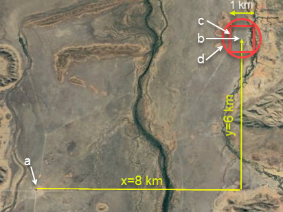
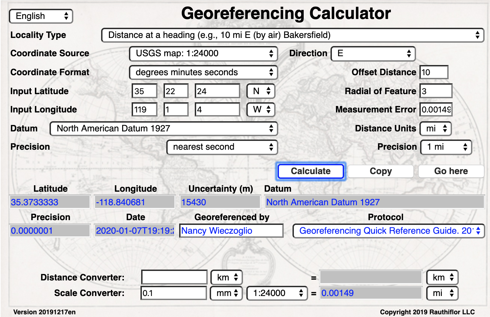
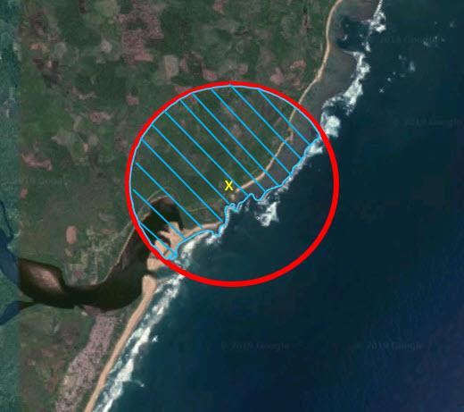

**The Georeferencing Process**

¤<<location,Locations>>¤ that are not fully ¤<<georeference,georeferenced>>¤ in the field may eventually have to be ¤<<georeference,georeferenced>>¤ __post-facto__ in order to be useful. One hopes in these situations that the collector of the original information followed best practices such as those described in the <<__*Elements for Describing a Location*__>>. As will be seen in <<__*3.4 Calculating Uncertainties*__>>, below, many of the greatest sources of ¤<<uncertainty>>¤ arise from missing, ambiguous, or non-specific information, which could have been avoided, but that can no longer be overcome without knowledge from someone who was there at the time the ¤<<event>>¤ occurred.

=== Planning a Georeferencing Project

Before beginning a ¤<<georeference,georeferencing>>¤ project, whether for an individual researcher or a large institution, it is helpful to anticipate the kinds of challenges one might expect to encounter. It may appear to be a daunting task, but there are many ways the process can be simplified and made more practical. Having a suitable workflow (see <<__*3.1.1 Georeferencing Project Workflow*__>>) decided in advance can increase both the efficiency and the consistency of the ¤<<data quality,quality>>¤ of the resulting ¤<<georeference,georeferences>>¤. The basic determiners for a project are what you have to start with and what outputs you want when you are finished. In an ideal world, the obvious practical questions such as the cost and how long it will take would not be important, but realistically, when balanced against the benefits of making the effort, these might be the major determining factors. Following is a representative list of questions that might affect planning of a ¤<<georeference,georeferencing>>¤ project:

* About the original data:
** Where is the source data coming from (herbarium labels, ledgers, database, or a combination, etc.)

** Are the source data already digitized?

** How many distinct ¤<<locality>>¤ descriptions are there to ¤<<georeference>>¤?

** Are there terrestrial or marine *locations* to ¤<<georeference>>¤? Or both?

** Is the geographic scope local? Country-wide? Global?

* About the process:
** What is the time frame for the project?

** When in the broader workflow will ¤<<georeference,georeferencing>>¤ happen?

** How much of the established best practices do I really need to follow?

** What if we want to use our own methods?

** What procedural documentation will we need to prepare?

** Who will do what?

** What expertise is needed?

** What skills do those who will be involved possess?

** Where can training be found?

** What ¤<<location>>¤ resources (maps, ¤<<gazetteer,gazetteers>>¤, tools) are available?

* About the final product:
** What data quality target is there for the ¤<<georeference,georeferences>>¤?

** How will data validation take place?

** How will the data be maintained?

** How will the ¤<<georeference,georeferenced>>¤ data be used and by whom?

** Will the georeferences be generalized on export (for sensitive species, for example)?

. How can the ¤<<georeference,georeferences>>¤ be integrated back into the original data?

** How can we incorporate suitable ¤<<data quality>>¤ feedback mechanisms?

The question, "When in the broader workflow will ¤<<georeference,georeferencing>>¤ happen?" is of particular significance. Is it best to ¤<<georeference>>¤ each record as you enter the data into the database? Or is it better to ¤<<georeference>>¤ in a batch after the data have been entered? There are arguments for each method, and again the circumstances of your institution should dictate the best method. If the data are stored taxonomically and not geographically (as is the case in the majority of instances) it is often best to ¤<<georeference>>¤ in a batch mode by sorting the ¤<<locality>>¤ data electronically, and in this way deal with many records on one map sheet or area at a time and not be jumping back and forth between map sheets. In other cases, there may be less wear and tear on collections, you may wish to database collections as they are received and before distributing duplicates, or sending on loan, or there may be other good practical reasons to ¤<<georeference>>¤ as you go. One advantage of ¤<<georeference,georeferencing>>¤ as you go is that you may be able to do all the collections of one collector at a time, and virtually follow his/her path, thus reducing errors from not knowing which of several ¤<<locality,localities>>¤ may be correct.

This document does not cover methods of general data entry. There are many ways that this may be conducted: direct entry from the field notes, labels, or ledgers with the material brought to a data entry computer; direct entry where tablets or laptops are brought to the material; indirect entry after using scanning or photographic (still or video) equipment to capture the original information so that data entry can be done _post facto_ from images, including handwriting and OCR tools, or crowdsourcing (_e.g._, https://digivol.ala.org.au/[_DigiV_]ol (Australian Museum __n.dat., _see_ <<*4.1 DigiVol*__>>), https://www.zooniverse.org/organizations/md68135/notes-from-nature[_Notes from Nature_] (Zooniverse __n.dat., _see_ <<*4.2 Notes from Nature*__>>) to capture the data. Some of these methods are just becoming practical, but you should make an active decision on the method that best suits the needs of your project. Remember, that at the same time as digitizing is being done, and each specimen is being handled, it is a good time to consider other actions. These may not be only ¤<<georeference,georeferencing>>¤ (which we do not recommend for the sake of efficiency), but might also include such things as assigning ¤<<Persistent Identifier (PID),persistent identifiers>>¤ (¤PID¤s) <<__*1.9 Persistent Identifiers (PIDS)*__>> and barcoding specimens, and linking these to the database to save resources further down the line.

It is also important that the long-term maintenance of the data is considered early in the process. Things like; "How are we going to deal with corrections to the data?, How do we handle feedback on ¤<<data quality>>¤ from data aggregators, data users, etc.?, Do we have a process in place for documenting changes to the data?, and Have we budgeted sufficient resources for ongoing maintenance and ¤<<data quality>>¤ checking?

==== Georeferencing Project Workflow

A workflow covering all the ¤<<georeference,georeferencing>>¤ activities can be a valuable instrument, not only for improving the efficiency of the whole ¤<<georeference,georeferencing>>¤ process, but also for incorporating checks and balances, and improving the ¤quality¤ of the resulting product. The type of workflow may be determined by the nature of the data, the way the original data are stored or documented, the nature of the desired end product, and even by the general preferences of those involved. In the following subsections we propose a generic workflow that covers all of the major aspects of ¤<<georeference,georeferencing>>¤ projects. Note that some of the steps presented might not apply to every project, and one must take into account priorities as discussed in <<__*3.1 Planning a Georeferencing Project*__>>. This first section, <<__*3.1.1 <<georeference,georeferencing>> Project Workflow*__*>>* outlines a recommended ¤<<georeference,georeferencing>>¤ project workflow in three phases - before, during, and after ¤<<georeference,georeferencing>>¤. Subsequent sections deal with the details of some of the steps presented in the outline.

Based on an assessment of a variety of large-scale ¤<<georeference,georeferencing>>¤ projects that had efficiency as well as ¤<<data quality>>¤ in mind (for example, see <<__*3.1.2 Project Workflow Example - MaNIS/HerpNET/ORNIS*__>>), we recommend the following generic outline for a ¤<<georeference,georeferencing>>¤ project workflow using either the ¤<<point-radius>> <<georeferencing method,method>>¤ or the ¤<<shape>> <georeferencing method,method>>¤, or a mix of the two. This workflow can be used for projects that involve a single individual or a large collaboration, though some steps may apply more in one case than in another.

===== Project Preparation Phase

* Commit to the use of a documented set of best practices such as those set forth in this document.
* Clearly define (and document) the goals of the project, including ¤<<data quality>>¤ requirements (see <<__*3.1 Planning a Georeferencing Project*__>>).
* Determine what data will be used as input for ¤<<georeference,georeferencing>>¤.
* Select the tools to be used.
* Estimate the resources needed to complete the data preparation phase (see <<__*3.1.4 Resources needed*__>>).
* Assign someone to manage the project.
* Acquire the resources needed to start the project.

===== Data Preparation Phase

* Assemble the data to be ¤<<georeference,georeferenced>>¤.
* Prepare the data for ¤<<georeference,georeferencing>>¤:
** Make sure that original records are uniquely identified (ideally with ¤<<Persistent Identifier (PID),PID>>¤s, see <<__*1.9 Persistent Identifiers (PIDs)*__>>).

** Extract distinct ¤<<locality,localities>>¤, generate unique identifiers (ideally <<Globally Unique Identifier (GUID),*GUIDs>>*, see <<__*1.9 Persistent Identifiers (PIDs)*__>>) for each, and reference the corresponding ¤<<locality>>¤ identifier in each original record.

** Use source-provided administrative geography fields to create and add standardized administrative geography values to the distinct ¤<<locality>>¤ records.

** Label ¤<<locality,localities>>¤ as marine, terrestrial, freshwater aquatic, or paleontologic. The same ¤<<locality>>¤ description may refer to more than one category (_e.g._, ¤<<location,locations>>¤ on coasts) unless further constraining information is used (see <<__*3.2.4 Applying Spatial Constraints*__>>). If dealing with ¤<<locality,localities>>¤ alone, you should account for all of the environmental possibilities.

** Create and uniquely identify distinct standardized ¤<<locality,localities>>¤ and reference the standardized ¤<<locality>> <<GUID>>¤ in the non-standardized ¤<<locality>>¤ records.

** Match standardized ¤<<locality,localities>>¤ against existing ¤<<locality,localities>>¤ that have already been ¤<<georeference,georeferenced>>¤ using satisfactory ¤<<georeferencing method,georeferencing methods>>¤ and extract the existing ¤<<georeference,georeferences>>¤ (see <<__*3.1.3 Using Previously Georeferenced Records*__>>).

* Assess the characteristics of the data to be ¤<<georeference,georeferenced>>¤ (__e.g., __how many already have ¤<<coordinates>>¤ without ¤<<georeference,georeferences>>¤? How many consist only of administrative geography? What is the geographic distribution of the ¤<<locality,localities>>¤?) with a view to determining the resources that will be needed to complete the project.
* Estimate the resources needed to complete the project using the information determined in the project preparation phase.
* Acquire the resources to complete the project.
* Train participating contributors and ¤<<georeference,georeferencing>>¤ operators (see <<__*6.3.1 Data Entry*__>> and <<__*6.6 Training*__>>).
* Establish a convention and tools to manage participation (assignments).
* Prepare data capture requirements and tools (see <<__*3.1.5 Data to Capture*__>>, <<__*3.1.7 User Interfaces*__>>, <<__*3.1.8 Using Standards and Guidelines*__>>, and <<__*5.1 Mapping to Darwin Core*__>>).
* Assign priorities to sets of standardized ¤<<locality,localities>>¤.
* Assign standardized ¤<<locality>>¤ sets to participants.

===== Georeferencing Phase

* Participants ¤<<georeference>>¤ assigned ¤<<locality>>¤ sets as outlined in _*<<3.2 Georeferencing Workflow - Localities>>.*_
* Participants utilize tools such as the _*Georeferencing Quick Reference Guide*_ (Zermoglio _et al._ 2020) and the _*Georeferencing Calculator*_ (Wieczorek & Wieczorek 2020).

===== Project Follow-up Phase

* Verify ¤<<georeference,georeferences>>¤ to meet ¤<<data quality>>¤ requirements (_e.g._, map ¤<<georeference,georeferenced>>¤ records to ensure they fall in the correct hemisphere, country, etc.) (see <<__*6.3 Data Checking and Cleaning*__>>).
* Populate standardized ¤<<locality>>¤ records with data for the ¤<<georeference,georeferences>>¤.
* For original records that have not changed ¤<<locality>>¤ information since they were assembled, populate the original records from the standardized ¤<<locality>>¤ records with ¤<<georeference,georeferences>>¤.
* Repatriate the original records with standardized ¤<georeference,georeferenced>> <<locality>>¤ data appended.
* Support the incorporation of the standardized ¤<<georeference,georeferenced>>¤ ¤<<locality>>¤ data into the source data management systems (see <<__*6.2 Accepting Feedback from Users*__>>).
* Support the sharing of the standardized ¤<<georeference,georeferenced>>¤ original data (including additional ¤<<generalization,generalizations>>¤ and withholdings) in open data venues such as GBIF (see <<__*Sharing Data*__>>).
* Establish a long-term data maintenance policy that includes the management of feedback on ¤<<data quality>>¤ and the documentation of changes (see <<__*6.2 Accepting Feedback from Users*__>>).

==== Project Workflow Example - MaNIS/HerpNET/ORNIS

One of the major contributions of the Mammal Networked Information System (MaNIS) project (Stein & Wieczorek 2004) was the design and implementation of a set of ¤<<georeference,georeferencing>>¤ guidelines (Wieczorek 2001) and online resources for a collaborative ¤<<georeference,georeferencing>>¤ workflow (http://georeferencing.org/manis/GeorefSteps.html[_http://georeferencing.org/manis/GeorefSteps.html)_]. The same basic workflow was implemented with great success for the sister projects HerpNET (http://herpnet.org/Gazetteer/GeorefSteps.html[_http://herpnet.org/Gazetteer/GeorefSteps.html_]) and the Ornithological Information System (ORNIS) (http://www.ornisnet.org/georeferencing/workflownew[_http://www.ornisnet.org/georeferencing/workflownew_]). Between the three projects, more than 1.2 million ¤<<locality,localities>>¤ were ¤<<georeference,georeferenced>>¤ for 4.5 million vertebrate occurrence records. The basic workflow was more or less as follows:

* Establish a ¤<<georeferencing method>>¤ and select tools to be used.
* Train participants (combination of help desk, forum, documents, and in the case of HerpNET, courses).
* Establish a convention and tools to manage ¤<<georeference,georeferencing>>¤ work packages for participants.
* Aggregate occurrences and extract distinct ¤<<locality,localities>>¤ into a project ¤<<gazetteer>>¤.
* Engage participants to claim and complete (¤<<georeference>>¤) work packages.
** Participant downloads work package.

** Participant ¤<<georeference,georeferences>>¤ work package, consulting documentation and colleagues to resolve questions.

** Send finished work package to project coordinator.

* Project coordinator validates ¤<<georeference,georeferences>>¤ to meet ¤<<data quality>>¤ standards.
* Project coordinator populates communal ¤<<gazetteer>>¤ with validated ¤<<georeference,georeferences>>¤.
* When ¤<<georeference,georeferencing>>¤ is completed for the entire project, project coordinator validates that ¤<<locality,localities>>¤ for original occurrence records have not changed since they were added to the ¤<<gazetteer>>¤ and repatriates occurrence records with ¤<<georeference,georeferences>>¤ to participating data custodians.
* Everyone involved rejoices.
* Participants add ¤<<georeference>>¤ data to their data management systems as time and resources allow.
* ¤<<georeference,Georeferenced>>¤ occurrence records get shared via global biodiversity networks such as VertNet (Guralnick & Constable 2010) and GBIF (http://gbif.org[_http://gbif.org_]).

==== Using Previously Georeferenced Records

It may be possible to use a look-up system that searches for similar localities that have already been ¤<<georeference,georeferenced>>¤. For example, if you have a record with the ¤<<locality>>¤ "10 km NW of Campinas", you can search for all records with ¤<<locality>>¤ "Campinas" and see if any records that mean the same thing as "10 km NW of Campinas" have been ¤<<georeference,georeferenced>¤previously. Note that it is always worth verifying the ¤<<georeference>>¤ on a map — this can easily be done using software such as Google Maps™, Google Earth™, etc. Checking this way can reduce ¤<<error,errors>>¤ such as neglecting to add the minus (-) sign to a ¤<<coordinates,coordinate>>¤ in the western or southern hemispheres.

An extension of this method could use the benefits of a distributed data system such as the http://www.gbif.net[_Global Biodiversity Information Facility_] (GBIF) Portal. A search could be conducted to see if the ¤<<locality>>¤ had already been ¤<<georeference,georeferenced>¤ by another institution. At present, we quite often find that duplicates of occurrence records have been given significantly different ¤<<georeference,georeferences>>¤ by different institutions. Presumably this would not happen if best practices were followed, or if ¤<<georeference,georeferencing>>¤ is done by the original institution before distributing duplicates.

A preliminary study (Wieczorek pers comm.) of roughly 33.1 million occurrences for 38.7 thousand plant taxa in GBIF from 15 April 2019 (GBIF 2019) showed that the records were associated with 7.2 million distinct ¤<<location,locations>>¤, of which 25.7% (30.9% of occurrences) already had ¤<<georeference,georeferences>>¤ (_i.e._, _*decimalLatitude*_, _*decimalLongitude*_, _*geodeticDatum*_, and _*coordinateUncertaintyInMeters*_). Of those without ¤<<georeference,georeferences>>¤, exact matches (on geography plus ¤<<locality>>¤ fields, all turned into upper case) from other ¤<<location,locations>>¤ in GBIF could be found for 2.5% of distinct ¤<<location,locations>>¤ (11.4% of occurrences).

In the case where multiple possible ¤<<georeference,georeferences>>¤ are found using a lookup on previously existing ¤<<georeference,georeferenced>>¤ locations, the problem is knowing which of the several ¤<<georeference,georeferences>>¤, if any, to choose.

If the ¤<<georeference>>¤ is not fully documented following best practices (including being reproducible), we recommend that existing ¤<<georeference,georeferences>>¤ not be used (or used only with extreme caution). Even if the ¤<<georeference>>¤ is documented, it should be checked visually on a map to be sure that it makes sense, just as for any new ¤<<georeference>>¤.

CARE: The re-use of existing <<georeference,georeferences>> can propagate <<error,errors>>. if a mistake was made the first time. Existing <<georeference,georeferences>> should be verified just as for any newly generated <<georeference>>.

==== Resources Needed

Each institution will have needs for different resources in order to ¤<<georeference>>¤ their ¤<<location>>¤ data. The basics, however, include:

* A database and database software (spreadsheets may be apt for data capture, but they leave a lot to be desired compared to databases for data management, for which we do not recommend the use of spreadsheets). Note that there are a lot of database management systems already established and available for use with biodiversity data. See if any of these may do the job before developing your own as it may save a lot of extra work. Many also already include ¤<<data quality>>¤ aspects that could help improve the ¤<<data quality,quality>>¤ of your own data.
* Topographic maps (electronic, paper or both), geologic maps (for paleontologic events) and/or speleological maps (for events in cave systems).
* Access to good ¤<<gazetteer,gazetteers>>¤ and/or maps – (many are available free via the Internet, either for downloading, or via online searching).
* Internet access (as there are many resources on the Internet that will help in ¤<<georeference,georeferencing>>¤ and locating places).
* Suitable computer hardware - such as a ¤<<geographic information system,Geographic Information System>>¤.

==== Data to Capture

The most important preparation for efficient ¤<<georeference,georeferencing>>¤ is to have a database set up for the purpose. This section will help you decide if your database will need modification or not, and to what extent.

Some ¤<<georeference,georeferencing>>¤ projects (_e.g._, MaPSTeDI) (Murphy _et al._ 2004) used a separate working database for data entry operators so that the main data were not modified and day-to-day use of the database was not hindered. This also meant that the working database could be designed optimally for data entry, rather than trying to accommodate other database management and searching requirements. The data from the working database can be checked for quality, and then uploaded to the main database from time to time. Such a way of operating is institution dependent, and may be worth considering.

What are the fields you need in your database to best store ¤<<georeference,georeferencing>>¤ information? This may seem obvious but it is surprising how often a database is created and finalized before it is determined exactly what the database is supposed to hold. Be sure not to lump together dissimilar data into one field. Always atomize the data into separate fields with very specific definitions and rules for their content. It is also of some benefit to name the fields unambiguously, as users tend to go by the field names rather than looking at the field definitions. Thus, 'latitude_in_degrees' is a better name than '¤<<latitude>>¤' for a field that is supposed to contain ¤<<latitude,latitudes>>¤ in ¤<<decimal degrees>>¤, while 'verbatim_latitude' is better name for a field that is supposed to contain the ¤<<latitude>>¤ in the format given in the source. The names and definitions of fields in ¤<<Darwin Core>>¤ (Wieczorek _et al_. 2012b) were created specifically with this principle of clarity in mind. Note, however, that the ¤<<georeference,georeferencing>>¤ results might benefit from additional fields that are not described in ¤<<Darwin Core>>¤ (_e.g._, '¤<<feature>>¤_¤<<radial>>¤', 'radialUnits') in order to make it possible to reproduce the ¤<<georeference>>¤ and thus test it's veracity. It is often tempting to include fields for the ¤<<georeference,georeferenced>>¤ ¤<<coordinates>>¤ and ignore any additional fields; however, you (or those who follow after you) are sure to regret this minimalist approach, because it severely limits the long-term usability of the data. Not only do ¤<<location,locations>>¤ occupy a physical ¤<<extent>>¤, but also the associated information on methods used to determine the ¤<<georeference>>¤, the ¤<<extent>>¤, ¤<<radial>>¤, and ¤<<uncertainty>>¤ associated with the ¤<<georeference>>¤ are important pieces of information for the end user, as well as for managing and improving the ¤<<data quality,quality>>¤ of your information. The fields that are needed can be divided into two categories, the first consists of the fields associated with the textual description of the ¤<<location>>¤, and the second consists of the fields associated with the spatially enabled interpretation as a ¤<<georeference>>¤ and the ¤<<georeference,georeferencing>>¤ process.

NOTE: When atomizing data on entry, always include a field or fields that record verbatim the original data so that atomization and other transformations can later be revealed and checked.

NOTE: Automatic format transformations to <<decimal degrees>> may introduce <<false precision>>. See <<1.6 Accuracy, Error, Bias, Precision, False Precision, and Uncertainty>>.

A reference worth checking before developing your own database system is the _*Herbarium Information Standards and Protocols for Interchange of Data*_ (HISCOM 2000, Neish _et al._ 2007), which although set up for data interchange for herbaria, is applicable to most natural history collection data.

Many institutions separate ¤<<locality>>¤ descriptions into their component parts; ¤<<feature>>¤ (_i.e._, the ¤<<location>>¤ name), distance and ¤<<direction>>¤, etc., and store this information in separate fields in their databases. If this division of ¤<<locality>>¤ information is done, it is important not to replace the verbatim free-text locality field (the data as written on the label or in the field notebook), but to add additional fields. This is because any transformation of data has the potential to lose information and to introduce ¤<<error,errors>>¤, and the written format of the description may be the only original source available. The original information should __never __be overwritten or deleted.

Location-related fields to consider for ¤<<georeference,georeferencing>>¤ include all of the geography, ¤<<locality>>¤, ¤<<elevation>>¤, ¤<<depth>>¤, and ¤<<georeference>>¤ terms in the *Location* class of ¤<<Darwin Core>>¤ (see https://dwc.tdwg.org/terms/#location[_https://dwc.tdwg.org/terms/#location_] and <<__*5.1 Mapping to Darwin Core*__>>) as well as the following fields that can have an influence on the ¤<<georeference>>¤:

* As many levels of administrative subdivision as necessary (_e.g._, country, state, county, municipality, etc.), though if the geographic scope is multinational, better to name the administrative subdivisions more generically to avoid confusion (_e.g_., country, geog_admin_1, geog_admin_2, etc.).
* ¤<<feature,Feature>>¤ name, ¤<<feature type>>¤, ¤<<offset>>¤ distance, ¤<<offset>> <<direction>>¤, ¤<<offset>>¤ units.
* ¤<<feature,Feature>> <<shape>>¤, ¤<<feature>>¤ center, ¤<<feature>> <<radial>>¤.
* Township, range, section, subsection or similar for other ¤<<grid>>¤ systems.
* Protected area.
* Watershed.
* Map quad.
* ¤<<UTM>> <<easting>>¤, ¤<<northing>>¤, and zone.
* For 🐠marine ¤<<location,locations>>¤ －nearest island, exclusive economic zone, etc.
* ¤<<elevation,Elevation>>¤ ¤<<accuracy>>¤, ¤<<vertical datum>>¤, and the method by which ¤<<elevation>>¤ was determined.
* ¤<<depth,Depth>>¤ ¤<<accuracy>>¤, ¤<<vertical datum>>¤, and the method by which ¤<<depth>>¤ was determined.
* ¤<<latitude,Latitude>>¤ degrees, ¤<<latitude>>¤ minutes, ¤<<latitude>>¤ seconds, ¤<<latitude>>¤ hemisphere, ¤<<longitude>>¤ degrees, ¤<<longitude>>¤ minutes, ¤<<longitude>>¤ seconds, ¤<<longitude>>¤ hemisphere.
* Environment, to distinguish terrestrial, aquatic, and marine locations.
* ¤<<event,Event>>¤ date (best to follow and enforce a standard format, such as ISO 8601 (ISO/TC 154 2019).
* Fields in the ¤<<Darwin Core>>¤ __*GeologicalContext*__ class for paleontological occurrences.

==== Applying Data Constraints

One of the key ways of making sure that data are clean and ¤<<accuracy,accurate>>¤ is to ensure, to the extent possible, that data are put in the correct field and that only data of an appropriate type can be put into each field by design. This is done by applying constraints on the data fields – for example, only allowing values between +90 and −90 in the field for ¤<<decimal latitude>>¤. Many of the ¤<<error,errors>>¤ found when checking databases could have been easily avoided if the database had been set up correctly in the first place. The use of pick lists are essential where the field should contain only values from a restricted list of terms.

More complex constraints may also be possible. With 🌳ecological or survey data for example, one could set ¤<<boundary>>¤ limits between the starting ¤<<locality>>¤ and ending ¤<<locality>>¤ of a ¤<<transect>>¤. For example, if your methodology always uses 1 km or shorter ¤<<transect,transects>>¤, then the database could include a ¤<<boundary>>¤ limit that flagged whenever an attempt was made to place these two points more than 1 km apart.

For more information on constraints, see various sections under <<__*3.4.1 Uncertainty due to the Extent of the Feature*__>>.

==== User Interfaces

Good user-friendly interfaces are essential to make ¤<<georeference,georeferencing>>¤ efficient and rapid, and to cut down on operator ¤<<error,errors>>¤. The design should take into consideration the specific details of the ¤<<georeference,georeferencing>>¤ workflow, and optimize simultaneously for both overall efficiency, and consistency of the data entry process. This will improve accuracy and cut down on ¤<<error,errors>>¤. The layout should be friendly, easy to use, and easy on the eyes. Where possible (and the software allows it) a number of different views of the data should be presented. These views can place emphasis on different aspects of the data and help data entry operator proficiency by allowing different ways of entering the data and by presenting a changing view for the operator.

In the same way, macros and scripts can help with automated and semi-automated procedures, reducing the need for tedious (and time-consuming) repetition. For example, if the data are being entered from a number of collections by one collector, taken at the same time from the same ¤<<location>>¤, the information that is repeated from record to record should be able to be entered using just one or two keystrokes.

If maps are being used to assist in determining ¤<<georeference,georeferences>>¤, a view that sorts the data geographically may also make the process more efficient by allowing the data operator to see all the records that may fall on one map sheet. Finally, it is also important to decide which fields the data entry operators should see when they are ¤<<georeference,georeferencing>>¤. Fields such as date of collection, collector, specimen ID, taxonomy, and formation (for paleontologic records) are very helpful for georeferencers to see along with the more obvious ¤<<locality>>¤ data.

==== Using Standards and Guidelines

Standard methodologies, in-house standards, and guidelines can help lead to consistency throughout the database and cut down on ¤<<error,errors>>¤. A set of standards and guidelines should be established before any ¤<<georeference,georeferencing>>¤ begins (see__* *__<<__*6.9 Documentation*__>>. They should remain flexible enough to cater for new data and changes in processes over time, though careful thought beforehand can minimize the need for methodological changes, which might lead to inconsistencies where earlier efforts are lacking compared to those produced under newer protocols. Standards and guidelines in the following areas can improve the ¤<<data quality,quality>>¤ of the data and the efficiency of data entry. They include:

* Units of measure. Use a single unit of measure in interpreted fields. For example, do not allow a mixture of feet and meters in ¤<<elevation>>¤ and ¤<<depth>>¤ fields. Irrespective of this, the original units and measurements should be retained in a verbatim field.
* Methods and formats for determining and recording ¤<<uncertainty>>¤ and ¤<<extent>>¤.

* Required fields (fields that must have meaningful, non-empty values).
* Format for recording ¤<<coordinates>>¤ (_e.g._, ¤<<DMS,degrees/minutes/seconds>>¤, degrees/decimal minutes, or ¤<<decimal degrees>>¤ for ¤<<latitude>>¤ and ¤<<longitude>>¤).
* Original source(s) of place names and ¤<<feature,features>>¤.
* Dealing with typographical ¤<<error,errors>>¤ and other ¤<<error,errors>>¤ in the existing database.
* Number of decimal places to keep in decimal numbers.
* How to deal with "empty" values as opposed to the numerical value zero (some databases have problems with this).
* How to deal with mandatory fields that cannot be filled in immediately (_e.g._, because a reference has to be found). There may be a need for something that can be put in the field that can allow the database to be filed and closed, but that flags that the information is still required.
* What data validation is to be carried out before a record can be considered complete?

Determining and documenting your institution’s own ¤<<georeference,georeferencing>>¤ best practice manuals, for example that suit the circumstances of that institute (including language, local software and resources, etc.) can help maintain consistency as well as assist in training and ¤<<data quality>>¤ recording. As an example, see Escobar _et al._ (2015), where an internal document for the Alexander von Humboldt Institute in Colombia has been developed and put into practice. See also <<__*6.9 Documentation*__>>.

==== Data Entry Operators

One of the greatest sources of ¤<<georeference,georeferencing>>¤ ¤<<error>>¤ is the data entry process. It is important that this process be made user-friendly, and be set up so that many ¤<<error,errors>>¤ cannot occur (_e.g._, through the use of pick lists, field constraints, etc.). The choice and training of data entry operators (see under <<__*6.6 Training*__>>) can make a big difference to the final ¤<<data quality,quality>>¤ of the ¤<<georeference,georeferenced>>¤ data. As mentioned earlier, the provision of good guidelines and standards can help in the training process and allow for data entry operators to reinforce their training over time.

=== Georeferencing Workflow - Localities

At the heart of any ¤<<georeference,georeferencing>>¤ project is the hands-on ¤<<georeference,georeferencing>>¤ of individual ¤<<locality>>¤ descriptions. The value of getting this part right can't be overstated.

Regardless of what other steps might have preceded this in a project workflow, for individual ¤<<locality,localities>>¤ we recommend the following ¤<<georeference,georeferencing>>¤ workflow — refined from Wieczorek _et al_. (2004).

* Choose the ¤<<georeferencing method>>¤ (_e.g._, ¤<<point-radius>>¤, ¤<<bounding box>>¤, ¤<<shape>>¤) to use. You may do this for all ¤<<locality,localities>>¤ or on a case by case basis (see <<__*3.3 Georeferencing Methods*__>>).
* Parse the ¤<<locality>>¤ into <locality clause,*locality clauses>>* (see __*<<3.2.1 Parsing the Locality Description*__>>).
* Identify the ¤<<feature>>¤(s) and determine the ¤<<locality type>>¤ of the most specific ¤<<locality clause>>¤ (see <<__*3.2.2 Classifying the Locality Description*__>>).
* Find the ¤<<feature>>¤(s) in a spatial data source (_e.g._, map, ¤<<gazetteer>>¤, ¤<<GIS>>¤ layer, application programming interface (API)) that can give you an idea of where the ¤<<feature>>¤ is with ¤<<coordinates>>¤, a ¤<<bounding box>>¤, a ¤<<point-radius>>¤, or a ¤<<shape>>¤).
* Determine the ¤<<boundary,boundaries>>¤ of the ¤<<feature>>¤(s) (see <<__*3.2.3 Setting the Boundaries of the Feature*__>>) including all constraints (see <<__*3.2.4 Applying Spatial Constraints*__>>).
* Follow the protocol in the _*Georeferencing Quick Reference Guide*_ (Zermoglio _et al_. 2020) to ¤<<georeference>>¤ the ¤<<locality>>¤ based on the ¤<<locality type>>¤ of the most specific ¤<<locality clause,clause>>¤ and the ¤<<shape>>¤ or ¤<<point-radius>>¤ of the constrained ¤<<feature>>¤ from the previous step.
* Document the sources and methods sufficiently to make the resulting ¤<<georeference>>¤ reproducible. (see <<__*1.1 Objectives*__>>).

Though the list of steps above apply to a single ¤<<locality>>¤ record, the most efficient way to implement these steps might be to do each step for all of the ¤<<locality,localities>>¤ in the set, and use the results of that step to organize the next step. For example, by identifying the ¤<<feature,features>>¤ from all of the most specific ¤<<locality clause,clauses>>¤, one could filter ¤<<locality,localities>>¤ by ¤<<feature>>¤ and with the accumulated body of information about the ¤<<feature>>¤ from all the ¤<<locality,localities>>¤ at hand, ¤<<georeference>>¤ all of the ¤<<locality,localities>>¤ containing the same ¤<<feature>>¤ together. One could also do statistics on the number of records affected by determining the ¤<<boundary,boundaries>>¤ of each ¤<<feature>>¤ and use that to prioritize which ¤<<locality,localities>>¤ get ¤<<georeference,georeferenced>>¤, if resources do not otherwise cover ¤<<georeference,georeferencing>>¤ everything. This kind of ¤<<feature>>¤ extraction could be done in the aggregate data preparation stage (see <<__*3.1.1 Georeferencing Project Workflow*__>>).

==== Parsing the Locality Description

¤<<locality,Locality>>¤ descriptions are often given in free text and encompass a wide range of content in a vast array of formats. An important part of the ¤<<georeference,georeferencing>>¤ process is to have a consistent way to interpret the text into spatial forms that can be operated on analytically. To do this, look for the parts of the description that can be interpreted independently, called ¤<<locality clause,locality clauses>>¤, each of which can be categorized into a ¤<<locality type>>¤ (see <<__*3.2.2 Classifying the Locality Description*__>>) that uses a specific set of rules to ¤<<georeference>>¤ (Wieczorek _et al_. 2004).

==== Classifying the Locality Description

There is a lot of variation in the way ¤<<locality clause,clauses>>¤ are written and the types of ¤<<feature,features>>¤ they reference, but there are actually very few basic ¤<<locality type,locality types>>¤, though these may have many variations depending on the ¤feature¤ ¤<<locality type,type>>¤ referenced. The _*Georeferencing Quick Reference Guide*_ (Zermoglio _et al._ 2020) was written specifically to explain how to ¤<<georeference>>¤ all of the most common variations of ¤<<locality type,locality types>>¤ and ¤<<feature>>¤ types (Wieczorek _et al_. 2004):

* *<<coordinates>>* only (_e.g._, 27°34'23.4" N, 121°56'42.3" W)
* geographic ¤<<feature>>¤ only (_e.g._, "Bakersfield")
* distance only (_e.g._, "5 mi from Bakersfield")
* *<<heading>>* only (_e.g._, "North of Bakersfield")
* distance along a ¤<<path>>¤ (_e.g._, "13 miles east (by road) from Bakersfield")
* distance along orthogonal ¤<<direction,directions>>¤ (_e.g._, "2 miles east and 3 miles north of Bakersfield")
* distance at a ¤<<heading>>¤ (_e.g._, "10 miles east (by air) from Bakersfield")
* distances from two distinct ¤<<path,paths>>¤ (_e.g._, "1.5 mile east of Louisiana State Highway 1026 and 2 miles south of U.S. Highway 190")
* dubious (_e.g._, "presumably central Chile")
* cannot be located (_e.g._, "¤<<locality>>¤ not recorded")
* demonstrably inconsistent (_e.g._, "Sonoma County side of the Gualala River, Mendocino County")
* captive or cultivated (_e.g_., "San Diego Wild Animal Park")

A full ¤<<locality>>¤ description may contain multiple ¤<<locality clause,clauses>>¤. The goal of a ¤<<georeference>>¤ is to describe the ¤<<location>>¤ where all of the ¤<<locality clause,clauses>>¤ are true simultaneously. In ¤<<geographic information system,GIS>>¤ terms, this would be the intersection of the ¤<<shapes>>¤ for all the ¤<<locality clause,clauses>>¤ in the ¤<<locality>>¤ description. As humans, we would choose the ¤<<locality clause,clause>>¤ that is most specific and ¤<<georeference>>¤ based on that, using the information from the other ¤<<locality clause,clauses>>¤ to filter from among multiple possibilities. For example, a ¤<<locality>>¤ written as

*‘bridge over the St. Croix River, 4 km N of Somerset’*

should be ¤<<georeference,georeferenced>>¤ with a ¤<<locality type>>¤ "geographic feature only" with subtype <<2.1.1 __*Feature - with Obvious Spatial Extent*__>> as in __*Georeferencing *__Q_*uick Reference Guide *_(Zermoglio _et al_. 2020) based on the _bridge_ as the ¤<<feature>>¤. Of course, the second ¤<<locality clause,clause>>¤ helps us to determine which bridge (something we wouldn't be able to do without that second ¤<<locality clause,clause>>¤), but beyond that the second ¤<<locality clause,clause>>¤ contributes nothing to the ¤<<boundary,boundaries>>¤ of the ¤<<feature>>¤, nor to the ¤<<uncertainty>>¤ in the final ¤<<georeference>>¤.

If the more specific part of the ¤<<locality>>¤ cannot be unambiguously identified, then the next less specific part of the ¤<<locality>>¤ ("4 km N of Somerset" in the example above) should be ¤<<georeference,georeferenced>>¤. In a case such as this, annotate in the ¤<<georeference>>¤ remarks with something like "unable to find the bridge, ¤<<georeference,georeferenced>>¤ '4 km N of Somerset'".

Some ¤<<locality>>¤ descriptions give information about the nature of the ¤<<offset>>¤ (‘by road’, ‘by river’, ‘by air’, ‘up the valley’, etc.). Having this information simplifies the choice of ¤<<offset>>¤-based ¤<<locality type>>¤ as <<__*2.9.3 Offset at a Heading*__>> or <<__*2.9.4 Offset along a Path*__>>.

_*Example*_:

*country*: AR *stateProvince*: Neuquén *county*: Los Lagos *locality*: 12.3 km N of (by road) Nahuel Huapi, elev: 760m

In this example, there are four fields contributing five separate clauses. The three administrative geography terms each have one <<locality clause,clause>> of the type "_Geographic feature only_" with subtype "_Feature - with obvious spatial extent_" (see <<__*2.1.1 Feature - with Obvious Spatial Extent*__>> in _*Georeferencing Quick Reference Guide*_ (Zermoglio _et al._ 2020)), while the <<locality>> field contains a <<locality clause,clause>> ("12.3 km N of (by road) Nahuel Huapi") of the type "_Distance along path_" (see <<__*2.2.3 Offset - Distance along a Path*__>> in _*Georeferencing Quick Reference Guide*_) and a <<locality clause,clause>> ("elev: 760m") of the type "_Geographic feature only_" with subtype "_Feature - Path_" (see <<__*2.1.3.3 Feature - Path*__>> in _*Georeferencing Quick Reference Guide*_). The most specific of all five <<locality clause,clauses>> is "12.3 km N of (by road) Nahuel Huapi".

It is sometimes possible to infer the nature of the ¤<<offset>>¤ ¤<<path>>¤ from additional supporting evidence in the ¤<<locality>>¤ description. For example, the ¤<<locality>>¤

____
_*‘58 km NW of Haines Junction, Kluane Lake’*_
____

suggests a measurement by road since the final ¤<<coordinates>>¤ by that ¤<<path>>¤ are nearer to the lake than going 58 km NW in a straight line. At other times, you may have to consult detailed supplementary sources, such as field notes, collectors’ itineraries (see <<__*3.2.4.3 Using Collector Itineraries*__>>), diaries, or sequential collections made on the same day, to determine this information.

If any of the ¤<<locality clause,clauses>>¤ in the ¤<<locality>>¤ description is classified as one of the three ¤<<locality>>¤ types, ‘_dubious_’, ‘_cannot be located_’, or ‘_demonstrably inaccurate_’, then the ¤<<locality>>¤ should not be ¤<<georeference,georeferenced>>¤. Instead, an annotation should be made to the ¤<<locality>>¤ record giving the reason why it is not being ¤<<georeference,georeferenced>>¤. See also <<__*2.4 Difficult Localities*__>> in Zermoglio et al. (2020).

==== Setting the Boundaries of the Feature

Regardless of the method to be used (*shape*, *bounding box*, or *point-radius*), the *georeferencing* *protocols* for nearly every *locality type* begin with the identification of the *features* of reference in the *locality* description and the determination of the *geographic boundaries* of their *extents*. This is usually the most critical and time-consuming part of the protocols. It is best to use a visual reference to determine *boundaries.* If a ¤feature¤ name search on a visual source does not reveal the ¤feature¤ of interest, it is a good idea to use * coordinates* from a ¤gazetteer¤ to find the *feature* on a map, and then use the map to find the *boundaries:*

* *Point-radius method*: store the *corrected center* of the constrained *boundaries* from the previous step as decimal ¤latitude¤ and decimal ¤longitude¤ and store the *geographic radial* as a distance in the units given in the most specific *locality clause*. If there are no distance units in that *clause*, use meters (see <<__*3.3.2 Point-radius Method*__>>.
* *Bounding Box* method: store the furthest north, south, east, and west coordinates on the constrained boundaries of the feature (see <<__*3.3.3 Bounding Box Method*__>>.
* *Shape method*: store the resulting constrained *boundaries* as a *shape *(see <<__*3.3.4 Shape Method*__>>

Use information from other clauses, such as administrative geography, information from other *location* fields such as *elevation*, and environmental information (_e.g._, terrestrial, freshwater aquatic, marine, taxon-specific) to constrain the *extent* as appropriate (see <<__*3.2.4 Applying Spatial Constraints*__>> and <<__*3.1.6 Applying Data Constraints*__>>).

==== Applying Spatial Constraints

There are many ways that a ¤<<location>>¤ can be constrained beyond what the geography and ¤<<locality>>¤ descriptions alone suggest. Doing so relies on applying additional ¤<<location>>¤ information, such as ¤<<elevation>>¤ or ¤<<depth>>¤, lithostratigraphic information for fossils, or information outside the ¤<<location>>¤ information, such as environmental constraints for a particular species. There are important implications about workflow and effort that need to be considered when applying additional constraints. For example, if taxon constraints are going to be applied, the ¤<<georeference,georeferencing>>¤ can not be done strictly on ¤<<location>>¤ information, which means it has to be done on occurrence records, or on an index combining ¤<<location>>¤ and taxon. This would be much slower than ¤<<georeference,georeferencing>>¤ based on ¤<<location>>¤ alone. A good compromise would be to ¤<<georeference>>¤ in multiple stages, with the first stage based on ¤<<location>>¤ information, and a subsequent stage including the rest of the occurrence information, and perhaps a final stage of review by collectors to be able to set _*dwc:georeferencingVerificationStatus*_ to "verified by collector" - the best status a ¤<<georeference>>¤ can possibly have.

===== Taxon Constraints

It is common to encounter ¤<<locality>>¤ descriptions for which the ¤<<boundary,boundaries>>¤ and ¤<<uncertainty>>¤ could be reduced if the taxon and its environmental or geographic constraints are known.

One case in which a taxon constraint might be applied is where a ¤<<locality>>¤ description would be ¤<<georeference,georeferenced>>¤ in a distinct manner if it was known to be terrestrial, aquatic, or marine. Here even the lifestage of a taxon could be taken into account.

🐠OBIS (the Ocean Biogeographic Information System) uses the _*World Register of Marine Species*_ (WoRMS 2019) to determine if a species can be classified as either marine or terrestrial. Note, however, that there are many species listed in the WoRMS database that occur on coastal shores or in estuaries (__i.e., __species that could be regarded as both marine and terrestrial at some stage during their life cycle), so caution needs to be taken when using this method in ¤<<georeference,georeferencing>>¤.

At the generic level there are similar biome-matching services available through The _*Interim Register of Marine and Nonmarine Genera*_ _*(IRMNG)*_ (Rees 2019), and the associated _*LifeWatch*_ taxon matching services (http://www.lifewatch.be/data-services/[_http://www.lifewatch.be/data-services/_]).

Another case where taxon might be taken into account is where a distribution range or environmental domain suggests a restriction in the ¤<<boundary,boundaries>>¤ of a ¤<<location>>¤. However, this kind of constraint on a ¤<<georeference>>¤ is not recommended, because an organism whose location falls outside of an established range map may indicate a genuine outlier, or a taxon misidentification. Given that, such information can help distinguish between two possible ¤<<location,locations>>¤ of the same ¤<<feature>>¤ name where one possible ¤<<location>>¤ fits within the environmental domain for the taxon, and the other outside the range. This auxiliary information is also particularly useful after ¤<<georeference,georeferencing>>¤, to reveal records of possible range extensions, exotic invasions, or cryptic taxa.

===== Using Date Constraints

The date is an important characteristic of an ¤<<event>>¤ and must be recorded. Towns, roads, counties, and even countries can change names and ¤<<boundary,boundaries>>¤ over time, and can even cease to exist as extant ¤<<feature,features>>¤. Rivers and coastlines can change position, billabongs and ox-bow lakes can come and go, and areas of once pristine environment may become farmland or urban areas.

*Example:* "Collecting localities along the Alaska Highway are frequently given in terms of milepost markers; however, the Alaska Highway is approximately 40 km shorter than it was in 1942 and road improvements continue to re-route and shorten it every year. Accurate location of a milepost, therefore, would require cross-referencing to the collecting date. To further complicate matters, Alaska uses historical mileposts (calibrated to 1942 distance), the Yukon uses historical mileposts converted to kilometers, and British Columbia uses actual mileage (expressed in kilometers)".(From Wheeler _et al._ 2001)

To the extent possible, the aim is to have a ¤<<georeference>>¤ and its ¤<<uncertainty,uncertainties>>¤ based on the conditions at the time an ¤<<event>>¤ occurred at a ¤<<locality>>¤. There are two major implications associated with this. One is that current maps and ¤<<gazetteer,gazetteers>>¤ may not reflect the conditions at the time of the ¤<<event>>¤, and the other is that old maps and ¤<<gazetteer,gazetteers>>¤ may not represent well the conditions of later ¤<<event,events>>¤.

We recommend that this sort of constraint be used in a followup workflow step to deal with ¤<<locality,localities>>¤ at the ¤<<event>>¤ level rather than try to construct a ¤<<gazetteer>>¤ that includes collecting dates.

===== Using Collector Itineraries

Collector’s itineraries and expedition tracks can be a useful adjunct in discovering locations that are otherwise difficult to find, especially where there may be more than one possible ¤<<location>>¤ based on a ¤<<feature>>¤ name. This may be done through using field notebooks, published reports and maps, searching for the ¤<<locality,localities>>¤ of specimens with adjacent collecting numbers, etc. With historic collecting events (_i.e._, before the days of modern transport), you may also be able to restrict the area to look in by limiting the distance a collector may have been able to travel within one day. Note that the collector name and date are essential pieces of information in tracking itineraries, and therefore can not be done on ¤<<locality,localities>>¤ alone. We thus recommend that this sort of constraint be used in a followup workflow step to deal with unresolved ¤<<locality,localities>>¤ rather than try to construct a ¤<<gazetteer>>¤ that includes collecting dates, collector names, and collector numbers.

===== Using Ship Logs

🐠Digitized ships logs contain a wealth of data (Dempsey 2014) and are valuable data resources. A freely downloadable database of surface marine observational records from ships, buoys, and other platform types is available as the _*International Comprehensive Ocean-Atmosphere Data Set*_ (https://icoads.noaa.gov/products.html[_https://icoads.noaa.gov/products.html_]) (NOAA 2018). Be aware that the ¤<<accuracy>>¤ of records obtained from this dataset vary, depending on the original source, and are not always documented.

===== Using Geological Context

Maps or ¤<<geographic information system,GIS>>¤ layers of geological contexts, such as formations, can be used to narrow the ¤<<location>>¤ in the case of a paleontological specimen that includes such information in the shared content of the record. For example, if a fossil is taken from the surface in the Fox Hills formation (which is Cretaceous in age), that can distinguish the ¤<<location>>¤ from nearby different formations on the surface, like a habitat could do in an ecological context.

=== Georeferencing Methods

The distinction between ¤<<georeferencing method,georeferencing methods>>¤ is in the basic approach taken to capture spatially enabled ¤<<location>>¤ data. Within each ¤<<georeferencing method,method>>¤ there should be protocols for how to produce ¤<<georeference,georeferences>>¤ based on the input ¤<<locality>>¤ description and supporting information. The goal of any ¤<<georeferencing method>>¤ and its specific, documented protocols should be to create a spatial representation of the entire ¤<<location>>¤, including all ¤<<uncertainty,uncertainties>>¤ involved, with sufficient accompanying information and documentation to make the ¤<<georeference>>¤ reproducible.

__*3.3.1 Point Method*__

Based on the aspirations for ¤<<georeferencing method,georeferencing methods>>¤ described in the previous paragraph, the point method, consisting of only ¤<<coordinates>>¤, or ¤<<coordinates>>¤ in a ¤<<coordinate reference system>>¤, is insufficient to be useful except to center a point on a map (and even that potentially incorrectly without the ¤<<coordinate reference system>>¤). The point method does not give any indication of scale, though the mistake is often made to try to represent scale and/or ¤<<uncertainty,uncertainties>>¤ in the ¤<<precision>>¤ of the ¤<<coordinates>>¤. For these reasons, the point method is *NOT* recommended as the end product of a ¤<<georeference,georeferencing>>¤ workflow.

==== Point-radius Method

The result of the ¤<<point-radius>>¤ ¤<<georeferencing method,method>>¤ (Wieczorek _et al._ 2004) is a ¤<<geographic coordinate>>¤ (the "¤<<corrected center>>¤"), its ¤<<geodetic datum>>¤, and a ¤<<maximum uncertainty distance>>¤ as a ¤<<radial,radius>>¤. The length of the ¤<<radial,radius>>¤ must be large enough so that a circle centered on the ¤<<corrected center>>¤ and based on that ¤<<radial,radius>>¤ encompasses all of the ¤<<uncertainty,uncertainties>>¤ in the interpretation of the ¤<<location>>¤. The ¤<<point-radius>>¤ is a very simple representation of the ¤<<location>>¤ that contains all of the places that the ¤<<locality>>¤ description might refer to, but may also circumscribe areas that do not match the ¤<<locality>>¤ description. That's OK. The ¤<<point-radius>>¤ circle can also be intersected with other spatially enabled information to constrain the effective area within the circle, such as ¤<<elevation>>¤, to derive a ¤<<shape>>¤ representation of the ¤<<locality>>¤. For example, calculate the intersection of a ¤<<point-radius>>¤ circle with the ¤<<shape>>¤ of the matching ¤<<elevation>>¤ contours in a ¤<<geographic information system>>¤ to get a ¤<<shape>>¤ that better matches the described ¤<<locality>>¤. Similarly, one could calculate the intersection of an exposed geological formation with a ¤<<point-radius>>¤ ¤<<georeference>>¤ to refine the latter into a ¤<<shape>>¤. The detailed recommended protocols for ¤<<georeference,georeferencing>>¤ using the ¤<<point-radius>> <georeferencing method,method>>¤ are given in the __*Georeferencing *__Q_*uick Reference Guide *_(Zermoglio __*et al.*__ 2020).

==== Bounding Box Method

The result of the ¤<<bounding box>>¤ ¤<<georeferencing method,method>>¤ (Wieczorek _et al._ 2004) is a set of two ¤<<coordinates>>¤, one for each of two corners diagonally opposed on the ¤<<bounding box>>¤ along with their ¤<<coordinate reference system>>¤. The corners define the minimum and maximum values of the ¤<<coordinates>>¤, within which the whole of the ¤<<location>>¤ and its ¤<<uncertainty,uncertainties>>¤ is contained. Like the ¤<<point-radius>>¤ ¤<<georeferencing method,method>>¤, the ¤<<bounding box>>¤ ¤<<georeferencing method,method>>¤ results in a very simple representation of the ¤<<location>>¤ that contains all of the places that the ¤<<locality>>¤ description might refer to, but may also contain areas that do not match the ¤<<locality>>¤ description.

Unlike the ¤<<point-radius>>¤ ¤<<georeferencing method,method>>¤, this method has no scalar ¤<<maximum uncertainty distance>>¤ to be able to easily understand or filter on the size of the enclosed region, though one can be calculated using half the distance between the two corners as given by Vincenty's formulae (Vincenty 1975, 1976). Thus, a ¤<<bounding box>>¤ ¤<<georeference>>¤ can be turned into a ¤<<point-radius>>¤ ¤<<georeference>>¤ by using the distance just described as the ¤<<geographic radial>>¤, and from that finding the ¤<<corrected center>>¤, which will not be equal to the ¤<<geographic center>>¤ of the ¤<<bounding box>>¤, except where the ¤<<bounding box>>¤ spans equal distances north and south of the equator or is based on a metric ¤<<grid>>¤.

A ¤<<point-radius>> <<georeference>>¤ can be turned into a ¤<<bounding box>>¤ ¤<<georeference>>¤ by using the ¤<<geographic radial>>¤ from the ¤<<corrected center>>¤ of the ¤<<point-radius>>¤ to determine the ¤<<coordinates>>¤ of the east-west and north-south extremes of the ¤<<bounding box>>¤.

NOTE: Though transformations can be made back and forth between <<point-radius>> and <<bounding box>> representations of a <<location>>, it is not recommended, because the transformed <<georeference>> will necessarily be bigger than the original, and therefore contain more area that does not pertain to the actual <<location>>. Better to <<georeference>> directly using the <<georeferencing method,method>> of choice.

Like the ¤<<point-radius>>¤ circle, the ¤<<bounding box>>¤ can also be intersected with other spatially enabled information to constrain the effective area within.

==== Shape Method

The ¤<<shape>>¤ ¤<<georeferencing method,method>>¤ (also called the polygon method by some (Yost 2015)) of determining ¤<<uncertainty>>¤ is a conceptually simple method that delineates a ¤<<locality>>¤ using ¤<<geometry,geometries>>¤ with one or more polygons, buffered points, or buffered polylines. A combination of these ¤<<shape,shapes>>¤ can represent a town, park, river, junction, or any other ¤<<feature>>¤ or combination of ¤<<feature,features>>¤ found on a map. While simple to describe, the task of generating these ¤<<shape,shapes>>¤ must account for all the ¤<<uncertainty,uncertainties>>¤, and that can be difficult. Except for the simplest ¤<<locality type,locality types>>¤, creating ¤<<shape,shapes>>¤ is impractical without the aid of digital maps, ¤<<geographic information system,GIS>>¤ software (for buffering, clipping, etc.), and expertise, all of which can be relatively expensive. Also, except for a ¤<<bounding box>>¤, which is an extremely simple example, storing a ¤<<shape>>¤ in a database can be considerably more complicated than storing a single pair of ¤<<coordinates>>¤ with a scalar ¤<<uncertainty>>¤ distance as in the ¤<<point-radius>>¤ ¤<<georeferencing method,method>>¤. ¤<<Darwin Core>>¤ (Wieczorek _et al_. 2012b) offers the field _*dwc:footprintWKT*_, in which a ¤<<geometry>>¤ can be stored in the Well-Known Text format (ISO 2016) accompanied by the ¤<<coordinate reference system>>¤ in the field _*dwc:footprintSRS*_. Particular challenges to making this method practical for ¤<<georeference,georeferencing>>¤ natural history collections data include assembling freely accessible digital cartographic resources and developing tools for automation of the ¤<<georeference,georeferencing>>¤ process (Yost _n.dat_.). This is because, not only does the ¤<<geometry>>¤ of the ¤<<feature>>¤ usually need to be created (unless it is an administrative ¤<<boundary>>¤ or other ¤<<shape>>¤ available in a spatial data layer), but also all the points in the ¤<<feature>>¤ ¤<<geometry>>¤ have to be used in combination with the ¤<<uncertainty,uncertainties>>¤ to arrive at a final ¤<<shape>>¤ that includes the ¤<<location>>¤ with its ¤<<uncertainty,uncertainties>>¤ and nothing more. Note that GEOLocate (Rios 2019) does produce an "error polygon" (Biedron and Famoso 2016) in addition to a ¤<<point-radius>>¤, but how this is done is not documented in detail (http://www.geo-locate.org/point_radii.html[_http://www.geo-locate.org/point_radii.html_]).

Of all the methods discussed in this document, the ¤<<shape>>¤ ¤<<georeferencing method,method>>¤ has the potential to generate the most specific digital spatial descriptions of ¤<<locality,localities>>¤, leaving out areas that are not viable as part of the ¤<<location>>¤. A ¤<<point-radius>>¤ can be easily derived from a final ¤<<shape>>¤ by using the ¤<<corrected center>>¤ for the ¤<<coordinates>>¤ and the ¤<<geographic radial>>¤ of the ¤<<georeference>>¤ (not just the ¤<<feature>>¤) for the ¤<<maximum uncertainty distance>>¤. See <<Figure 15>> for one example of where a ¤<<point-radius>>¤ may be refined by using the ¤<<shape>>¤ ¤<<georeferencing method,method>>¤. See also <<__*2.3.3 Polygons*__>>.

==== Probabilistic Method

Other shape-based ¤<<georeferencing method,methods>>¤ have been proposed that use probabilistic approaches (Guo _et al._ 2008, Liu _et al._ 2009). Since these ¤<<georeferencing method,methods>>¤ are even more difficult than the ¤shape¤ ¤<<georeferencing method,method>>¤, and there are currently no tools available to take advantage of these ¤<<georeferencing method,methods>>¤, we do not discuss them further in this document.

=== Calculating Uncertainties

Regardless of the ¤<<georeferencing method,method>>¤, ¤<<uncertainty,uncertainties>>¤ in ¤<<georeference,georeferenced>>¤ data are essential to document, so that the data’s fitness for use and thus their overall ¤<<data quality>>¤ can be understood. There are sources of ¤<<uncertainty>>¤ in each ¤<<locality>>¤ interpretation as well as in the data sources used to ¤<<georeference>>¤, and any physical measurement that might need to be made (such as on maps, digital or physical). Each of the sources of ¤<<uncertainty>>¤ have to be taken into account to capture the overall ¤<<uncertainty>>¤ in a resulting ¤<<georeference>>¤.

Whenever subjectivity is involved, it is preferable to overestimate each contribution to ¤<<uncertainty>>¤. The following seven sources of ¤<<uncertainty>>¤ are the most commonly encountered. These are explained below and can be accounted for by using the Georeferencing Chttp://manisnet.org/gci2.html[_*alculator*_] (Wieczorek & Wieczorek 2020).

* ¤<<uncertainty,Uncertainty>>¤ due to the ¤<<extent>>¤ of the ¤<<feature>>¤ in the ¤<<locality>>¤ description.
* ¤<<uncertainty,Uncertainty>>¤ in ¤<<coordinates,coordinate>>¤ source.
* ¤<<uncertainty,Uncertainty>>¤ in map measurements.
* ¤<<uncertainty,Uncertainty>>¤ related to ¤<<coordinate precision>>¤.
* ¤<<uncertainty,Uncertainty>>¤ from unknown ¤<<coordinate reference system>>¤ or ¤<<datum>>¤.
* ¤<<uncertainty,Uncertainty>>¤ related to ¤<<heading>>¤.
* ¤<<uncertainty,Uncertainty>>¤ related to ¤<<offset>> <<precision>>¤.

==== Uncertainty Due to the Extent of the Feature

The first step in determining the ¤<<coordinates>>¤ for a ¤<<locality>>¤ description is to identify the most specific ¤<<feature>>¤ within the ¤<<locality>>¤ description. ¤<<coordinates,Coordinates>>¤ may be retrieved from ¤<<gazetteer,gazetteers>>¤, geographic name databases, maps, or from other ¤<<locality>>¤ descriptions that have ¤<<coordinates>>¤ or ¤<<shape,shapes>>¤. We use the term ‘¤<<feature>>¤’ to refer to not only traditional named places, but also to places that may not have proper names, such as road junctions, stream confluences, highway mile pegs, and cells in ¤<<grid>>¤ systems (_e.g._, Quarter Degree Square Cells, see <<__*2.3.4.2 Quarter Degree Squares*__>>). The source and ¤<<precision>>¤ of the ¤<<coordinates>>¤ should be recorded so that the validity of the ¤<<georeference,georeferenced>>¤ ¤<<locality>>¤ can be checked. The original ¤<<coordinate system>>¤ and the ¤<<geodetic datum>>¤ should also be recorded. This information helps to determine sources and the ¤<<maximum uncertainty distance>>¤, especially with respect to the original ¤<<coordinate precision>>¤.

How do we take into account the ¤<<uncertainty>>¤ due to the ¤<<shape>>¤ of the ¤<<feature>>¤? The method that results in the least ¤<<uncertainty>>¤ is to find the ¤<<smallest enclosing circle>>¤ (Matoušek _et al_. 1996) that contains all of the points on the ¤<<geographic boundary>>¤ of the ¤<<feature>>¤. If the center of the circle does not fall on or within the ¤<<boundary>>¤ of the ¤<<feature>>¤, choose the point nearest to the center that is on the ¤<<boundary>>¤. This is known as the ¤<<corrected center>>¤. The distance from the ¤<<corrected center>>¤ to the farthest point on the ¤<<geographic boundary>>¤ of the ¤<<feature>>¤ is called the ¤<<geographic radial>>¤. The ¤<<geographic radial>>¤ is the ¤<<uncertainty>>¤ due to the ¤<<extent>>¤ of the ¤<<feature>>¤ (see <<Figure 4>>).

Every ¤<<feature>>¤ occupies a finite space, or ‘¤<<extent>>¤’. The ¤<<extent,extents>>¤ of ¤<feature,features>>¤ are an important source of ¤<<uncertainty>>¤. Points of reference for ¤<<feature,features>>¤ may change over time – post offices and courthouses are relocated, towns change in size, the courses of rivers change, etc. Moreover, there is no guarantee that the person who recorded the ¤<<locality>>¤ information paid attention to any specific convention when reporting a ¤<<locality>>¤ as an ¤<<offset>>¤ from a ¤<<feature>>¤. For example,

__*‘4 km E of Bariloche, Argentina’*__

may have been measured from the post office, the civic plaza, or from the bus station on the eastern side of the heavily populated part of town, or anywhere else in Bariloche, which is actually quite large. When calculating an ¤<<offset>>¤, we generally have no way of knowing where the person who recorded the ¤<<locality>>¤ started to measure the distance. The determination of the ¤<<boundary,boundaries>>¤ of a ¤<<feature>>¤ are discussed in <<__*3.2.3 Setting the Boundary of the Feature*__>>.

It is also worth noting that the ¤<<extent>>¤ of a ¤<<feature>>¤ may have changed over time, so the date of the recording may also be important when calculating an ¤<<extent>>¤ and thus the ¤<<geographic radial>>¤. In many cases (especially for populated places), the current ¤<<extent>>¤ of a ¤<<feature>>¤ will be greater than its historical ¤<<extent>>¤ and the ¤<<uncertainty>>¤ may be somewhat overestimated if current maps are used.

If the ¤<<locality>>¤ described is an irregular shape (_e.g._, a winding road or river), there are two ways of calculating the "center" ¤<<coordinates>>¤ and determining the ¤<<radial>>¤. The first is to measure along the vector (line) and determine the midpoint as the ¤<<location>>¤ of the ¤<<feature>>¤. This is not always easy, so the second method is to determine the ¤<<geographic center>>¤ (_i.e._, the midpoint of the extremes of ¤<<latitude>>¤ and ¤<<longitude>>¤) of the ¤<<feature>>¤. This method describes a point where the ¤<<uncertainty>>¤ due to the ¤<<extent>>¤ of the ¤<<feature>>¤ is minimized (what we are calling the ¤<<corrected center>>¤). The ¤<<radial>>¤ is then determined as the distance from the determined position to the furthest point at the extremes of the vector. If the ¤<<geographic center>>¤ of the ¤<<shape>>¤ is used and it does not lie within the ¤<<locality>>¤ described (_e.g._, the ¤<<geographic center>>¤ of a segment of a river does not actually lie on the river), then the point nearest the ¤<<geographic center>>¤ that lies within the shape (¤<<corrected center>>¤) is the preferred reference for the ¤<<feature>>¤ and represents the point from which the ¤<<geographic radial>>¤ should be calculated (see <<Figure 4>>).

When documenting the ¤<<georeference,georeferencing>>¤ process, it is recommended that the ¤<<feature>>¤, its *extent*, *radial*, and the source of the information (including its date) all be recorded. For details on georeferencing, see <<__*2.1 Geographic Feature Only*__>> in _*Georeferencing Quick Reference Guide*_ (Zermoglio _et al._ 2020).

¤<<geographic coordinates,Geographic coordinates>>¤ can be expressed in a number of different ¤<<coordinate format,coordinate formats>>¤. ¤<<decimal degrees,Decimal degrees>>¤ provide the most convenient ¤<<coordinates>>¤ to use for ¤<<georeference,georeferencing>>¤ for no more profound reason than a ¤<<locality>>¤ can be described with only four attributes - ¤<<decimal latitude>>¤, ¤<<decimal longitude>>¤, ¤<<datum>>¤, and ¤<<uncertainty>>¤ (Wieczorek 2001).

==== Uncertainty in Coordinate Source

There are many ways of finding ¤<<coordinates>>¤ for a ¤<<location>>¤, including using a ¤<<gazetteer>>¤, a ¤<<geographic information system,GPS>>¤, aerial photogrammetry, digital maps, or paper maps of many different types, and scales.

===== Uncertainty in Paper Map Measurements

One of the most common methods of finding ¤<<coordinates>>¤ for a ¤<<location>>¤ is to estimate the ¤<<location>>¤ from a paper map. Using paper maps can be problematic and subject to varying degrees of inaccuracy. Unfortunately, the ¤<<accuracy>>¤ of many maps, particularly old ones, is undocumented. ¤<<accuracy,Accuracy>>¤ standards generally explain the physical ¤<<error>>¤ tolerance on a printed map, so that the net ¤<<uncertainty>>¤ is dependent on the map scale (see <<Table 1>>).

Map reading requires a certain level of skill in order to determine ¤<<coordinates>>¤ ¤<<accuracy,accurately>>¤, and different types of maps require different skills. Challenges arise due to the ¤<<coordinate system>>¤ of the map (¤<<latitude>>¤ and ¤<<longitude>>¤, ¤<<UTM>>¤, etc.), the scale of the paper map, the line widths used to draw the ¤<<feature,features>>¤ on the maps, the frequency of ¤<<grid>>¤ lines, etc.

The ¤<<accuracy>>¤ of a map depends on the ¤<<accuracy>>¤ of the original data used to compile the map, how ¤<<accuracy,accurately>>¤ these source data have been transferred onto the map, and the resolution at which the map is printed or displayed. For example, USGS maps of 1:24,000 and 1:100,000 are different products. The ¤<<accuracy>>¤ is explicitly dependent on scale but is due to the different methods of preparation. When using a map, the user must take into account the limitations encountered by the map maker such as acuity of vision, lithographic processes, plotting methodologies, and symbolization of ¤<<feature,features>>¤ (_e.g._, line widths) (Hardy & Field 2012).

With paper topographic maps, drawing constraints may restrict the ¤<<accuracy>>¤ with which lines are placed on the map. A 0.5 mm wide line depicting a road on a 1:250,000 map represents 125 meters on the ground. To depict a railway running beside the road, a separation of 1-2 mm (250-500 meters) is needed, and then the line for the railway (another 0.5 mm or 125 meters) makes a total of 500-750 m as a minimum representation. If one uses such ¤<<feature,features>>¤ to determine an occurrence ¤<<locality>>¤, for example, then minimum ¤<<uncertainty>>¤ would be in the order of 1 km. If thicker lines were used, then appropriate adjustments would need to be made (Chapman _et al._ 2005).

The National Standard for Spatial Data Accuracy (NSSDA) (FGDC 1998) established a standard methodology for calculating the horizontal and vertical ¤<<accuracy>>¤ of printed maps, which state that 95% of all points must fall within a specified tolerance (1/30" for map scales larger than 1:20,000, and 1/50" for map scales smaller than or equal to 1:20,000).

<<Table 1>> shows the inherent ¤<<accuracy>>¤ of a number of maps at different scales. The <<Table 1,table>> gives uncertainties for a line 0.5 mm wide at a number of different map scales. A value of 1 mm of ¤<<error>>¤ can be used on maps for which the standards are not published. This corresponds to about three times the detectable graphical ¤<<error>>¤ and should serve well as an ¤<<uncertainty>>¤ estimate for most maps.

The <<Table 1,table>> uses data from several sources. The TOPO250K Map series is the finest resolution mapping that covers the whole of the Australian continent. It is based on 1:250,000 topographic data, for which Geoscience Australia (2007, Section 2) defines the ¤<<accuracy>>¤ as "_not more than 10% of well-defined ¤<<feature,features>>¤ are in error by more than 140_ _meters_ (for 1:250,000 scale maps)_; more than 56_ _meters _(for 1:100,000 maps)". The USGS Map Horizontal Uncertainty is calculated from US Bureau of Budget (1947) (reported in United States National Map Accuracy Standards (USGS 1999) https://pubs.usgs.gov/fs/1999/0171/report.pdf[_https://pubs.usgs.gov/fs/1999/0171/report.pdf_]) which states that "_As applied to the USGS 7.5-minute quadrangle topographic map, the horizontal <<accuracy>> standard requires that the positions of 90 percent of all points tested must be <<accuracy,accurate>> within 1/50th of an inch (0.05_ _centimeters) on the map. At 1:24,000 scale, 1/50th of an inch is 40_ _feet (12.2_ _meters)._" These values need to be taken into account when determining the ¤<<uncertainty>>¤ of your ¤<<georeference>>¤.

*Table 1.* Horizontal ¤<<accuracy>>¤ based on 0.5 mm of ¤<<accuracy>>¤ per unit of map scale, except for the 1:250,000 map series where the figure supplied with the data has been used.

[cols=",,,",]
|=========================================================================================================================================================================
|*Scale of Map* |**Map Horizontal <<Accuracy>> (Geoscience Australia**^*1*^*)3 |**Map Horizontal <<Accuracy>> (USGS**^*2*^*)* |*NSSDA Horizontal <<Accuracy>> (FGDC 1998)*
|1:1000 |0.5 m |2.8 ft (0.85 m) |3.2 ft (1 m)
|1:10,000 |5 m |28 ft (8.5 m) |32 ft (10 m)
|1:25,000 |12.5 m |70 ft (21 m) |47.5 ft (14.5 m)
|1:50,000 |25 m |139 ft (42 m) |95 ft (29 m)
|1:75,000 | | |142.5 ft (43.5 m)
|1:100,000 |50 m |278 ft (85 m) |190 ft (58 m)
|1:250,000 |160-300 m |695 ft (210 m) |475 ft (145 m)
|1:500,000 | | |950 ft (290 m)
|1:1 million |500 m |2,777 ft (845 m) |1,900 ft (580 m)
|=========================================================================================================================================================================

If you are using phenomena that do not have distinct ¤<<boundary,boundaries>>¤ in nature to determine a ¤<<locality>>¤ (such as soils, vegetation, geology, timberlines, etc.) then err vastly on the side of conservatism when determining an ¤<<uncertainty>>¤ value as such ¤<boundary,boundaries>>¤ are seldom ¤<<accuracy,accurate>>¤, often determined at a scale of 1:1 million or worse and would have a minimum ¤<<uncertainty>>¤ of between 1 and 5 km. Also be aware that coastlines vary greatly at different scales (see Chapman _et al._ 2005) and rivers are often straightened on smaller scale maps, and can thus include ¤<<uncertainty,uncertainties>>¤ far greater than are generally recorded on maps whose ¤<<accuracy,accuracies>>¤ are determined from "well-defined" points such as buildings, road intersections, etc. In addition, coastlines and river ¤<<path,paths>>¤ can change greatly over time (World Ocean Review 2010) and thus the date of the map needs to be taken into account when determining ¤<<uncertainty>>¤.

In addition to the inherent inaccuracies of printed maps, one must consider inaccuracies that can arise from using maps to measure distances. These potential inaccuracies are a direct consequence of the projection of the map and one's ability to distinguish between two adjacent points, which may be affected by your measuring device and even your eyesight. A straight line distance measurement only works on a map in an equal distance projection, where distance follows the same scale regardless of the orientation. Unless the conditions for measuring are particularly poor, it is reasonable to use 1 mm as a value for measurement ¤<<error>>¤ on physical maps. Depending on the scale of the map, this translates into a distance on the ground.

===== Uncertainty in Digital Map Measurements

Digital versions of traditional paper maps that have been scanned or digitized by hand using a digitizing tablet to trace lines, have an extra layer of ¤<<uncertainty>>¤ (Dempsey 2017). Depending on how the map was digitized, the ¤<<error>>¤ may be small or large when compared to the scale of the original map. In parts of the world where digitized maps are not readily available, they can be scanned and rectified using satellite data (Raes _et al._ 2009). Scanned maps often (and should always) include information on the ¤<<accuracy>>¤ added by the digitizing process (see ASPRS 1990). Be careful when using digital maps, and record any information on the scanning ¤<<accuracy>>¤ if that information is available. Always err on the cautious side when recording the ¤<<uncertainty>>¤ of your ¤<<georeference>>¤ when using maps of this type (ASPRS 2014).

NOTE: A digital map is never more <<accuracy,accurate>> than the original from which it was derived, nor is it more <<accuracy,accurate>> when you zoom in on it. The <<accuracy>> is strictly a function of the scale and digitizing <<error,errors>> of the original map, plus the additional <<error>> added by the digitization process.

CARE: Care must be used when using a digital map that records the scale in the form of text (e.g., 1:100,000) rather than by using a scale bar, as the resolution of the computer screen, and the level of zooming will change the apparent scale of the map being viewed. (It does not change the scale at which the map was prepared). This also applies to maps printed from a digital map. When preparing digital maps, always include scale as a scale bar and do not just record scale in textual form (e.g., 1:20,000).

Measurement ¤<<error>>¤ is not unique to physical maps, it also enters into measurements on digital media. In general, the resolution of the media affects one's ability to distinguish between two points, and this in turn can be affected by the extent to which the media is zoomed. Note that zooming does not improve the ¤<<accuracy>>¤ of the original source from which the media was derived. That ¤<<accuracy>>¤ remains an independent factor, as described in the earlier paragraphs in this section. Naturally, the greater the zoom, the easier it is to pinpoint a ¤<<location>>¤. This effect of zoom on digital media also has an effect on one's ability to measure along a ¤<<path>>¤ in that medium. The greater the zoom, the easier it is to follow the ¤<<path>>¤ faithfully and thus determine a distance along that ¤<<path>>¤ with the least ¤<<error>>¤. The greater the curviness of the ¤<<path>>¤, the greater the potential effect on ¤<<accuracy>>¤. Note also, that the scale of the map may reduce the curviness of a ¤<<path>>¤ (road, river, etc.) and that small scale maps tend to smooth out the ¤<<path,paths>>¤ of rivers, roads, coastlines, and other curved linear ¤<<feature,features>>¤ (Chapman _et al_. 2005).

===== Using OpenStreetMap™, Google Maps™, and Google Earth™

With the ever increasing availability of high-quality satellite imagery and ¤<<shape,shapes>>¤ for geographic ¤<<feature,features>>¤, online digital map resources are increasingly being used to find ¤<<feature,features>>¤ and their ¤<<boundary,boundaries>>¤, and to ¤<<georeference>>¤. Some sites have tools that are particularly suited for drawing and measuring on maps. In Google Maps™, for example, the measuring tool can be initiated by clicking at your starting point or origin, then using right-click to select _*Measure distance*_ from a pop-up menu__*.*__ You can then click on your end point and a line segment with distance indicators will join the two chosen ¤<<location,locations>>¤. You can click repeatedly to trace a ¤<<path>>¤, such as along a road or river. You can also close the shape to make a polygon by clicking on the starting point again. Once you have your line or polygon, you can modify the node positions (for example after zooming in further), and add intermediate nodes. It can also be used to determine distance from a point, such as "5 km N of [*feature*]". By closing the polygon, you can get an area as well as total distance. Determine ¤<<uncertainty>>¤ as you would for any other map, but be aware of the effects of the level at which you may be zoomed in. One's capacity to point ¤<<accuracy,accurately>>¤ is higher at higher zoom levels. One can test the effect empirically by trying repeatedly to put a marker on the center of a ¤<<feature>>¤ that can be seen at low zoom levels, then checking how far off they are on average at higher zoom levels.

The positional ¤<<error>>¤ on Google Maps™ and Google Earth™ is poorly documented and varies both geographical and with imagery resolution. We recommend the conservative combination of root mean square <<error>> from Google Earth™ and Landsat imagery of 89.7m estimate derived by Potere (2008) for Google Earth™ or Google Map™ readings in or before 2008. After that, we recommend the 8m (95% confidence interval) estimated by Paredes-Hernández _et al_. (2013). Limited data based on the ¤<<accuracy>>¤ of street junctions on OpenStreetMap™ (Helbich _et al._ 2012) suggests that this source has ¤<<accuracy>>¤ of the same order of magnitude as the Google products.

¤<<elevation,Elevation>>¤ coverage from Google Maps™ is inconsistent, it can be obtained by reading the contour lines in mountainous areas in the Terrain view, but it does not show ¤<<elevation>>¤ by default and not in cities or areas where there are no natural ¤<<elevation>>¤ gradients. In Google Earth™ one can access ¤<<elevation>>¤ information everywhere and it is visible with the ¤<<latitude>>¤ and ¤<<longitude>>¤ in the lower right of the view screen. ¤<<elevation,Elevation>>¤ in Google Earth™ is based on the ¤<<mean sea level>>¤ model of the EGM96 ¤<<geoid>>¤. Note that this can vary by up to 200 meters from the ¤<<WGS84>>¤ reference ¤<<ellipsoid>>¤ in some areas (see <<Figure 8>>). As noted under <<__*2.7.7 Google Earth™*__>>, we recommend using the values extracted from the work of Wang _et al_. (2017) as estimates of ¤<<elevation,elevational>> <<uncertainty>>¤ when the source is the Google Earth™ terrain model.

===== Uncertainties in Marine Maps

Harbour charts are generally produced at a scale of 1:10,000, and coastal charts at 1:50,000 to 1:150,000, and often in the Mercator projection. A page on Navigation - finding ¤<<location>>¤ on nautical maps can be seen at http://www.coastalnavigation.com/samples/sec_1/1_pages/1_3.htm. A majority of new maps (post-2019) are only being produced digitally (NOAA, pers. comm. 25 Jan 2020), with paper maps being produced from the digital product.

For most marine or nautical charts, the ¤<<accuracy>>¤ and reliability of the information used to compile the chart is recorded as Zones of Confidence (ZOC) (Prince 2020http://www.hydro.gov.au/prodserv/important-info/accuracy_and_reliability_of_charts.pdf[)]. ZOC categories warn mariners which parts of the chart are based on good or poor information and which areas should be navigated with caution. The ZOC system consists of five categories for assessed ¤<<data quality>>¤, with a sixth category for data which has not been assessed (<<Table 2>>).

Positional ¤<<accuracy>>¤ refers to the horizontal ¤<<accuracy>>¤ of a ¤<<depth>>¤ or ¤<<feature>>¤. ¤<<depth,Depth>> <<accuracy>>¤ refers to the vertical ¤<<accuracy>>¤ of individual recorded ¤<<depth,depths>>¤, of which those shown on the chart are a subset designed to best represent the sea floor as it is known or estimated.

*Table 2*. Marine mapping Zones of Confidence (ZOC) categories and their associated <<accuracy>>. Derived from AHP20. Mariner’s Handbook for Australian Waters (Australian Hydrographic Office 2020) and NOAA (2016) with permission of the Australian Hydrographic Office and NOAA (pers. comm. 2020).

[cols=",,,",]
|===================================================================================
|*ZOC* |*Positional <<Accuracy>>* |*Depth <<Accuracy>>* |*Seafloor Coverage*
|*A1* |± 5m (16 ft) a|
=0.50m (1.6 ft)

+ 1% depth

 |All significant seafloor features detected.
|*A2* |± 20m (66 ft) a|
=1.0m (3.2 ft)

+ 2% depth

 |All significant seafloor features detected.
|*B* |± 50m (160 ft) a|
=1.0m (3.2 ft)

+ 2% depth

 |Uncharted features hazardous to surface navigation are not expected but may exist.
|*C* |± 500m (1600 ft) a|
=2.0m (6.5 ft)

+ 5% depth

 |Depth anomalies may be expected.
|*D* a|
Worse than

ZOC C

 |Worse than ZOC C |Large depth anomalies may be expected.
|*U* |Unassessed. The quality of bathymetric data has yet to be assessed.
|===================================================================================

===== Uncertainty due to GPS

The ¤<<uncertainty,uncertainties>>¤ inherent in various <GNSS,*Global Navigation Satellite Systems>>* and ¤<<GPS>>¤/¤<<GNSS>>¤ devices are discussed in detail in Section <<__*2.6.2 GPS Accuracy*__>>. The most common way of getting ¤<<coordinates>>¤ in the field is from a ¤<<GNSS>>¤-enabled device, which includes most smartphones. Most user interfaces on hand-held ¤<<GPS>>¤/¤<<GNSS>>¤ devices and applications on smartphones show a "GPS Accuracy". The figure shown as "Accuracy" isn't true ¤<<accuracy>>¤. It is the EPE (Estimated Position Error) (Herries 2012). In other words, it is the probability that the location the ¤<<GPS>>¤ is displaying is within the "¤<<accuracy>>¤" distance from the true ¤<<location>>¤. Keep in mind that a ¤<<GPS>>¤ receiver doesn't actually know its true ¤<<location>>¤. It calculates a ¤<<location>>¤, based on the data received from the satellites. However, if the instrument has a ¤<<bias>>¤, it still may give a low reported "Accuracy" (_i.e._, the repeated measurements may be close together) but they may be some distance from the true ¤<<location>>¤ (see <<Figure 1>>). While most ¤<<GPS>>¤ manufacturers don’t tell you how they calculate "¤<<accuracy>>¤", you can consider it a figure that says "most of the time, the displayed ¤<<location>>¤ ¤<<coordinates>>¤ are within X distance of the ¤<<GPS>>¤ receiver" (where X is the "¤<<accuracy>>¤" figure).

The "Accuracy" value is affected by the current satellite configuration (the number of satellites that are visible and their positions in the sky (satellite ephemeris)), and a vast host of environmental variables between the device and the satellites that affect the signal trajectories and signal-to-noise ratios. Without access to a ¤<<SBAS>>¤ (see <<__*2.6.4 Satellite Based Augmentation System*__>>), this value can be used only as an indicator of relative ¤<<accuracy>>¤, but it is statistically always less than the real value. This is easy to demonstrate with sufficient repeated measurements of ¤<<coordinates>>¤ and purported ¤<<accuracy>>¤ at the same well-known ¤<<location>>¤ over time. The mean ¤<<accuracy>>¤ value will be less than the mean distance shift between the mean ¤<<coordinates,coordinate>>¤ given by all readings (a statistical proxy for the true ¤<<coordinates>>¤) and the individual ¤<<coordinates,coordinate>>¤ readings. Herries (2012) recommends doubling the Accuracy (EPE) reported by the ¤<<GPS>>¤ Receiver (including smartphones) to get a more realistic representation of true ¤<<accuracy>>¤.

In summary, the EPE (‘accuracy’ given on a ¤<<GPS>>¤) is not a maximum ¤<<uncertainty>>¤, but an equal (50%) chance that your position lies with a ¤<<radial,radius>>¤ of that value. To get a 95% confidence level that your measurement is within a circle of a fixed ¤<<radial,radius>>¤, you have to multiply the EPE value by two as an absolute minimum. For details on <<georeference,georeferencing>> ¤<<GPS>> <<coordinates>>¤ see <<__*1.6.15 GPS Accuracy*__>>, and <<__*2.3.1 Coordinates - Geographic Coordinates*__>> in the _*Georeferencing Quick Reference Guide*_ (Zermoglio _et al._ 2020).

===== Uncertainty due to using previously georeferenced localities

Using previously ¤<<georeference,georeferenced>>¤ ¤<<locality,localities>>¤ - whether from your own database, or from an external source can introduce ¤<<uncertainty,uncertainties>>¤. If the source is previously ¤<<georeference,georeferenced>>¤ ¤<<locality,localities>>¤ from your own database, then it is important that you retain all the metadata associated with that previously ¤<<georeference,georeferenced>> <<locality>>¤ with all subsequent records. Similarly, if using an external source, try and record a DOI reference or similar if possible, so that any subsequent changes can be traced.

NOTE: When using previously <<georeference,georeferenced>> <<locality,localities>> as a source, if an <<error>> was made with the original <<georeference,georeferencing>>, then it will be perpetuated through all subsequent <<georeference,georeferences>>.

==== Uncertainty Related to Coordinate Precision

¤<<geographic coordinates,Geographic coordinates>>¤ should always be recorded using as many digits as possible; the ¤<<precision>>¤ of the ¤<<coordinates>>¤ should be captured separately from the ¤<<coordinates>>¤ themselves, preferably as a distance, which conserves its meaning regardless of ¤<<location>>¤ and ¤<<coordinates,coordinate>>¤ transformations. Recording ¤<<coordinates>>¤ with insufficient ¤<<precision>>¤ can result in unnecessary ¤<<uncertainty,uncertainties>>¤. The magnitude of the ¤<<uncertainty>>¤ is a function of not only the ¤<<precision>>¤ with which the data are recorded, but also of the ¤<<datum>>¤ and the ¤<<coordinates>>¤ themselves. This is a direct result of the fact that a degree does not correspond to the same distance everywhere on the surface of the earth.

<<Table 3>> shows examples of the contributions to ¤<<uncertainty>>¤ for different levels of ¤<<precision>>¤ in ¤<<coordinates>>¤ using the ¤<<WGS84>>¤ reference ¤<<ellipsoid>>¤. Calculations are based on the same degree of ¤<<precision,imprecision>>¤ in both ¤<<coordinates>>¤ and are given for several different ¤<<latitude,latitudes>>¤. Approximate calculations can be made based on this <<Table 3,table>>, however, more ¤<<accuracy,accurate>>¤ calculations can be obtained using the _*Georeferencing Calculator*_ (Wieczorek & Wieczorek 2020) - see further discussion below.

From <<Table 3>>, it can be seen that an observation recorded in degrees, minutes, and seconds (¤<<DMS>>¤) has a minimum ¤<<uncertainty>>¤ of between 32 and 44 meters.

*Table 3*. Table showing metric ¤<<uncertainty>>¤ due to ¤<<precision>>¤ of ¤<<coordinates>>¤ based on the ¤<<WGS84>> <<datum>>¤ at varying ¤<<latitude,latitudes>>¤. ¤<<uncertainty,Uncertainty>>¤ values have been rounded up in all cases. From http://manisnet.org/docs/GeorefGuide.html#imprecision_in_coordinates[_Wieczorek (2001)_].

[cols=",,,,",]
|======================================================================================================
|*Precision* |*0 degrees Latitude* |*30 degrees Latitude* |*60 degrees Latitude* |*85 degrees Latitude*
|1.0 degree |156,904 m |146,962 m |124,605 m |112,109 m
|0.1 degree |15,691 m |14,697 m |12,461 m |11,211 m
|0.01 degree |1,570 m |1,470 m |1,246 m |1,121 m
|0.001 degree |157 m |147 m |125 m |112 m
|0.0001 degree |16 m |15 m |13 m |12 m
|0.00001 degree |2 m |2 m |2 m |2 m
|1.0 minute |2,615 m |2,450 m |2,077 m |1,869 m
|0.1 minute |262 m |245 m |208 m |187 m
|0.01 minute |27 m |25 m |21 m |19 m
|0.001 minute | 3 m |3 m |3 m |2 m
|1.0 second |44 m |41 m |35 m |32 m
|0.1 second |5 m |5 m |4 m |4 m
|0.01 second |1 m |1 m |1 m |1 m
|======================================================================================================

CARE: False <<precision>> can arise when transformations from <<DMS,degrees minutes seconds>> to <<decimal degrees>> are stored in a database (see Glossary for expanded discussion).

CARE: Never use <<precision>> in a database as a surrogate for the <<coordinates,coordinate>> <<uncertainty>>; instead, record the <<uncertainty>> explicitly, preferably as a distance.

NOTE: Details of calculations used to determine <<uncertainty,uncertainties>> in <<coordinate precision,coordinate precisions>> can be found in *__http://manisnet.org/docs/GeorefGuide.html#imprecision_in_coordinates[_*Wieczorek (2001)*_]_* and Wieczorek et al. (2004).

_*Example*_:

*Lat:* 10.27° *Long:* −123.6° *Datum:* WGS84

In this example, the lat/long <<precision>> is 0.01 degrees. Thus, <<latitude>> <<error>> = 1.1061 km, <<longitude>> <<error>> = 1.0955 km, and the <<uncertainty>> resulting from the combination of the two is 1.5568 km.

_*Example*_:

*Lat:* 10.00000° *Long:* −123.50000° *Datum:* WGS84

In this example, the lat/long <<precision>> is 0.5 degrees because neither <<coordinates,coordinate>> demonstrates more specificity than that. Thus, <<latitude>> <<error>> = 55.6 km, <<longitude>> <<error>> = 54.75 km, and the <<uncertainty>> resulting from the combination of the two is 77.87 km.

==== Uncertainty from Unknown Datum

It is important to record the ¤<<datum>>¤ used for the ¤<<coordinates,coordinate>>¤ source (¤<<GPS>>¤, map sheet, ¤<<gazetteer>>¤) if it is known, or to record the fact that it is not known. ¤<<coordinates,Coordinates>>¤ without a ¤<<coordinate reference system>>¤ are ambiguous. ¤<<geographic coordinates,Geographic coordinates>>¤ with a ¤<<datum>>¤ constitute a ¤<<coordinate reference system>>¤ (see <<__*2.5 Coordinate Reference System*__>>), but seldom do natural history collections have complete ¤<<coordinate reference system>>¤ information. Even with a ¤<<GPS>>¤ being used to record ¤<<coordinates>>¤ in the field, the ¤<<geodetic datum>>¤ is typically ignored.

The ambiguity from a missing ¤<<datum>>¤ varies geographically and adds greatly to the ¤<<error>>¤ inherent in the ¤<<georeference,georeferencing>>¤. Differences between ¤<<datum,datums>>¤ may cause an ¤<<error>>¤ in true ¤<<location>>¤ from a few centimeters up to kilometers (Wieczorek 2019). Note that the difference between ¤<<datum,datums>>¤ is not a simple function that can be calculated on the fly. The values have to be pre-calculated comparing all ¤<<datum,datums>>¤ to a reference ¤<<datum>>¤ of choice (_e.g._, ¤<<WGS84>>¤) at every point of interest over the earth's surface and stored in a way that can be looked up by ¤<<geographic coordinates>>¤. The _*Georeferencing Calculator*_ (Wieczorek & Wieczorek 2020) is capable of doing such a lookup (see <<__*3.4.9 Using the Georeferencing Calculator*__>>). In the absence of looking up the actual value by ¤<<coordinates>>¤, the worst case scenario of 5359 m (Wieczorek 2019) can be used.

==== Uncertainty Related to Heading

The calculation of ¤<<uncertainty>>¤ from the ¤<<precision>>¤ in which a ¤<<direction>>¤ is recorded depends on the distance from the starting reference ¤<<feature>>¤. The ¤<<uncertainty>>¤ will increase with increasing distance from the source. For simple determinations of angular ¤<<precision>>¤ due to ¤<<direction>>¤ – see <<Table 4>>.

NOTE: The <<uncertainty>> due to directional <<precision,imprecision>> increases with distance, so it can only be calculated from the combination of distance and direction (see below).

*Table 4.* Calculating ¤<<uncertainty>>¤ using the ¤<<precision>>¤ of the recorded direction (derived from Wieczorek _et al._ 2004).

[cols=",,,",]
|=======================================================================
|*Precision* |*Interpretation* |*Example* |*Heading Uncertainty*
|N |Between NW and NE |10.6 km N of Lambert Centre |45°
|NE |Between NNE and ENE |10.5 mi NE of Lambert Centre |22.5°
|NNE |Between N of NNE and E of NNE |10 km NNE of Lambert Centre |11.25°
|=======================================================================

image:img/Pictures/10000201000001D10000018AA74E388EBF0F4109.png[image,width=464,height=394]

*Figure 11.* Diagram showing directional ¤<<precision>>¤ for the interpretation of NE between ENE and NNE. ¤<<uncertainty,Uncertainty>>¤ (*x*, and *y*) grows with distance from the ¤<<feature>>¤.

Using the example

**‘**__*10 km NE of Lambert Centre*__*’*

and if we ignore distance ¤<<precision,imprecision>>¤, ¤<<uncertainty>>¤ due to the ¤<<direction>>¤ ¤<<precision,imprecision>>¤ (<<Figure 11>>) is encompassed by an arc centered 10 km (*d*) from the center of Lambert Centre (at *x,y*) at a heading of 45 degrees (*θ*), extending 22.5 degrees in either direction from that point. At this scale the distance (*e*) from the center of the arc to the furthest extent of the arc (at *x',y'*) at a heading of 22.5 degrees (*θ'*) from the center of Lambert Centre can be approximated by the Pythagorean Theorem,

____
**e=sqrt( (x'-x)**^*2*^** + (y'-y)**^*2 *^*) *
____

and the ¤<<uncertainty>>¤ in the above example would be 3.90 km.

This shows just one simple example. For details and formulae for calculating more complicated ¤<<uncertainty,uncertainties>>¤, see http://manisnet.org/docs/GeorefGuide.html#combinations_of_uncertainties_distances[_Wieczorek (2001)_] and Wieczorek _et al._ (2004). Because of the complicated nature of these calculations, it is best to use the _*Georeferencing Calculator*_ (Wieczorek & Wieczorek 2020) - see <<__*3.4.9 Using the Georeferencing Calculator*__>>.

==== Uncertainty Related to Offset Precision

¤<<precision,Precision>>¤ can be difficult to gauge from a ¤<<locality>>¤ description as it is seldom, if ever, explicitly recorded. Further, a database record may not reflect, or may reflect incorrectly, the ¤<<precision>>¤ inherent in the original measurements, especially if the ¤<<locality>>¤ description in the database has undergone normalization, reformatting, or secondary interpretation of the original ¤<<locality>>¤ description.

There are a number of ways of calculating ¤<<uncertainty>>¤ from distances. In this document, we have taken a conservative approach, which assumes that many records have undergone a certain amount of interpretation or transformation when being entered into the database. Thus, a record of "10¼ mi" may be entered into the database as 10.25 mi. The ¤<<precision>>¤ implied in the value 10.25 is thus a ¤<<false precision>>¤ and the real ¤<<precision>>¤ should not be assumed to be between 10.24 and 10.26 or between 10.2 and 10.3. The method of Wieczorek__ et al. __(2004), adapted here, bases the estimate of uncertainty on the fractional part of the distance, calculated by dividing 1 by the fractional denominator. The ¤<<uncertainty>>¤ would just be half of the ¤<<precision>>¤. For example, 10.5 mi N of Bakersfield could reasonably be expected to mean 10½ mi with a ¤<<precision>>¤ of half a mile between 10.25 and 10.75 mi, or 10.5 with an ¤uncertainty¤ of 0.25 mi.

For distance measurements that are positive integer powers of 10, the ¤<<precision>>¤ should be ten to the next lower power This calculation differs from Wieczorek 2004, which recommended that the ¤<<precision>>¤ should be based on ten to the same power. Upon reconsideration, that seems excessive (see <<Table 5>>). This same reasoning can be used for ¤<<precision>>¤ in verbatim ¤<<elevations>>¤ and ¤<<depths>>¤.

*Table 5.* Calculating ¤<<uncertainty>>¤ using the ¤<<precision>>¤ from a distance recording. Adapted from Wieczorek _et al. _(2004) and Frazier _et al._ (2004).

[cols=",,",]
|==========================================================================================================
|*Example* |*Uncertainty *(adapted from Wieczorek __et al. __2004) |*Uncertainty *(Frazier __et al. __2004)
|10.1 km |0.05 km |0.1 km
|10.25 mi |0.125 mi |0.01 mi
|10.5 km |0.25 km |0.1 km
|10.6 mi |0.05 mi | 0.1 mi
|10.75 km |0.125 km |0.01 km
|10 mi |0.5 mi |1.5 mi
|15 km |0.5 km |1 km
|30 mi |5 mi |4.5 mi
|33 km |0.5 km |1 km
|100 mi |5 mi |15 mi
|140 km |5 km |21 km
|200 mi |5 mi |30 mi
|1000 m |50 m |150 m
|2000 m |50 m |300 m
|==========================================================================================================

¤<<precision,Precision>>¤ can also be masked or lost when measurements are converted, such as from feet to meters, or from miles to kilometers.

CARE: Be careful that the value you are using for <<precision>> when calculating the <<uncertainty>> is a true <<precision>> and not a <<false precision>>. For example, converting a collector’s recording of 16 miles (with a <<precision>> of 1 mile) to 25.6 km (with a <<precision>> of 0.1 km) leads to an unwarranted level of <<precision>> that is more than 16 times higher than the original.

<<Figure 12>> shows an example of two orthogonal distances measured from a ¤<<feature>>¤, each with the ¤<<uncertainty>>¤ due to distance ¤<<precision>>¤. If we ignore all sources of ¤<<uncertainty>>¤ except those arising from distance ¤<<precision>>¤, the ¤<<uncertainty>>¤ is a ¤<<bounding box>>¤ centered on the point 8 km E and 6 km N of the ¤<<corrected center>>¤ of the ¤<<feature>>¤. Each of the distance measurements demonstrates a ¤<<precision>>¤ of 1 km. Thus, each side of the box is a total of 1 km in length (0.5 km ¤<<uncertainty>>¤ in each cardinal direction from the center). Since we are characterizing the ¤<<precision>>¤ as a single distance measurement (1 km), we need the circle that circumscribes the above-mentioned ¤<<bounding box>>¤ to get the ¤<<uncertainty>>¤ due to the combined distance ¤<<precision,precisions>>¤. The radius of this circle is half the length of the distance ¤<<precision>> <<bounding box>>¤, which is equal to one half the square root of two times the distance ¤<<precision>>¤. So, for the above example the ¤<<uncertainty>>¤ associated with only the distance ¤<<precision>>¤ is one half the square root of two, or 0.707 km.

**Figure 12. **Example of a ¤<<locality>>¤ (b) as ¤<<offsets>>¤ (*x*, and *y*) in orthogonal directions (from the ¤<<corrected center>>¤ (a) of a ¤<<feature>>¤ (_i.e._, stock watering point). The ¤<<coordinates>>¤ (b) (8 km E and 6 km N of (a) are surrounded by a ¤<<bounding box>>¤ 1 km square (c) showing the ¤<<uncertainty>>¤ due to distance ¤<<precision>>¤ of 1 km. The net ¤<<uncertainty>>¤ from distance ¤<<precision>>¤ is represented by a circle (d) that circumscribes the ¤<<bounding box>>¤ and which has a ¤<<radial>>¤ of 0.707 km. By convention the ¤<<heading,headings>>¤ for localities with offsets in orthogonal directions are exactly in the specified directions and contribute no ¤<<uncertainty>>¤ due to ¤<<direction>>¤ ¤<<precision>>¤.

==== Combined Uncertainties

When combining ¤<<uncertainty,uncertainties>>¤ from different sources, it is not as simple as taking the average or adding them together. ¤<<uncertainty,Uncertainties>>¤ inherent in the ¤<<location>>¤ of the ¤<<feature>>¤, in its ¤<<extent>>¤, in the direction of the ¤<<offset>>¤, and the distance of the ¤<<offset>>¤, are just four sources that need to be combined to get an overall ¤<<uncertainty>>¤. A detailed discussion of the calculations involved can be found in http://manisnet.org/docs/GeorefGuide.html#combinations_of_uncertainties_directions[_Wieczorek (2001)_] and Wieczorek _et al._ (2004). For a practical way of calculating ¤<<uncertainty,uncertainties>>¤ in ¤<<locality>>¤ descriptions, we recommend the _*Georeferencing Calculator*_ (Wieczorek & Wieczorek 2020). To understand how each source of ¤<<uncertainty>>¤ contributes to the net overall ¤<<uncertainty>>¤, see <<__*Understanding uncertainty contributions*__>> in the __*Georeferencing *__C_*alculator Manual*_ (Bloom _et al,_ 2020).

==== Using the Georeferencing Quick Reference Guide

The _*Georeferencing Quick Reference Guide*_ (Zermoglio__ et al.__ 2020) is a practical guide for ¤<<georeference,georeferencing>>¤ giving step-by-step instructions on how to ¤<<georeference>>¤ a wide variety of <<locality type,*locality types>> *(see <<__*3.2 Georeferencing Workflow - Localities*__>>) following the best practices in this document and with specific reference on what to enter into the _*Georeferencing Calculator*_ (Wieczorek & Wieczorek 2020).

==== Using the Georeferencing Calculator

The _*Georeferencing Calculator*_ (Wieczorek & Wieczorek 2020) (<<Figure 13>>), is a tool to aid in ¤<<georeference,georeferencing>>¤ descriptive ¤<<locality,localities>>¤ such as those found in museum-based natural history collections. It was originally designed for the Mammal Networked Information System (MaNIS) Project and has since been adopted by many other ¤<<georeference,georeferencing>>¤ initiatives. The current version and its __*Georeferencing *__C_*alculator Manual*_ (Bloom _et al._ 2020) have been extensively upgraded to include new features and to bring it in line with this document.

The application makes calculations adapted from the methods originally described in the _*Georeferencing Guidelines*_ (Wieczorek 2001) and later formalized in a peer-reviewed publication (Wieczorek 2004). We recommend its use generally by all natural history institutions to calculate ¤<<uncertainty>>¤ in ¤<<location>>¤ data without the need for a detailed understanding of the complicated underlying algorithms. The more institutions that use this one method, the more consistent will be the ¤<<data quality,quality>>¤ of data across and between institutions, making it easier for users to evaluate the ¤<<data quality,quality>>¤ of the data. We recommend reading both of the above-mentioned publications and the __*Georeferencing *__C_*alculator Manual*_ (Bloom _et al._ 2020) for an understanding of the calculations involved and an understanding of how the __*Calculator *__works.

The __*Calculator *__can work online (at http://georeferencing.org/georefcalculator/gc.html[_http://georeferencing.org/georefcalculator/gc.html_]) or locally in a browser (latest release available on GitHub at https://github.com/VertNet/georefcalculator/releases[_https://github.com/VertNet/georefcalculator/releases_]). The source code is freely and openly available (on GitHub at https://github.com/VertNet/georefcalculator[_https://github.com/VertNet/georefcalculator_]).

**Figure 13. **A snapshot of the _*Georeferencing Calculator*_ (Wieczorek & Wieczorek 2020) showing ¤<<maximum uncertainty distance,maximum uncertainty>>¤ calculation for the ¤<<locality>>¤: ‘_10 mi E (by air) Bakersfield_’.

=== Difficult Localities

Some localities are difficult to ¤<<georeference>>¤. For some the recommendation is to not even try. These are generally ¤<<locality,localities>>¤ without sufficient information, with conflicting or ambiguous information, or where the information is explicitly in question. Some ¤<<locality,localities>>¤ reference a ¤<<feature>>¤ that can't be found with easily available resources. For these it may be just a matter of applying enough effort, but if the project is on a budget that can not support lengthy investigations into difficult ¤<<locality,localites>>¤, they may need to be left for another time. Difficult ¤<<locality,localites>>¤ are not uncommon. Don't despair. Some interesting ones have been documented by the MaNIS project at http://georeferencing.org/manis/ClassicLocalities.html[_http://georeferencing.org/manis/ClassicLocalities.html_].

Some 🐠marine ¤<<locality,localites>>¤ can also provide difficulties - for example "Off Mar del Plata". The trouble is, one doesn’t know how far "off" Mar del Plata the ¤<<event>>¤ took place. In terrestrial ¤<<locality,localites>>¤ one can generally make a decision that it is between the ¤<<feature>>¤ and the next ¤<<feature>>¤, but in the marine environment, that may not be as easy. Does it mean "within sight of", 5km, 12km, the EEZ boundary, the continental shelf…? One does not reliably know the end point so it makes it difficult (if not impossible) to ¤<<georeference>>¤ ¤<<accuracy,accurately>>¤. One good resource for finding marine ¤<<locality,localites>>¤, ¤<<boundary,boundaries>>¤, etc. is the website http://www.marineregions.org[_marineregions.org_] (VLIZ 2019).

=== Determining Spatial Fit

¤<<spatial fit,Spatial fit>>¤ is a ¤<<georeference,georeferencing>>¤ concept designed to measure how well a given geometric representation matches the original spatial representation. This is useful when spatial transformations change the way a ¤<<locality>>¤ is represented, either to mask its detail, or to match an agreed upon schema for data sharing (such as fitting ¤<<location,locations>>¤ to a ¤<<grid>>¤ cell).

A ¤<<spatial fit>>¤ with a value of "1" is an exact match or 100% overlap. If the ¤<<geometry>>¤ given does not completely encompass the original spatial representation, then the ¤<<spatial fit>>¤ is zero (_i.e._, some of the original is outside the transformed version, which we interpret as not being a fit). If the transformed shape does completely encompass the original spatial representation, then the value of the ¤<<spatial fit>>¤ is the ratio of the area of the transformed ¤<<geometry>>¤ to the area of the original spatial representation. Special case: If the original spatial representation is a point and the ¤<<geometry>>¤ presented is not a point, then the ¤<<spatial fit>>¤ is undefined. The range of values of ¤<<spatial fit>>¤ is 0, 1, greater than 1, or undefined (see <<Figure 14>> and <<Table 6,Tables 6>>, <<Table 7,7>>, <<Table 8,8>>, and <<Table 9,9>>).

An example of the applicability of the ¤<<spatial fit>>¤ is where a point representing a terrestrial collection lies close to the coast, and the calculated ¤<<uncertainty>>¤ ¤<<radial,radius>>¤ encompasses some 🐠marine area. In this case the ¤<<spatial fit>>¤ would be greater than 1 as it represents an area greater than the real ¤<<uncertainty>>¤ (<<Figure 15>>). ¤<<spatial fit,Spatial fit>>¤ is also a valuable measure for describing the degree of ¤<<generalization>>¤ of a sensitive species, for example see <<__*5.2 Generalizing Georeferences for Sensitive Taxa and Locations*__>> and Chapman (2020).

image:img/Pictures/100002010000025D0000022C5721981AA8FB961C.png[image,width=429,height=395]

*Figure 14.* A diagram illustrating the ¤<<spatial fit>>¤ of a ¤<<location>>¤ that can be described by a polygon, a ¤<<bounding box>>¤, a circle, or a point. c: ¤<<corrected center>>¤, r1: ¤<<radial>>¤ of the circle encompassing the polygon, *r2*: ¤<<radial>>¤ of the circle encompassing the ¤<<bounding box>>¤. (Modified from Chapman & Wieczorek 2006).

<<Figure 14>> illustrates a few examples of the definition of ¤<<spatial fit>>¤ and these are elaborated in the Tables below:

*Table 6.* Calculations of ¤<<spatial fit>>¤ where the original spatial representation of a ¤<<locality>>¤ given by the polygon in <<Figure 14>>, with area *A*.

[cols=",",]
|=============================================================================
|The ¤<<spatial fit>>¤ of the white circle (r~2~) |**(𝛑r**~*2*~^*2*^**)/A**
|The ¤<<spatial fit>>¤ of the ¤<<bounding box>>¤ |**(2r**~*2*~^*2*^**)/A**
|The ¤<<spatial fit>>¤ of the yellow circle (r~1~) |**(𝛑r**~*1*~^*2*^**)/A**
|The ¤<<spatial fit>>¤ of the polygon |*1*
|The ¤<<spatial fit>>¤ of the point C |*0*
|=============================================================================

*Table 7.* Calculations of ¤<<spatial fit>>¤ where the original spatial representation of a ¤<<locality>>¤ was given as the ¤<<bounding box>>¤ in <<Figure 14>>, with area 2r~2~^2^.

[cols=",",]
|==============================================================================================
|The ¤<<spatial fit>>¤ of the white circle (r~2~) |**(𝛑r**~*2*~^*2*^**)/**(** 2r**~*2*~^*2*^)
|The ¤<<spatial fit>>¤ of the ¤<<bounding box>>¤ |*1*
|The ¤<<spatial fit>>¤ of the yellow circle (r~1~) |*0*
|The ¤<<spatial fit>>¤ of the polygon |*0*
|The ¤<<spatial fit>>¤ of the point C |*0*
|==============================================================================================

*Table 8.* Calculations of ¤<<spatial fit>>¤ where the spatial representation of a ¤<<locality>>¤ was given as the circle (r~1~) in <<Figure 14>>, with area PI*r~1~^2^.

[cols=",",]
|===================================================================================
|The ¤<<spatial fit>>¤ of the white circle (r~2~) |**r**~*2*~^*2*^**/r**~*1*~^*2*^
|The ¤<<spatial fit>>¤ of the ¤<<bounding box>>¤ |*0*
|The ¤<<spatial fit>>¤ of the yellow circle (r~1~) |*1*
|The ¤<<spatial fit>>¤ of the polygon |*0*
|The ¤<<spatial fit>>¤ of the point C |*0*
|===================================================================================

**Table 9.** Calculations of ¤<<spatial fit>>¤ where the original spatial representation of a ¤<<locality>>¤ was given as the point C (Figure 14).

[cols=",",]
|================================================================
|The ¤<<spatial fit>>¤ of the white circle (r~2~) |*Undefined*
|The ¤<<spatial fit>>¤ of the ¤<<bounding box>>¤ |*Undefined*
|The ¤<<spatial fit>>¤ of the yellow circle (r~1~) |*Undefined*
|The ¤<<spatial fit>>¤ of the polygon |*Undefined*
|The ¤<<spatial fit>>¤ of the point C |*1*
|================================================================

<<Figure 15>> shows an example of applying the ¤<<spatial fit>>¤ concept of a ¤<<point-radius>>¤ ¤<<georeferencing method,method>>¤ of describing ¤<<uncertainty>>¤ where it is restricted to a ¤<<shape>>¤ ¤<<georeferencing method,method>>¤ representation. For example, the ¤<<location>>¤ of a plant along the coast of north-east Madagascar - marked with the yellow *X* (<<Figure 15>>) - has an ¤<<uncertainty>>¤ ¤<<radial,radius>>¤ of approx 1.35 km, but we know the record is of a terrestrial plant species so we can calculate the true area of ¤<<uncertainty>>¤ by excluding the marine biome using the ¤<<shape>>¤ ¤<<georeferencing method,method>>¤, thus the ¤<<spatial fit>>¤ is the ratio of the area of the red circle (5.726 sq km) divided by the area of the blue shaded area (~4.1 sq km) giving a ¤<<spatial fit>>¤ of the ¤<<uncertainty>>¤ ¤<<radial,radius>>¤ of *1.39*.

**Figure 15. **Example of using ¤<<spatial fit>>¤ on the results of both a ¤<<point-radius>>¤ ¤<<georeferencing method,method>>¤ and a refined ¤<<shape>>¤ ¤<<georeferencing method,method>>¤ of describing ¤<<uncertainty>>¤. Assuming the blue-shaded area is the "true" ¤<<locality>>¤ as we know the species is terrestrial, and the red circle is the ¤<<point-radius>>¤ ¤<<georeferencing method,method>>¤ of representing the ¤<<uncertainty>>¤, the ratio of the area of the red circle (5.726 sq km) divided by the area of the blue shaded area (~4.1 sq km) gives a ¤<<spatial fit>>¤ for the ¤<<point-radius>>¤ of 1.39.
